? What is the project name? test
? Describe your app in as much detail as possible. I want to create a chat app. An user must be able to login with an username, search
 other user by his username and start a chat
Your project description seems a bit short. The better you can describe the project, the better GPT Pilot will understand what you'd like to build.

Here are some tips on how to better describe the project: https://github.com/Pythagora-io/gpt-pilot/wiki/How-to-write-a-good-initial-project-description


Let's start by refining your project idea:

**Chat Application - Requirements Specification**

**1. Introduction**

A simple and user-friendly chat application that allows users to log in, search for other users by username, and initiate a chat conversation.

**2. User Roles**

- **User:** A registered individual who can log in, search for other users, and start chat conversations.

**3. Functional Requirements**

**3.1 User Registration and Authentication**

- **Account Creation:**
  - Users can sign up by creating a unique username and password.
- **Login and Logout:**
  - Secure login and logout functionality for all registered users.
- **Profile Management:**
  - Users can update their username and password.

**3.2 User Search and Discovery**

- **Search Functionality:**
  - Users can search for other users by entering a username in the search bar.
- **Search Results:**
  - Display a list of users matching the search criteria, with basic details such as username.
  
**3.3 Chat Functionality**

- **Starting a Chat:**
  - Users can initiate a chat with another user from the search results.
- **Chat Interface:**
  - Display a chat window where users can send and receive messages in real-time.
- **Message Exchange:**
  - Users can type and send text messages.
  - Messages appear in the chat window in chronological order.
- **Chat History:**
  - Users can view past messages in the chat window.

**3.4 Notifications**

- **In-App Notifications:**
  - Notify users of new messages in active chats.
- **Unread Message Indicator:**
  - Display an indicator for chats with unread messages.

**4. User Interface Requirements**

- **Responsive Design:**
  - The application should be accessible and optimized for desktop and mobile devices.
- **User-Friendly Navigation:**
  - Simple and intuitive navigation for easy access to search and chat functionalities.
- **Visual Design:**
  - Clean and minimalist design with emphasis on usability.

**5. Non-Functional Requirements**

- **Performance:**
  - Quick response times for searches and message delivery.
- **Scalability:**
  - Ability to support a growing number of users and simultaneous chat sessions.
- **Reliability:**
  - Ensure high availability and minimal downtime.

**6. Assumptions**

- All users have internet access and a modern web browser.
- Usernames are unique identifiers for each account.

**7. Constraints**

- Users must agree to terms and conditions during account creation.
- The application focuses on text-based communication only.

---

This requirements specification outlines the necessary features and functionalities for the chat application from the user's perspective, ensuring clarity for the development team.


Does this sound good, and does it capture all the information about your project?

? Can we proceed with this project description? If so, just press ENTER. Otherwise, please tell me what's missing or what you'd like t
o add. 
Planning project architecture...

Planning project end to end use cases...

Generating use cases mermaid diagrams...

Generating architecture mermaid diagram...

**********************************************
Based on the project requirements, I'll design a serverless AWS architecture using CDK with Python that's optimized for a real-time chat application. Here's the detailed architecture:

**1. High-Level Architecture Overview**

The architecture consists of five main CDK stacks that work together to provide a scalable, real-time chat application:

- **AuthenticationStack**
- **DatabaseStack**
- **APIStack**
- **WebSocketStack**
- **FrontendStack**

**Interactions:**
- Authentication flows through Cognito to secure all APIs
- WebSocket connections maintain real-time chat functionality
- DynamoDB stores user and chat data with fast access
- API Gateway handles REST endpoints for user management
- CloudFront delivers the static frontend application

**Justification:**
This architecture is optimized for real-time communication, scalability, and low latency, which are crucial for a chat application. The serverless approach minimizes operational overhead and costs.

**2. Detailed CDK Stack Descriptions**

**AuthenticationStack**

- **Purpose:** Manages user authentication and session handling
- **AWS Resources:**
  - **Amazon Cognito User Pool:**
    - Username-based authentication
    - Custom attributes for user profiles
    - Password policies
  - **Cognito App Client:**
    - Configured for web application access
    - OAuth flows disabled (username-only auth)
- **Interactions:**
  - Provides authentication tokens for API access
  - Integrates with API Gateway authorizers
- **Rationale:**
  - Simple username-based authentication as per requirements
  - Managed service with built-in security features

**DatabaseStack**

- **Purpose:** Stores user profiles and chat messages
- **AWS Resources:**
  - **DynamoDB Tables:**
    - Users Table:
      - Partition Key: username
      - GSI for username search
    - Messages Table:
      - Partition Key: chatId
      - Sort Key: timestamp
      - GSI for user-based queries
    - Connections Table:
      - Stores WebSocket connection IDs
- **Interactions:**
  - Accessed by Lambda functions for data operations
  - Supports real-time message delivery
- **Rationale:**
  - DynamoDB provides fast, consistent access for chat operations
  - GSIs enable efficient username searches

**APIStack**

- **Purpose:** Handles REST API endpoints for user operations
- **AWS Resources:**
  - **API Gateway (REST):**
    - User search endpoint
    - Profile management endpoints
  - **Lambda Functions:**
    - User search function
    - Profile update function
  - **IAM Roles:**
    - DynamoDB access permissions
    - Cognito integration
- **Interactions:**
  - Integrates with AuthenticationStack for authorization
  - Queries DatabaseStack for user operations
- **Rationale:**
  - REST API for non-real-time operations
  - Lambda provides serverless compute for API handling

**WebSocketStack**

- **Purpose:** Manages real-time chat communications
- **AWS Resources:**
  - **API Gateway (WebSocket):**
    - Connection management
    - Message routing
  - **Lambda Functions:**
    - Connection handler
    - Message handler
    - Disconnect handler
  - **IAM Roles:**
    - WebSocket management permissions
    - DynamoDB access
- **Interactions:**
  - Maintains WebSocket connections
  - Stores messages in DatabaseStack
  - Broadcasts messages to connected clients
- **Rationale:**
  - WebSocket API enables real-time chat functionality
  - Lambda functions handle connection lifecycle

**FrontendStack**

- **Purpose:** Hosts and delivers the web application
- **AWS Resources:**
  - **S3 Bucket:**
    - Stores static web assets
  - **CloudFront Distribution:**
    - Global content delivery
    - HTTPS termination
  - **Route53 Records (optional):**
    - Custom domain configuration
- **Interactions:**
  - Serves the web application to users
  - Connects to WebSocket and REST APIs
- **Rationale:**
  - Global distribution of static assets
  - Secure and scalable content delivery

**3. Assumptions and Considerations**

**Assumptions:**
- Username-based authentication is sufficient
- Text-only chat messages
- Web browser-based access
- No file sharing required

**Constraints:**
- Simple authentication model
- Real-time message delivery requirements
- Scalability needs for concurrent chat sessions

**Scalability and Security:**
- DynamoDB auto-scaling for database operations
- WebSocket API scales automatically
- Cognito handles authentication security
- API Gateway manages authorization
- CloudFront provides edge caching and security

This architecture provides a robust foundation for a chat application with:
- Real-time message delivery
- Efficient user search
- Secure authentication
- Scalable data storage
- Global content delivery

All components are serverless, minimizing operational overhead while maintaining high availability and scalability.
----------------------------------------------
I'll break down the main use cases and describe the end-to-end workflows, showing how data flows through the AWS services.

**Main Use Cases Flow:**

1. **User Registration/Login**
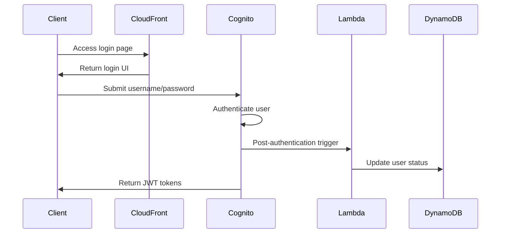

**Data Flow:**
- User credentials stored in Cognito User Pool
- User profile data stored in DynamoDB Users table:
```json
{
    "username": "john_doe",
    "status": "online",
    "lastSeen": "2024-01-20T10:30:00Z"
}
```

2. **Search Users**
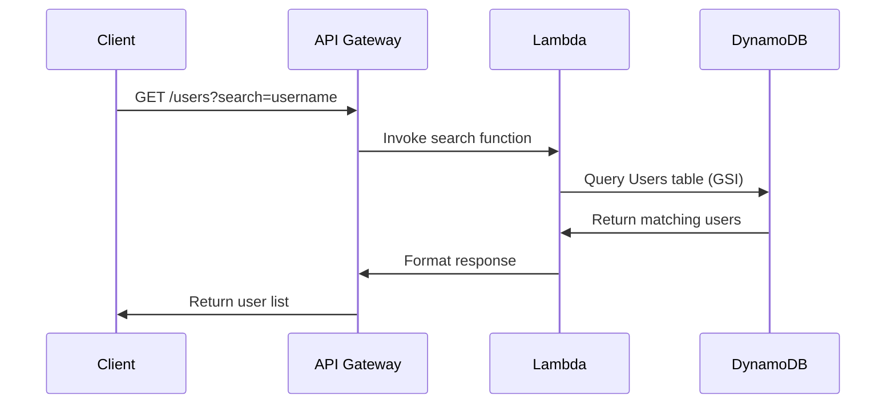

**Data Flow:**
- Search query uses DynamoDB GSI on username
- Example API Response:
```json
{
    "users": [
        {
            "username": "john_doe",
            "status": "online"
        },
        {
            "username": "john_smith",
            "status": "offline"
        }
    ]
}
```

3. **Start Chat**
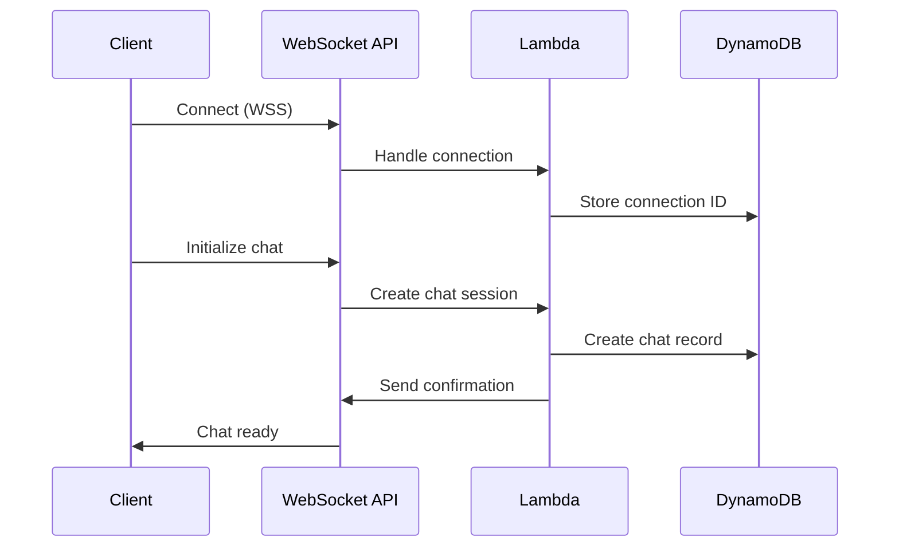

**Data Flow:**
- Connections table record:
```json
{
    "connectionId": "ABC123",
    "username": "john_doe",
    "timestamp": "2024-01-20T10:30:00Z"
}
```
- Chat session record:
```json
{
    "chatId": "chat_123",
    "participants": ["john_doe", "jane_smith"],
    "createdAt": "2024-01-20T10:30:00Z"
}
```

4. **Send/Receive Messages**
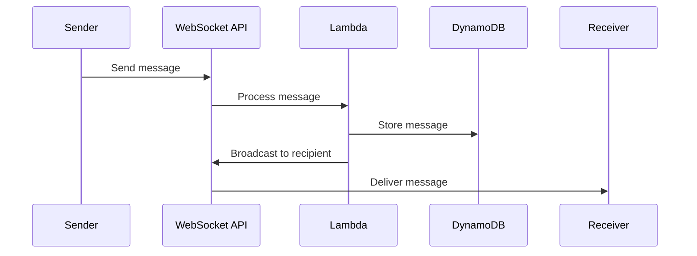

**Data Flow:**
- Message record in DynamoDB:
```json
{
    "chatId": "chat_123",
    "messageId": "msg_456",
    "sender": "john_doe",
    "content": "Hello!",
    "timestamp": "2024-01-20T10:31:00Z"
}
```
- WebSocket message format:
```json
{
    "action": "message",
    "chatId": "chat_123",
    "content": "Hello!",
    "sender": "john_doe",
    "timestamp": "2024-01-20T10:31:00Z"
}
```

**End-to-End Workflow Example:**

Let's follow a complete workflow of two users chatting:

1. **Initial Setup:**
   - Both users authenticate through Cognito
   - Receive JWT tokens for API authorization
   - Connect to WebSocket API

2. **User Search:**
   - User A searches for User B
   - API Gateway invokes Lambda
   - Lambda queries DynamoDB using GSI
   - Returns user profile to User A

3. **Chat Initialization:**
   - User A initiates chat with User B
   - Lambda creates chat session in DynamoDB
   - Both users receive chat session details

4. **Message Exchange:**
   - User A sends message:
     1. Message goes to WebSocket API
     2. Lambda stores in DynamoDB
     3. Lambda checks recipient's connection
     4. WebSocket API broadcasts to User B
   
   - User B receives message:
     1. WebSocket connection delivers message
     2. Client updates UI
     3. Client sends read receipt
     4. Lambda updates message status

5. **Session Management:**
   - DynamoDB tracks active connections
   - Lambda handles disconnections
   - Updates user status accordingly

**Data Consistency Considerations:**

1. **Message Ordering:**
   - DynamoDB sort key ensures message sequence
   - Timestamps used for message ordering
   - Client-side message queue for offline handling

2. **State Management:**
   - Connection status tracked in real-time
   - User presence updated via WebSocket
   - Offline messages queued for delivery

3. **Error Handling:**
   - Failed message delivery retry mechanism
   - Connection recovery procedures
   - Message persistence guarantees

This workflow ensures:
- Real-time message delivery
- Message persistence
- Proper user status tracking
- Scalable chat sessions
- Efficient user discovery
- Secure communications

The architecture handles these flows efficiently while maintaining:
- Low latency
- High availability
- Data consistency
- User session management
- Security at all levels
----------------------------------------------
Here are the main use case diagrams in Mermaid:

**User Registration**
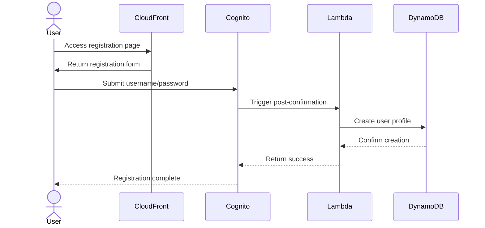

**User Search**
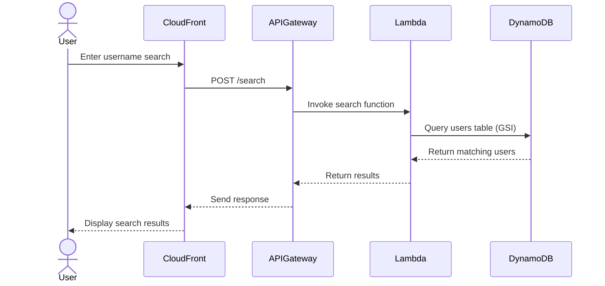

**Start Chat**
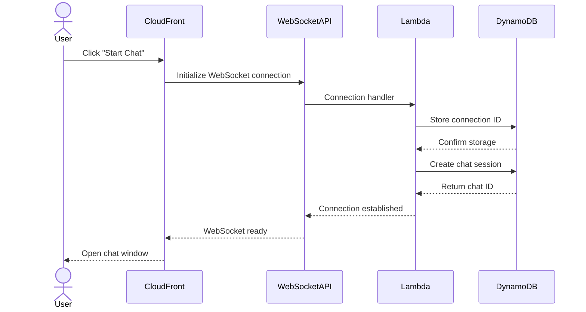

**Send Message**
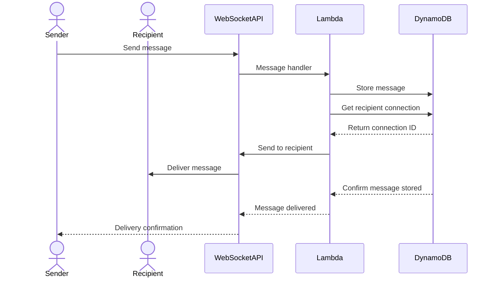

**User Login**
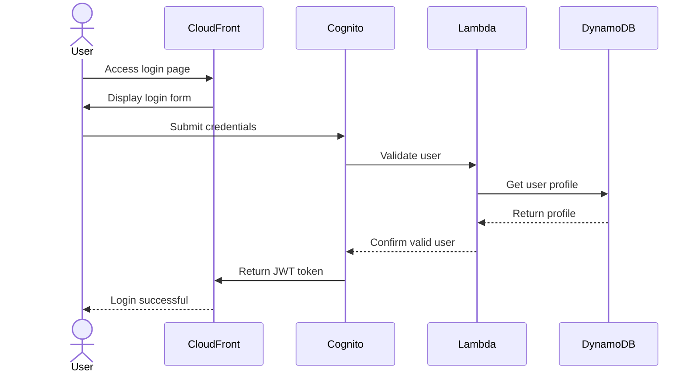
----------------------------------------------
Here are the main use case diagrams followed by the complete architecture diagram:

**Use Case 1: User Registration/Login**
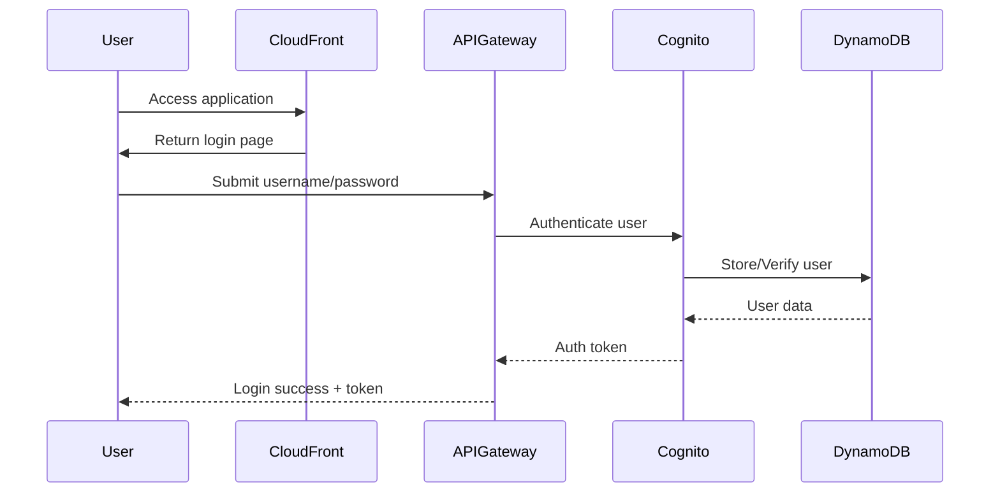

**Use Case 2: Search Users**
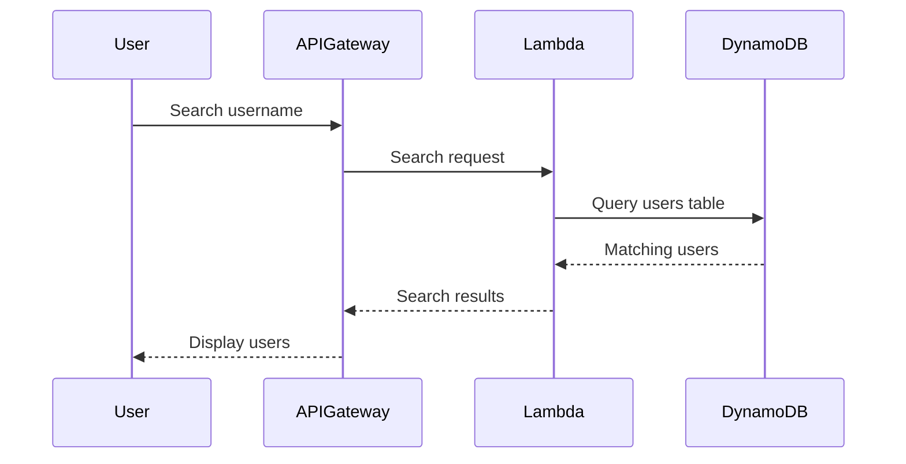

**Use Case 3: Start Chat**
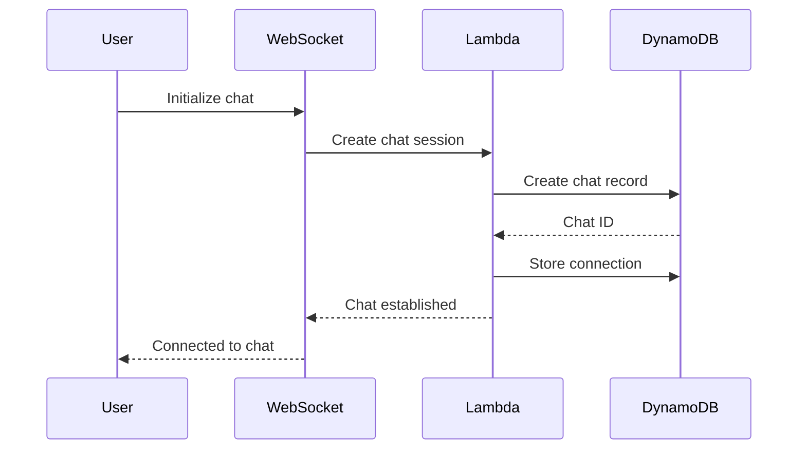

**Complete Architecture**
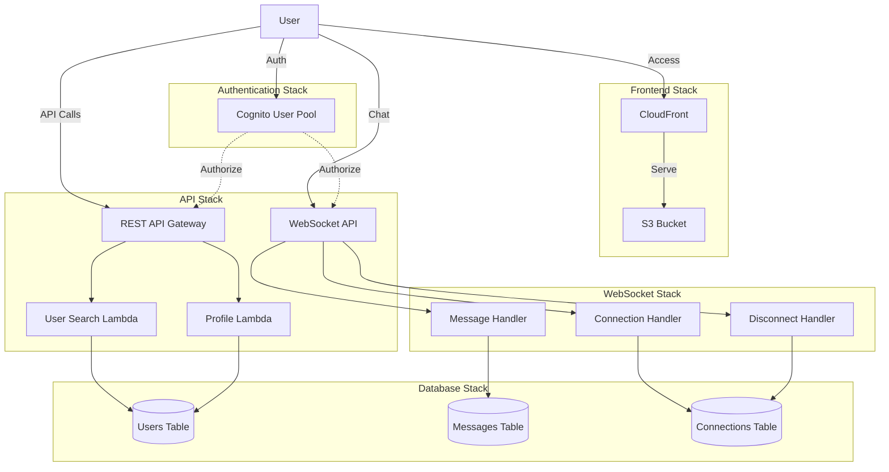
