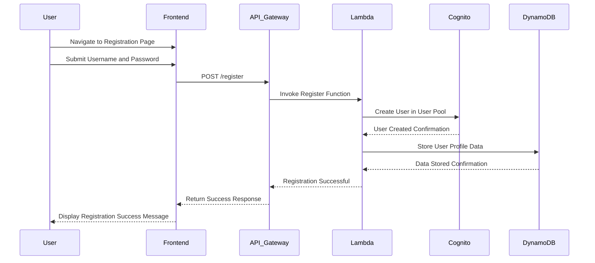
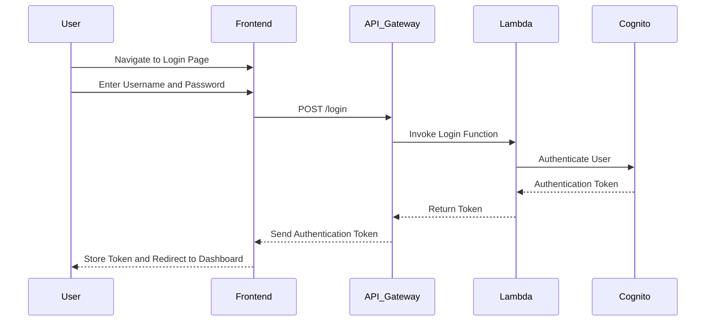
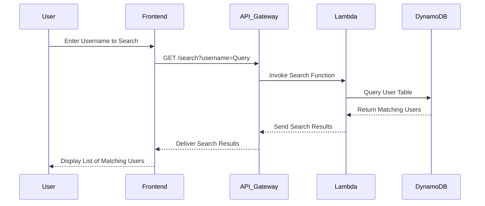
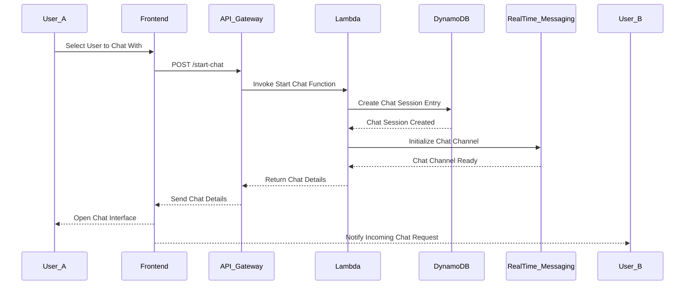
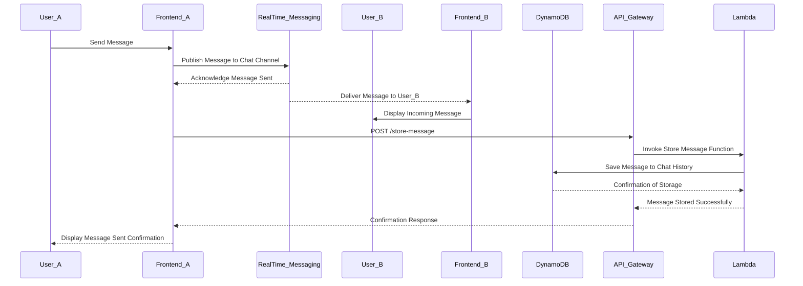
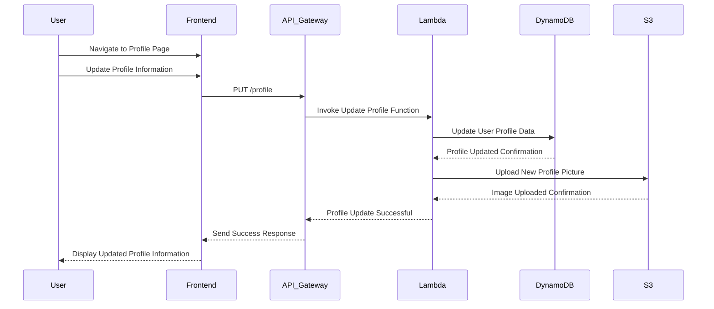
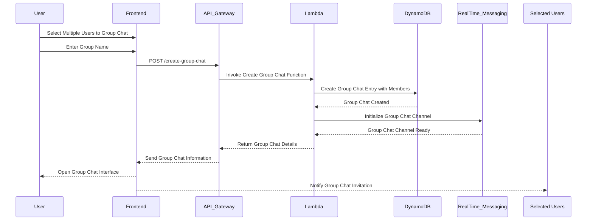
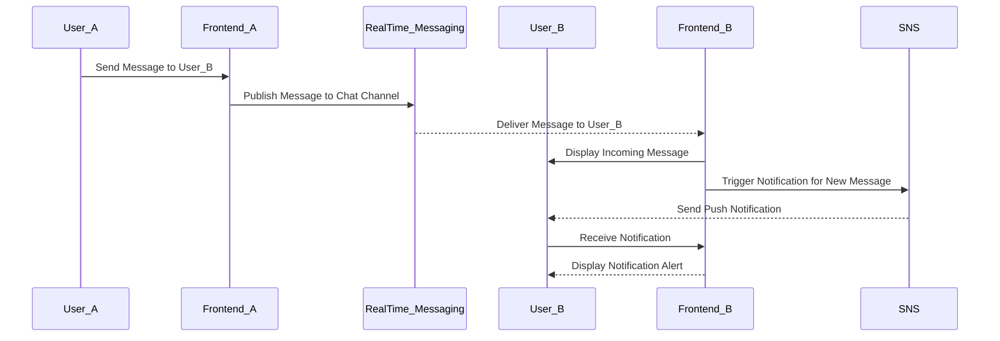
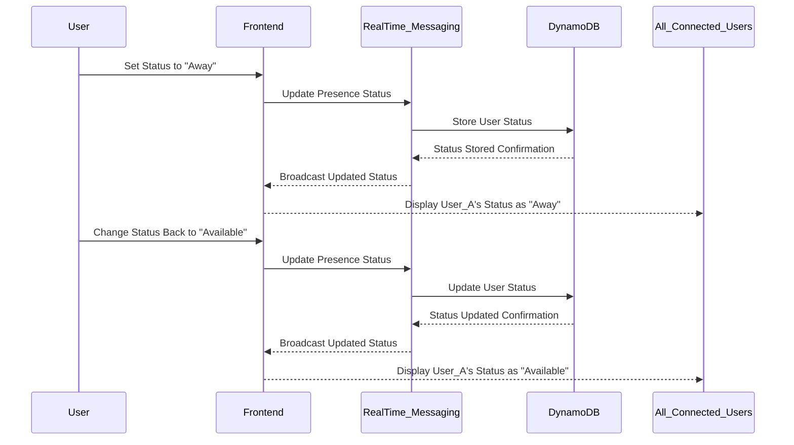

? What is the project name? test
? Describe your app in as much detail as possible. I want to create a chat app. An user must be able to login with an username, search
 other user by his username and start a chat
Your project description seems a bit short. The better you can describe the project, the better GPT Pilot will understand what you'd like to build.

Here are some tips on how to better describe the project: https://github.com/Pythagora-io/gpt-pilot/wiki/How-to-write-a-good-initial-project-description


Let's start by refining your project idea:
? Thank you for sharing your idea for a chat application. To ensure we capture all your requirements accurately, could you please elab
orate on the main objectives and target audience of the application? For example, is it intended for casual conversations, professiona
l communication, specific communities, or something else? skip_questions

---

**Chat Application - Requirements Specification**

**1. Introduction**

A web-based chat application that allows users to communicate in real-time. The platform enables users to create accounts, search for other users by username, and engage in private or group conversations. The application aims to provide a seamless and user-friendly messaging experience.

**2. User Roles**

- **Guest:** An unregistered user who can view limited information but cannot access chat functionalities.
- **Registered User:** A user who has created an account and can utilize all chat features.
- **Administrator:** A user with elevated permissions to manage user accounts, monitor activities, and oversee the platform's operations.

**3. Functional Requirements**

**3.1 User Registration and Authentication**

- **Account Creation:**
  - Users can sign up using a unique username and password.
  - Option to sign up using email address for account verification.
- **Authentication:**
  - Secure login mechanism requiring username and password.
  - Password recovery feature using registered email.
- **Profile Management:**
  - Users can update personal information such as display name, status message, and profile picture.
  - Option to set privacy settings for profile visibility and chat preferences.

**3.2 User Search and Discovery**

- **Search Functionality:**
  - Users can search for other users by entering their exact or partial username.
  - Display search results with matching usernames and profile pictures.
- **User Suggestions:**
  - Provide suggestions based on mutual connections or recent interactions.

**3.3 Chat Initiation and Management**

- **Start a Chat:**
  - Users can initiate a private one-on-one chat with any registered user found via search.
- **Group Chats:**
  - Option to create group chats by selecting multiple users.
  - Ability to name the group and assign an optional group avatar.
- **Chat Interface:**
  - Real-time messaging with instant delivery.
  - Display of sender's username and timestamp for each message.
- **Message Management:**
  - Users can edit or delete their sent messages within a specified time frame.
  - Support for multimedia messages, including images, videos, and documents.

**3.4 Notifications**

- **Real-Time Notifications:**
  - Alert users of new messages, incoming chat requests, and mentions.
- **Customization:**
  - Users can customize notification settings for different chat types or specific users.

**3.5 User Presence and Status**

- **Online Status:**
  - Display real-time online/offline status of users.
- **Status Indicators:**
  - Users can set custom status messages (e.g., Available, Busy, Away).

**3.6 Security and Privacy**

- **Data Protection:**
  - Ensure secure storage of user data with encryption.
- **Privacy Controls:**
  - Users can block or report other users.
  - Option to control who can send chat requests or view profiles.
- **Authentication Security:**
  - Implement measures against unauthorized access, such as account lockout after multiple failed login attempts.

**3.7 Administrative Functions**

- **User Management:**
  - Administrators can view, edit, or deactivate user accounts.
- **Content Moderation:**
  - Monitor chats for inappropriate content and take necessary actions.
- **Reporting and Analytics:**
  - Access to usage statistics, active users, and chat volumes.

**4. User Interface Requirements**

- **Responsive Design:**
  - The application should be accessible and optimized for desktop, tablet, and mobile devices.
- **Intuitive Navigation:**
  - Easy access to chat lists, search functionality, and user profiles.
- **Chat Interface:**
  - Clean and clutter-free design with clear distinction between sent and received messages.
- **Accessibility:**
  - Support for screen readers, keyboard navigation, and adherence to accessibility standards.

**5. Non-Functional Requirements**

- **Performance:**
  - Fast message delivery and minimal latency in real-time communication.
- **Scalability:**
  - Ability to handle a growing number of users and concurrent chats without performance loss.
- **Reliability:**
  - High availability with minimal downtime and robust backup systems.
- **Security:**
  - Protection against common security threats such as SQL injection, cross-site scripting (XSS), and data breaches.

**6. Assumptions**

- Users have access to the internet and compatible devices to use the web application.
- All users have unique usernames; the system enforces username uniqueness during registration.
- The platform will comply with relevant data protection regulations (e.g., GDPR).

**7. Constraints**

- Usernames must be between 3 to 15 characters, containing only alphanumeric characters and underscores.
- The application will support text, image, and basic file formats for multimedia messaging.
- Privacy policies and terms of service must be agreed upon during account creation.

---

This requirements specification outlines the essential features and functionalities of the proposed chat application from the user's perspective. It ensures that the development team has a clear understanding of the application's objectives and user needs without delving into technical implementation details.


Does this sound good, and does it capture all the information about your project?

? Can we proceed with this project description? If so, just press ENTER. Otherwise, please tell me what's missing or what you'd like t
o add. 
Planning project architecture...

Planning project end to end use cases...

Generating use cases mermaid diagrams...

Generating architecture mermaid diagram...

**********************************************
---

**1. High-Level Architecture Overview**

The proposed architecture is a scalable and secure web-based chat application hosted entirely on AWS. It leverages AWS managed services to ensure rapid development, high availability, and seamless scalability. The architecture is organized into distinct CDK stacks, each representing a logical grouping of related components to promote separation of concerns and ease of management.

**CDK Stacks List:**

- **Networking Stack**
- **Authentication Stack**
- **Database Stack**
- **Backend Application Stack**
- **Real-Time Messaging Stack**
- **Storage Stack**
- **Frontend Hosting Stack**

**Interactions:**

- The **Networking Stack** establishes the foundational network infrastructure utilized by all other stacks.
- The **Authentication Stack** manages user authentication and authorization, integrating with the **Backend Application Stack** and **Real-Time Messaging Stack** to secure access.
- The **Database Stack** handles data persistence for user profiles, chat histories, and other application data, interfacing with the **Backend Application Stack**.
- The **Backend Application Stack** contains the core business logic and APIs, communicating with the **Database Stack** and **Real-Time Messaging Stack** to facilitate chat functionalities.
- The **Real-Time Messaging Stack** manages real-time communication between users, leveraging services optimized for low-latency interactions.
- The **Storage Stack** manages static assets such as profile pictures and multimedia messages, interfacing with both the **Backend Application Stack** and **Frontend Hosting Stack**.
- The **Frontend Hosting Stack** serves the user-facing web application, interacting with the **Backend Application Stack** and **Real-Time Messaging Stack** to provide a seamless user experience.

**Justification:**

This modular architecture ensures that each stack is responsible for a specific set of functionalities, enhancing maintainability and scalability. By utilizing AWS managed services, the architecture reduces operational overhead, accelerates development timelines, and ensures robust security and performance. The separation into logical stacks allows independent scaling and deployment, accommodating future feature expansions with minimal disruption.

---

**2. Detailed CDK Stack Descriptions**

**Networking Stack**

- **Purpose:** Establishes the fundamental network infrastructure for the chat application, ensuring secure and efficient communication between all components.
  
- **AWS Resources:**
  - **Amazon VPC:** Creates an isolated network environment.
  - **Public and Private Subnets:** Segregates resources based on accessibility requirements.
  - **Internet Gateway:** Enables internet access for public-facing resources.
  - **NAT Gateways:** Allows private subnets to access the internet securely.
  - **Security Groups and Network ACLs:** Implements granular traffic control and security policies.
  
- **Interactions:**
  - Provides the networking foundation for all other stacks, ensuring that resources are properly segmented and secured.
  
- **Rationale:**
  - A dedicated networking stack centralizes network management, enhancing security and simplifying resource connectivity across the application.

---

**Authentication Stack**

- **Purpose:** Manages user authentication and authorization, ensuring secure access to application features.

- **AWS Resources:**
  - **Amazon Cognito User Pools:** Handles user sign-up, sign-in, and authentication processes.
  - **Amazon Cognito Identity Pools:** Provides temporary AWS credentials for authenticated users.
  
- **Interactions:**
  - Integrates with the **Backend Application Stack** to secure API endpoints.
  - Works with the **Frontend Hosting Stack** to manage user sessions and authentication flows.
  
- **Rationale:**
  - Amazon Cognito offers a robust, scalable solution for user authentication, reducing the need for custom authentication implementations and ensuring security best practices.

---

**Database Stack**

- **Purpose:** Manages data storage and persistence for user profiles, chat histories, and other application data.

- **AWS Resources:**
  - **Amazon DynamoDB:** Provides a scalable NoSQL database for storing user data and chat messages.
  - **Amazon DynamoDB Streams:** Enables real-time data processing and triggers for backend operations.
  - **AWS Secrets Manager:** Secures database credentials and sensitive configuration data.
  
- **Interactions:**
  - Accessed by the **Backend Application Stack** for CRUD operations related to user information and chat data.
  - Utilizes DynamoDB Streams to trigger real-time updates in the **Real-Time Messaging Stack**.
  
- **Rationale:**
  - Amazon DynamoDB offers high performance and scalability, essential for handling the real-time nature of chat applications. Its seamless integration with other AWS services facilitates efficient data management.

---

**Backend Application Stack**

- **Purpose:** Hosts the core business logic and RESTful APIs that power the chat application's functionalities.
  
- **AWS Resources:**
  - **AWS Lambda:** Executes serverless functions to handle API requests and business logic.
  - **Amazon API Gateway:** Exposes RESTful API endpoints for frontend and external interactions.
  - **AWS AppSync (optional):** Provides a managed GraphQL service for more flexible data querying.
  - **AWS IAM Roles:** Manages permissions and access controls for backend services.
  
- **Interactions:**
  - Interfaces with the **Database Stack** to perform data operations.
  - Utilizes the **Authentication Stack** to validate and authorize user requests.
  - Communicates with the **Real-Time Messaging Stack** to facilitate instant messaging capabilities.
  
- **Rationale:**
  - Serverless computing with AWS Lambda ensures automatic scaling and cost-efficiency, accommodating varying workloads typical of chat applications without manual infrastructure management.

---

**Real-Time Messaging Stack**

- **Purpose:** Enables real-time communication between users, ensuring low-latency message delivery and interactive chat experiences.
  
- **AWS Resources:**
  - **Amazon API Gateway WebSockets:** Facilitates persistent WebSocket connections for real-time messaging.
  - **AWS Lambda:** Processes incoming and outgoing messages in real-time.
  - **Amazon ElastiCache (Redis):** Provides in-memory caching to manage active connections and message queues.
  
- **Interactions:**
  - Connects with the **Backend Application Stack** to authenticate users and route messages.
  - Interfaces with the **Database Stack** to store and retrieve chat histories.
  
- **Rationale:**
  - Utilizing WebSockets through Amazon API Gateway ensures efficient real-time communication. ElastiCache enhances performance by managing connection states and reducing latency.

---

**Storage Stack**

- **Purpose:** Manages the storage and retrieval of static assets and multimedia content within the chat application.
  
- **AWS Resources:**
  - **Amazon S3 Buckets:** Stores user-uploaded files such as profile pictures, images, videos, and documents.
  - **Amazon CloudFront:** Distributes static and dynamic content globally with low latency.
  - **AWS Lambda (for S3 event processing):** Handles automatic processing or thumbnail generation for uploaded media.
  
- **Interactions:**
  - Accessed by the **Backend Application Stack** to upload and retrieve user files.
  - Integrated with the **Frontend Hosting Stack** to deliver static assets efficiently to end-users.
  
- **Rationale:**
  - Amazon S3 combined with CloudFront provides a highly durable and scalable solution for storing and delivering static and multimedia content, enhancing user experience with fast content access.

---

**Frontend Hosting Stack**

- **Purpose:** Hosts the user-facing web application, ensuring it is accessible, performant, and scalable.
  
- **AWS Resources:**
  - **Amazon S3 (Static Website Hosting):** Serves the frontend assets such as HTML, CSS, and JavaScript files.
  - **Amazon CloudFront:** Distributes the frontend content globally for low-latency access.
  - **AWS Certificate Manager:** Manages SSL/TLS certificates for secure HTTPS connections.
  
- **Interactions:**
  - Interacts with the **Backend Application Stack** and **Real-Time Messaging Stack** to consume APIs and real-time messaging services.
  - Fetches static assets from the **Storage Stack** via CloudFront for efficient delivery.
  
- **Rationale:**
  - Hosting the frontend on Amazon S3 with CloudFront ensures high availability, automatic scaling, and secure content delivery, providing users with a responsive and reliable interface.

---

**3. Assumptions and Considerations**

- **Assumptions:**
  - Users will access the chat application via modern web browsers with internet connectivity.
  - The application will handle a variable number of concurrent users, necessitating scalable backend services.
  - Users will primarily engage in text-based communication, with occasional multimedia message exchanges.
  - Data privacy and security are paramount, aligning with regulations such as GDPR.

- **Constraints:**
  - The architecture must remain within the AWS ecosystem, utilizing only AWS services for hosting and infrastructure.
  - Development timelines are tight (one to two weeks), requiring the use of managed services to expedite deployment.
  - Budgetary limitations necessitate cost-effective service choices without compromising essential functionalities.

- **Scalability and Security:**
  - **Scalability:**
    - Leveraging AWS serverless services like Lambda and DynamoDB ensures automatic scaling to handle varying loads.
    - Amazon API Gateway and CloudFront facilitate horizontal scaling for API and content delivery with minimal latency.
  - **Security:**
    - Implementing Amazon Cognito for authentication ensures secure user management and access controls.
    - Utilizing VPC, Security Groups, and IAM Roles enforces network security and resource-specific permissions.
    - Data stored in DynamoDB and S3 is encrypted at rest, and all data in transit is secured via SSL/TLS.
    - Regular security audits and compliance checks are assumed to be in place to maintain data protection standards.

---

This architectural design leverages AWS's robust managed services to deliver a secure, scalable, and high-performance chat application. By organizing resources into logical CDK stacks, the architecture promotes maintainability and facilitates rapid development within the project's tight timeline.

----------------------------------------------
---

**Use Case Interactions and Data Handling**

This section outlines how the main use cases of the chat application interact with the designed AWS architecture. It details the flow of data and the sequence of interactions between AWS services to accomplish each user action.

---

### 1. User Registration

**Interaction with AWS Services:**

- **Frontend Hosting Stack:**
  - User accesses the registration form via the web application hosted on Amazon S3 and delivered through Amazon CloudFront.
  
- **Backend Application Stack:**
  - **Amazon API Gateway:** Receives registration requests from the frontend.
  - **AWS Lambda:** Processes the registration logic.
  
- **Authentication Stack:**
  - **Amazon Cognito User Pools:** Manages user creation and stores user credentials.

**Data Handling and Workflow:**

1. **User Action:**
   - The user fills out the registration form with a unique username, password, and email address.

2. **Frontend Processing:**
   - The frontend application sends a POST request to the API Gateway endpoint with the registration data.

3. **Backend Processing:**
   - **API Gateway** routes the request to the appropriate **Lambda** function.
   - The **Lambda** function invokes **Amazon Cognito User Pools** to create a new user account.

4. **Authentication Handling:**
   - **Cognito** stores the user credentials securely and sends a verification email to the user's registered email address.

5. **Verification:**
   - The user verifies their email by clicking on the link provided, activating their account.

6. **Completion:**
   - Upon successful verification, the user's account becomes active, and they can proceed to log in.

---

### 2. User Login and Authentication

**Interaction with AWS Services:**

- **Frontend Hosting Stack:**
  - User enters login credentials on the web application.

- **Backend Application Stack:**
  - **Amazon API Gateway:** Handles login requests.
  - **AWS Lambda:** Facilitates authentication logic.

- **Authentication Stack:**
  - **Amazon Cognito User Pools:** Authenticates user credentials and issues tokens.

**Data Handling and Workflow:**

1. **User Action:**
   - The user enters their username and password into the login form.

2. **Frontend Processing:**
   - The frontend sends a POST request with the credentials to the API Gateway.

3. **Backend Processing:**
   - **API Gateway** forwards the request to a **Lambda** function.
   - The **Lambda** function communicates with **Cognito** to authenticate the user.

4. **Authentication Handling:**
   - **Cognito** verifies the credentials and, upon successful authentication, issues JWT tokens (Access Token, ID Token, Refresh Token).

5. **Token Management:**
   - The frontend stores the tokens securely (e.g., in HTTP-only cookies or secure storage) for session management and authorization in subsequent requests.

6. **Access Granted:**
   - The user gains access to authenticated features of the application, such as searching for other users and initiating chats.

---

### 3. Searching for Users

**Interaction with AWS Services:**

- **Frontend Hosting Stack:**
  - User initiates a search query through the search interface.

- **Backend Application Stack:**
  - **Amazon API Gateway:** Receives search requests.
  - **AWS Lambda:** Executes search logic.
  
- **Database Stack:**
  - **Amazon DynamoDB:** Stores user profiles and indexes for efficient searching.

**Data Handling and Workflow:**

1. **User Action:**
   - The user enters a username or partial username into the search bar to find other users.

2. **Frontend Processing:**
   - The frontend sends a GET request with the search parameters to the API Gateway.

3. **Backend Processing:**
   - **API Gateway** routes the request to the appropriate **Lambda** function.
   - The **Lambda** function queries **DynamoDB** using the provided search parameters, leveraging indexes for quick retrieval.

4. **Data Retrieval:**
   - **DynamoDB** returns matching user profiles, including usernames and profile pictures.

5. **Response Delivery:**
   - The **Lambda** function formats the response and sends it back through the **API Gateway** to the frontend.

6. **Display Results:**
   - The frontend displays the search results, allowing the user to select a profile to initiate a chat.

---

### 4. Initiating a Chat

**Interaction with AWS Services:**

- **Frontend Hosting Stack:**
  - User selects another user from search results to start a chat.

- **Backend Application Stack:**
  - **Amazon API Gateway:** Handles chat initiation requests.
  - **AWS Lambda:** Processes chat creation logic.

- **Real-Time Messaging Stack:**
  - **Amazon API Gateway WebSockets:** Establishes a real-time connection for messaging.

- **Database Stack:**
  - **Amazon DynamoDB:** Stores chat session information.

**Data Handling and Workflow:**

1. **User Action:**
   - The user selects another user from the search results and clicks to start a chat.

2. **Frontend Processing:**
   - The frontend sends a POST request to the API Gateway to create a new chat session.

3. **Backend Processing:**
   - **API Gateway** forwards the request to a **Lambda** function.
   - The **Lambda** function creates a new chat session entry in **DynamoDB**, recording participant IDs and generating a unique chat ID.

4. **Real-Time Connection:**
   - The frontend establishes a WebSocket connection via **Amazon API Gateway WebSockets** using the chat ID.

5. **Confirmation:**
   - **Lambda** confirms the creation of the chat session and the establishment of the WebSocket connection.

6. **Chat Interface:**
   - The user is redirected to the chat interface, ready to send and receive messages in real-time.

---

### 5. Sending and Receiving Messages

**Interaction with AWS Services:**

- **Frontend Hosting Stack:**
  - Users compose and send messages through the chat interface.

- **Real-Time Messaging Stack:**
  - **Amazon API Gateway WebSockets:** Handles message transmission.
  - **AWS Lambda:** Processes incoming messages.

- **Database Stack:**
  - **Amazon DynamoDB:** Stores chat messages and metadata.

- **Storage Stack:**
  - **Amazon S3:** (If messages include multimedia content) Stores uploaded files.

**Data Handling and Workflow:**

1. **User Action:**
   - The user types a message and clicks send in the chat interface.

2. **Frontend Processing:**
   - The message is sent through the established WebSocket connection to the **API Gateway WebSockets** endpoint.

3. **Message Processing:**
   - **API Gateway WebSockets** routes the message to a **Lambda** function.
   - The **Lambda** function:
     - Validates the message and sender.
     - Stores the message in **DynamoDB** under the corresponding chat session.
     - If the message includes multimedia, uploads the file to **Amazon S3** and stores the URL in **DynamoDB**.

4. **Real-Time Delivery:**
   - The **Lambda** function broadcasts the message to the recipient's WebSocket connection via **API Gateway WebSockets**.

5. **Message Receipt:**
   - The recipient's frontend receives the message in real-time and displays it in the chat interface.

6. **Acknowledgment:**
   - Both users see the message with the sender's username and timestamp, confirming successful delivery.

---

### 6. Managing User Profiles

**Interaction with AWS Services:**

- **Frontend Hosting Stack:**
  - Users access and edit their profiles through the web application.

- **Backend Application Stack:**
  - **Amazon API Gateway:** Handles profile update requests.
  - **AWS Lambda:** Processes profile updates.

- **Database Stack:**
  - **Amazon DynamoDB:** Stores and updates user profile information.

- **Storage Stack:**
  - **Amazon S3:** Stores profile pictures and other media.

**Data Handling and Workflow:**

1. **User Action:**
   - The user navigates to their profile page and makes changes, such as updating their display name or uploading a new profile picture.

2. **Frontend Processing:**
   - The frontend sends a PUT/PATCH request with the updated profile data to the API Gateway.

3. **Backend Processing:**
   - **API Gateway** routes the request to a **Lambda** function.
   - The **Lambda** function updates the user's profile information in **DynamoDB**.
   - If the user uploads a new profile picture, the image is sent to **Amazon S3**, and the S3 URL is stored in **DynamoDB**.

4. **Data Storage:**
   - **DynamoDB** reflects the updated profile information, ensuring data consistency and integrity.

5. **Confirmation:**
   - The **Lambda** function sends a success response back to the frontend.

6. **Frontend Update:**
   - The frontend updates the displayed profile information to reflect the changes immediately.

---

### 7. Uploading and Retrieving Multimedia Content

**Interaction with AWS Services:**

- **Frontend Hosting Stack:**
  - Users upload images, videos, or documents through the chat interface or profile management.

- **Backend Application Stack:**
  - **Amazon API Gateway:** Receives upload requests.
  - **AWS Lambda:** Handles file processing and storage.

- **Storage Stack:**
  - **Amazon S3 Buckets:** Stores uploaded multimedia files.
  - **Amazon CloudFront:** Distributes multimedia content efficiently to users.

**Data Handling and Workflow:**

1. **User Action:**
   - The user selects a file (image, video, or document) to upload within a chat or their profile.

2. **Frontend Processing:**
   - The frontend initiates a multipart/form-data POST request to the API Gateway for file upload.

3. **Backend Processing:**
   - **API Gateway** forwards the upload request to a **Lambda** function.
   - The **Lambda** function:
     - Validates the file type and size.
     - Generates a unique identifier for the file.
     - Uploads the file to the appropriate **Amazon S3 Bucket**.
     - Stores the file metadata and S3 URL in **DynamoDB** linked to the user's profile or chat message.

4. **Content Distribution:**
   - **Amazon CloudFront** caches and serves the multimedia content, ensuring low-latency access for all users globally.

5. **Retrieval:**
   - When a user accesses a chat or profile containing multimedia content, the frontend retrieves the S3 URL from **DynamoDB** and fetches the file via **CloudFront**.

6. **Display:**
   - The multimedia content is displayed within the chat interface or user profile seamlessly.

---

### 8. Administrative Functions

**Interaction with AWS Services:**

- **Frontend Hosting Stack:**
  - Administrators access the admin dashboard through the web application.

- **Backend Application Stack:**
  - **Amazon API Gateway:** Handles administrative requests.
  - **AWS Lambda:** Processes administrative actions.

- **Database Stack:**
  - **Amazon DynamoDB:** Manages user accounts and chat data.

- **Real-Time Messaging Stack:**
  - **Amazon API Gateway WebSockets:** Monitors and manages real-time communications.

**Data Handling and Workflow:**

1. **Admin Action:**
   - An administrator logs into the admin dashboard to manage user accounts, monitor chats, or review analytics.

2. **Frontend Processing:**
   - The admin interface sends secured requests to the API Gateway for various administrative tasks.

3. **Backend Processing:**
   - **API Gateway** routes these requests to corresponding **Lambda** functions.
   - **Lambda** functions perform actions such as:
     - Viewing, editing, or deactivating user accounts in **DynamoDB**.
     - Monitoring chat activities and flagging inappropriate content.
     - Generating and retrieving usage statistics and analytics data.

4. **Security Enforcement:**
   - **Amazon Cognito User Pools** ensure that only authorized administrators can perform these actions through role-based access controls.

5. **Data Update and Retrieval:**
   - Any changes made by admins are reflected in **DynamoDB**, ensuring data consistency across the application.

6. **Feedback:**
   - **Lambda** functions send confirmation responses back to the admin dashboard, updating the interface accordingly.

---

**End-to-End Workflow Example: Sending a Message**

To illustrate an end-to-end workflow, consider the process of a user sending a message to another user:

1. **User Initiates Message:**
   - User A types a message in the chat interface and clicks send.

2. **Frontend Processing:**
   - The message is sent through the established WebSocket connection to **Amazon API Gateway WebSockets**.

3. **Real-Time Messaging Processing:**
   - **API Gateway WebSockets** routes the message to an **AWS Lambda** function for processing.

4. **Backend Processing:**
   - The **Lambda** function:
     - Validates the sender and message content.
     - Stores the message in **Amazon DynamoDB** under the relevant chat session.
     - If the message includes multimedia, uploads the file to **Amazon S3** and stores the URL in **DynamoDB**.

5. **Message Delivery:**
   - The **Lambda** function broadcasts the message to User B's WebSocket connection via **API Gateway WebSockets**.

6. **Frontend Update:**
   - User B's frontend receives the message in real-time and displays it in their chat interface with User A.

7. **Data Persistence:**
   - The message is persistently stored in **DynamoDB**, ensuring it can be retrieved for future sessions or audits.

---

**Next Steps in the End-to-End Workflow**

1. **Testing and Validation:**
   - Conduct comprehensive testing of each use case to ensure seamless interaction between AWS services.
   - Validate data flow, security measures, and real-time functionalities.

2. **Deployment:**
   - Utilize AWS CDK to deploy the designed architecture stacks systematically.
   - Implement continuous integration and continuous deployment (CI/CD) pipelines for automated deployments.

3. **Monitoring and Optimization:**
   - Set up monitoring using **Amazon CloudWatch** to track application performance and service health.
   - Optimize resource configurations based on usage patterns and performance metrics.

4. **Security Audits:**
   - Perform regular security audits to ensure compliance with data protection regulations (e.g., GDPR).
   - Implement automated alerts for any suspicious activities or security breaches.

5. **User Feedback and Iteration:**
   - Deploy the application to a staging environment for user feedback.
   - Iterate on the architecture and functionalities based on user insights and requirements.

6. **Scaling and Future Enhancements:**
   - Plan for scaling strategies to accommodate growing user bases.
   - Explore additional features such as video calls, file sharing enhancements, and integration with other AWS services for enriched functionalities.

---

This comprehensive interaction model ensures that each user action is efficiently handled by the appropriate AWS services, maintaining data integrity, security, and a seamless user experience throughout the chat application.

----------------------------------------------
**User Registration and Authentication**


---

**User Login and Authentication**


---

**User Search and Discovery**


---

**Start a Chat**


---

**Send and Receive Messages**


---

**Profile Management**


---

**Group Chat Creation**


---

**Notifications for New Messages**


---

**User Presence and Status**


---
----------------------------------------------
```mermaid
graph TD
    %% User Interaction
    User["User"] -->|Access via Browser| CloudFront["Content Delivery Stack: Amazon CloudFront"]
    CloudFront -->|Serves Frontend Assets| Frontend[S3: Frontend Hosting (Amazon S3)]
    
    %% Authentication
    Frontend -->|User Authentication| Cognito["Authentication Stack: Amazon Cognito User Pools"]
    User -->|Authenticate| Cognito
    Cognito -->|Issues Tokens| Frontend
    
    %% Application Stack
    Frontend -->|API Requests| APIGateway["Application Stack: Amazon API Gateway"]
    APIGateway -->|Invoke| LambdaAPI["AWS Lambda Functions"]
    
    %% Database Interaction
    LambdaAPI -->|CRUD Operations| DynamoDB["Database Stack: Amazon DynamoDB"]
    
    %% Storage Interaction
    LambdaAPI -->|Store/Retrieve Files| S3Storage["Storage Stack: Amazon S3 Buckets"]
    
    %% Notification Interaction
    LambdaAPI -->|Send Notifications| SNS["Notification Stack: Amazon SNS"]
    
    %% Search Interaction
    LambdaAPI -->|Search Queries| Elasticsearch["Search Stack: Amazon Elasticsearch Service"]
    
    %% Real-Time Messaging
    User -->|Real-Time Chat| WebSockets["Real-Time Messaging Stack: API Gateway WebSockets"]
    WebSockets -->|Message Handling| LambdaMessaging["AWS Lambda for Messaging"]
    LambdaMessaging --> DynamoDB
    LambdaMessaging -->|Publish to SNS| SNS
    
    %% Content Delivery
    CloudFront -->|Distributes Content| Frontend
    Frontend -->|Fetches Static Content| S3Storage
    Frontend -->|Interacts with APIs| APIGateway
    
    %% Security Components
    subgraph Security
        IAMRoles["IAM Roles"]
        SecurityGroups["Security Groups"]
    end
    IAMRoles -->|Access Control| LambdaAPI
    IAMRoles -->|Access Control| LambdaMessaging
    SecurityGroups -->|Network Security| APIGateway
    SecurityGroups -->|Network Security| WebSockets
    
    %% Networking Stack
    subgraph Networking_Stack
        VPC["Amazon VPC"]
        PublicSubnets["Public Subnets"]
        PrivateSubnets["Private Subnets"]
        InternetGateway["Internet Gateway"]
        NATGateway["NAT Gateway"]
    end
    CloudFront -.->|Distributed Within| VPC
    Frontend -.->|Hosted In| PublicSubnets
    APIGateway -.->|Hosted In| PublicSubnets
    LambdaAPI -.->|Runs In| PrivateSubnets
    LambdaMessaging -.->|Runs In| PrivateSubnets
    DynamoDB -.->|Accessible From| PrivateSubnets
    S3Storage -.->|Accessible Publicly| PublicSubnets
    SNS -.->|Accessible From| PrivateSubnets
    Elasticsearch -.->|Accessible From| PrivateSubnets
    
    %% Optional Components
    subgraph Optional
        AppSync["AWS AppSync"]
    end
    Frontend -->|GraphQL API (Optional)| AppSync
    AppSync -->|Interact With| LambdaAPI
```
