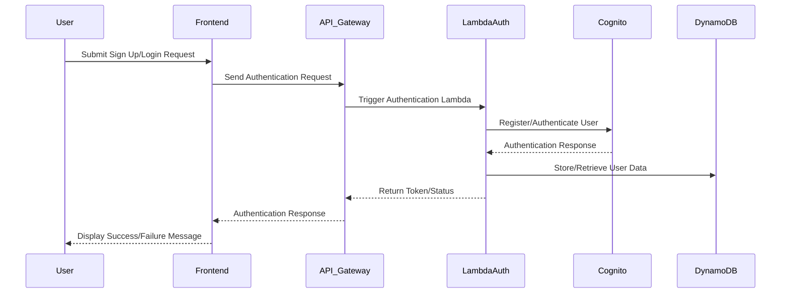
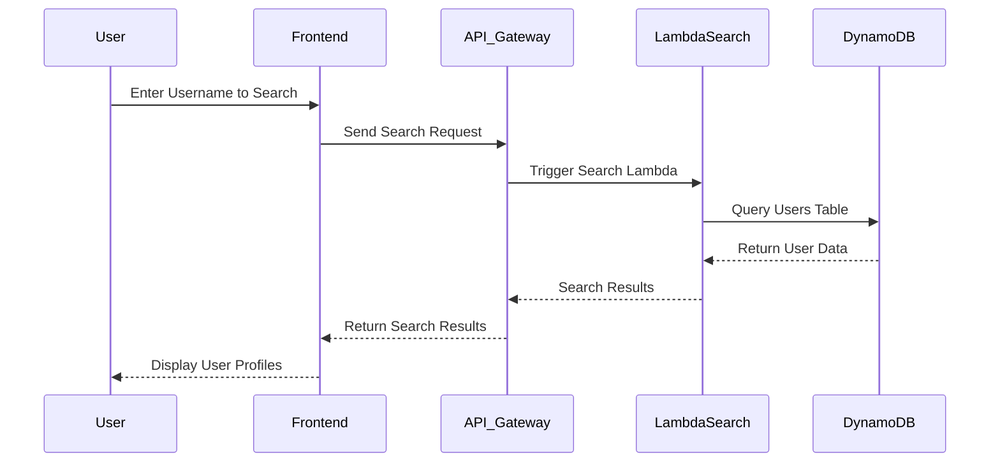
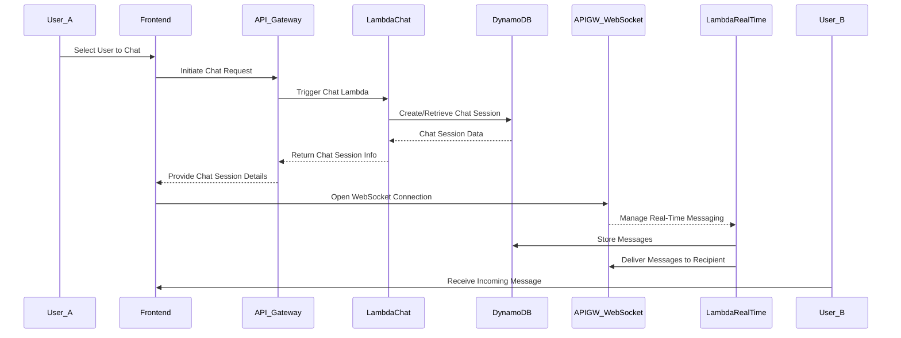
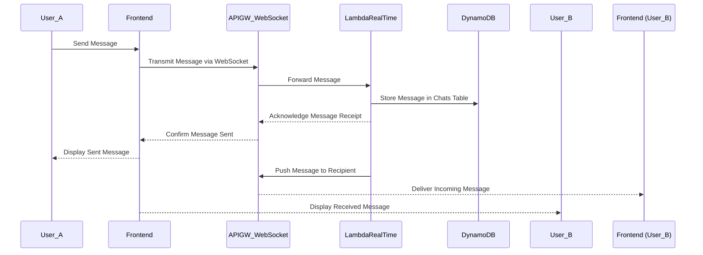
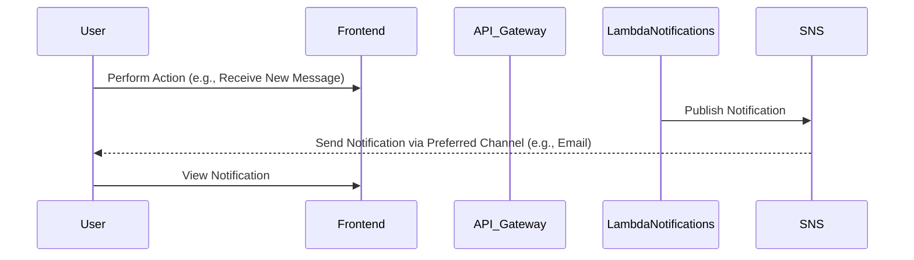
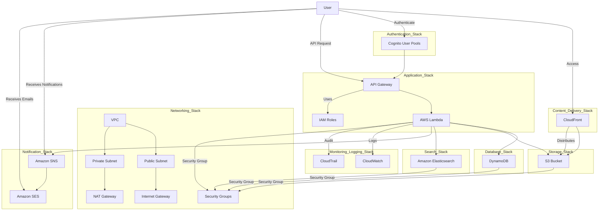

? What is the project name? test
? Describe your app in as much detail as possible. 

**I want to create a chat app. An user must be able to login with an username, search other user by his username and start a chat**

Your project description seems a bit short. The better you can describe the project, the better GPT Pilot will understand what you'd like to build.

Here are some tips on how to better describe the project: https://github.com/Pythagora-io/gpt-pilot/wiki/How-to-write-a-good-initial-project-description

Let's start by refining your project idea:
Len llm response: 5668
---

**Chat Application - Requirements Specification**

**1. Introduction**

A web-based chat application that allows users to communicate with each other in real-time. The application enables users to create accounts, log in with a username, search for other users by their username, and engage in one-on-one chats.

**2. User Roles**

- **Guest:** An unregistered visitor who can view information about the application but cannot access chat functionalities.
- **Registered User:** A user who has created an account and can use all chat features, including searching for other users and initiating chats.
- **Administrator:** Oversees the platform, manages user accounts, and ensures the application's smooth operation.

**3. Functional Requirements**

**3.1 User Registration and Authentication**

- **Account Creation:**
  - Users can sign up by providing a unique username and password.
  - Option to add an email address for account verification and password recovery.
- **Login and Logout:**
  - Secure login functionality using username and password.
  - Option to stay logged in using a "Remember Me" feature.
  - Users can securely log out from their accounts.
- **Password Management:**
  - Users can reset their passwords via email verification.
  - Password strength requirements to ensure account security.

**3.2 User Profile**

- **Profile Information:**
  - Users can view and edit their profile information, including:
    - Display name
    - Profile picture/avatar
    - Status message (e.g., "Online," "Away," custom messages)
- **Privacy Settings:**
  - Users can set their profiles to be searchable or private.
  - Option to block or unblock other users.

**3.3 User Search**

- **Search Functionality:**
  - Users can search for other registered users by entering their username.
  - Display search results with relevant user information (e.g., display name, avatar).
- **Search Filters:**
  - Option to filter search results based on online status or other criteria.

**3.4 Chat Functionality**

- **One-on-One Chat:**
  - Users can initiate a private chat with another user from the search results or their contact list.
  - Real-time messaging with instant delivery of messages.
- **Chat Interface:**
  - User-friendly chat window displaying the conversation history.
  - Timestamp for each message.
  - Option to send text messages and basic emojis.
- **Chat History:**
  - Users can view past conversations.
  - Search within chat history for specific messages or keywords.

**3.5 Notifications**

- **Real-Time Notifications:**
  - Notification alerts for incoming messages when the user is online.
- **Offline Notifications:**
  - Email notifications for unread messages received while the user was offline (optional based on user settings).
- **Status Alerts:**
  - Notifications when a user comes online or goes offline.

**3.6 Administrative Functions**

- **User Management:**
  - Administrators can view, edit, or deactivate user accounts.
  - Ability to reset user passwords if necessary.
- **Content Moderation:**
  - Monitor and manage inappropriate content or behavior within chats.
  - Option to issue warnings or ban users violating terms of service.
- **Analytics:**
  - Access to usage statistics, such as active users, number of messages sent, etc.

**4. User Interface Requirements**

- **Responsive Design:**
  - The application should be accessible and optimized for desktop and mobile browsers.
- **Intuitive Navigation:**
  - Clear layout with easy access to search, chat windows, and user profiles.
- **User-Friendly Chat Interface:**
  - Clean and minimalistic design focusing on readability and ease of use.
- **Accessibility:**
  - Features to assist users with disabilities, such as keyboard navigation and screen reader compatibility.

**5. Non-Functional Requirements**

- **Performance:**
  - Fast loading times for all pages and swift message delivery to enhance user experience.
- **Scalability:**
  - Ability to accommodate an increasing number of users and message volumes without performance degradation.
- **Reliability:**
  - High availability with minimal downtime to ensure users can access the chat service whenever needed.
- **Security:**
  - Secure data transmission using SSL/TLS encryption.
  - Protection against common web vulnerabilities (e.g., SQL injection, XSS).
- **Data Privacy:**
  - Compliance with relevant data protection regulations (e.g., GDPR).
  - Secure storage of user data and chat histories.

**6. Assumptions**

- All users have access to a modern web browser and a stable internet connection.
- The application will support text-based messaging; additional media types (e.g., images, videos) may be considered in future iterations.
- Usernames are unique identifiers within the system.
- Users are responsible for maintaining the confidentiality of their login credentials.

**7. Constraints**

- The application must be developed within a two-week development timeframe, focusing on essential features for an MVP.
- Limited support for advanced features such as group chats, file sharing, or voice/video calls in the initial version.
- User interface designs should adhere to basic accessibility standards without extensive customization.

---

This requirements specification outlines the essential functionalities and user needs for the proposed chat application. It focuses on enabling users to create accounts, authenticate securely, search for other users, and engage in real-time one-on-one chats. The document avoids technical implementation details, ensuring that the development team has a clear understanding of what needs to be built from the user's perspective.
Does this sound good, and does it capture all the information about your project?

? Can we proceed with this project description? If so, just press ENTER. Otherwise, please tell me what's missing or what you'd like to add. 
Planning project architecture...

Planning project end to end use cases...

Generating use cases mermaid diagrams...

Generating architecture mermaid diagram...

Generating the action plan for development...

## Architecture

---

**1. High-Level Architecture Overview**

The proposed architecture is a scalable, secure, and real-time chat application hosted entirely on AWS. It leverages AWS managed services to ensure high availability, scalability, and minimal operational overhead. The architecture is organized into the following CDK stacks:

- **Networking Stack**
- **Authentication Stack**
- **Database Stack**
- **Backend Application Stack**
- **Real-Time Communication Stack**
- **Storage Stack**
- **Monitoring and Logging Stack**

**Interactions:**

- The **Networking Stack** establishes the foundational network infrastructure utilized by all other stacks.
- The **Authentication Stack** manages user authentication and interfaces with the **Backend Application Stack** to secure API endpoints.
- The **Database Stack** handles data persistence, including user profiles and chat histories.
- The **Backend Application Stack** hosts the application's business logic and APIs, communicating with both the **Database Stack** and **Real-Time Communication Stack**.
- The **Real-Time Communication Stack** manages real-time messaging functionalities.
- The **Storage Stack** handles static assets and any user-uploaded content.
- The **Monitoring and Logging Stack** oversees application performance, logging, and operational health.

**Justification:**

This architecture promotes a clear separation of concerns, enhances scalability by utilizing serverless and managed services, and ensures robust security. Logical grouping into CDK stacks facilitates organized infrastructure management, ease of maintenance, and efficient resource scaling.

---

**2. Detailed CDK Stack Descriptions**

---

**Networking Stack**

- **Purpose:**
  - Establishes the foundational network infrastructure for the application.
  
- **AWS Resources:**
  - **Amazon VPC:** Creates an isolated network environment.
  - **Public and Private Subnets:** Segregates resources based on accessibility requirements.
  - **Internet Gateway:** Provides internet access to public subnets.
  - **NAT Gateway:** Enables private subnets to access the internet securely.
  - **Security Groups and Network ACLs:** Controls inbound and outbound traffic to resources.
  
- **Interactions:**
  - All other stacks deploy their resources within the VPC provided by the Networking Stack.
  
- **Rationale:**
  - Centralizing network management enhances security and control over resource accessibility. Separating public and private subnets ensures that sensitive resources remain protected from direct internet exposure.

---

**Authentication Stack**

- **Purpose:**
  - Manages user authentication and authorization processes.
  
- **AWS Resources:**
  - **Amazon Cognito User Pools:** Handles user registration, authentication, and account management.
  - **Amazon Cognito Identity Pools:** Provides temporary AWS credentials for authenticated users.
  - **Lambda Triggers (optional):** Facilitates custom authentication flows or user attribute verification.
  
- **Interactions:**
  - The **Backend Application Stack** utilizes Cognito to secure API endpoints and manage user sessions.
  
- **Rationale:**
  - Amazon Cognito offers a scalable and secure user authentication service with built-in support for various authentication methods, reducing the need to manage custom authentication infrastructure.

---

**Database Stack**

- **Purpose:**
  - Manages data persistence for user profiles and chat histories.
  
- **AWS Resources:**
  - **Amazon DynamoDB:** A fully managed NoSQL database for storing user information and chat messages.
  - **DynamoDB Tables:**
    - **Users Table:** Stores user profiles and related data.
    - **Chats Table:** Stores chat sessions and messages.
  - **DynamoDB Streams (optional):** Enables real-time data processing or triggering events based on data changes.
  
- **Interactions:**
  - The **Backend Application Stack** interacts with DynamoDB to perform CRUD operations on user data and chat messages.
  
- **Rationale:**
  - DynamoDB provides low-latency, high-throughput data storage, making it ideal for real-time applications like chat apps. Its scalability ensures that the database can handle varying loads efficiently.

---

**Backend Application Stack**

- **Purpose:**
  - Hosts the application's backend APIs and business logic.
  
- **AWS Resources:**
  - **AWS Lambda Functions:** Implements serverless functions to handle API requests.
  - **Amazon API Gateway:** Exposes RESTful API endpoints for frontend communication.
  - **AWS AppSync (optional):** Manages GraphQL APIs if required.
  - **IAM Roles and Policies:** Defines permissions for accessing other AWS services securely.
  
- **Interactions:**
  - Communicates with the **Database Stack** to access and manipulate user and chat data.
  - Integrates with the **Authentication Stack** to verify user identities and secure endpoints.
  
- **Rationale:**
  - Serverless architecture using Lambda and API Gateway offers scalability, cost-efficiency, and reduced operational management. It allows the application to handle varying traffic loads seamlessly.

---

**Real-Time Communication Stack**

- **Purpose:**
  - Manages real-time messaging capabilities for the chat application.
  
- **AWS Resources:**
  - **Amazon API Gateway WebSocket APIs:** Facilitates real-time, two-way communication between clients and the backend.
  - **AWS Lambda Functions:** Handles WebSocket connection events and message routing.
  - **Amazon DynamoDB or Amazon ElastiCache (Redis):** Manages session state and message delivery if required.
  
- **Interactions:**
  - Integrates with the **Backend Application Stack** to process and route messages in real time.
  
- **Rationale:**
  - WebSocket APIs in API Gateway provide a scalable solution for real-time communication without the need to manage persistent server connections manually.

---

**Storage Stack**

- **Purpose:**
  - Stores static assets, user-uploaded files, and any media related to chats.
  
- **AWS Resources:**
  - **Amazon S3 Buckets:** Stores static website content and user-uploaded files such as profile pictures.
  - **Amazon CloudFront:** Distributes content globally with low latency.
  - **AWS Lambda@Edge (optional):** Facilitates custom content processing at CloudFront edge locations.
  
- **Interactions:**
  - The **Backend Application Stack** accesses S3 for storing and retrieving user-uploaded content.
  - Frontend applications fetch static assets via CloudFront for improved performance.
  
- **Rationale:**
  - Amazon S3 provides durable and scalable storage for static content, while CloudFront enhances content delivery speeds globally, improving user experience.

---

**Monitoring and Logging Stack**

- **Purpose:**
  - Oversees application performance, monitoring, and logging for maintenance and troubleshooting.
  
- **AWS Resources:**
  - **Amazon CloudWatch:** Collects and monitors logs, metrics, and sets up alarms.
  - **AWS X-Ray (optional):** Facilitates tracing of requests and analyzing performance bottlenecks.
  - **AWS CloudTrail:** Logs API calls for auditing and compliance purposes.
  
- **Interactions:**
  - Aggregates logs and metrics from all other stacks, enabling centralized monitoring and alerting.
  
- **Rationale:**
  - Effective monitoring and logging are critical for maintaining application health, troubleshooting issues, and ensuring security compliance. Leveraging CloudWatch and CloudTrail provides comprehensive visibility into system operations.

---

**3. Assumptions and Considerations**

- **Assumptions:**
  - The chat application requires scalability to handle a growing user base and message volume.
  - Real-time communication is essential for user engagement.
  - Users will access the application via modern web browsers with stable internet connections.
  - The application will focus on one-on-one chats in the MVP phase, with potential for future enhancements like group chats.
  - Usernames are unique identifiers within the system to facilitate accurate user searches and chat initiation.
  
- **Constraints:**
  - The architecture must be entirely hosted on AWS, utilizing only AWS services.
  - Development must prioritize essential features to align with the MVP focus and a manageable development timeframe.
  
- **Scalability and Security:**
  - **Scalability:**
    - Serverless services like AWS Lambda and Amazon API Gateway automatically scale with demand.
    - DynamoDB scales seamlessly to handle increasing data volumes and request rates.
    - Amazon CloudFront ensures scalable content delivery without degradation in performance.
  - **Security:**
    - User data is secured through Amazon Cognito and IAM roles, ensuring proper authentication and authorization.
    - Data transmission is protected via SSL/TLS encryption.
    - Amazon VPC and security groups restrict access to sensitive resources.
    - Compliance with data protection regulations (e.g., GDPR) is maintained by leveraging AWS's compliant services and configurations.
  
---

This architectural design leverages AWS's robust suite of managed services to deliver a secure, scalable, and efficient chat application. By organizing resources into logical CDK stacks, the architecture ensures maintainability and facilitates future enhancements.

## End to end use cases

---

**3. Interaction of Main Use Cases with AWS Services**

This section outlines how the primary user interactions with the chat application map to the AWS services defined in the architecture. It details data handling and the end-to-end workflow for each use case: **User Login**, **User Search**, and **Starting a Chat**.

---

### **3.1 User Login**

**Use Case Overview:**

A registered user logs into the chat application using their username and password to access chat functionalities.

**Interaction with AWS Services:**

1. **Frontend Application:**
   
   - **User Input:** The user enters their username and password on the login interface.
   - **API Request:** The frontend sends an authentication request to the backend via **Amazon API Gateway**.

2. **Backend Application Stack:**

   - **Amazon API Gateway:**
     - **Endpoint:** Receives the login request at a designated `/login` endpoint.
     - **Integration:** Triggers an **AWS Lambda** function to handle authentication.

   - **AWS Lambda Function:**
     - **Authentication Logic:** Utilizes **Amazon Cognito User Pools** to authenticate the user credentials.
     - **Token Generation:** Upon successful authentication, Cognito generates authentication tokens (ID Token, Access Token, Refresh Token).

3. **Authentication Stack:**

   - **Amazon Cognito User Pools:**
     - **User Verification:** Validates the provided username and password.
     - **Token Management:** Issues tokens that encapsulate user identity and session information.

4. **Frontend Application:**
   
   - **Token Handling:** Receives and securely stores the authentication tokens (e.g., in local storage or secure cookies).
   - **Session Management:** Uses tokens to authenticate subsequent API requests and maintain user sessions.

**Data Handling:**

- **Secure Transmission:** All authentication data is transmitted over HTTPS to ensure data privacy and integrity.
- **Credential Storage:** User credentials are securely managed by Amazon Cognito, adhering to best security practices.
- **Token Security:** Authentication tokens are stored securely on the client side to prevent unauthorized access.

**End-to-End Workflow:**

1. **Login Initiation:**
   - User enters username and password on the login page.
   
2. **Authentication Request:**
   - Frontend sends a POST request to the `/login` endpoint via Amazon API Gateway, including the entered credentials.

3. **Credential Verification:**
   - API Gateway invokes the associated Lambda function.
   - The Lambda function communicates with Amazon Cognito User Pools to validate credentials.

4. **Token Issuance:**
   - Upon successful validation, Cognito generates authentication tokens and returns them to the Lambda function.

5. **Token Delivery:**
   - Lambda function sends the tokens back to the frontend through API Gateway.

6. **Session Establishment:**
   - Frontend stores the tokens and marks the user as authenticated, allowing access to chat functionalities.

---

### **3.2 User Search**

**Use Case Overview:**

A registered user searches for other users by their username to initiate a chat.

**Interaction with AWS Services:**

1. **Frontend Application:**
   
   - **Search Input:** User enters the target username in the search bar.
   - **API Request:** Frontend sends a search query to the backend via **Amazon API Gateway**.

2. **Backend Application Stack:**

   - **Amazon API Gateway:**
     - **Endpoint:** Receives the search request at a designated `/search` endpoint.
     - **Integration:** Triggers an **AWS Lambda** function to handle the search logic.

   - **AWS Lambda Function:**
     - **Database Query:** Queries the **Users Table** in **Amazon DynamoDB** to find matching usernames.
     - **Data Processing:** Formats the retrieved user data for frontend consumption.

3. **Database Stack:**

   - **Amazon DynamoDB - Users Table:**
     - **Data Schema:** Stores user profiles, including usernames, display names, avatars, and privacy settings.
     - **Indexing:** Utilizes primary and secondary indexes to facilitate efficient search operations.

4. **Backend Application Stack:**

   - **Response Formation:** Lambda function aggregates and structures the search results.
   - **API Response:** Sends the formatted data back to the frontend via API Gateway.

5. **Frontend Application:**
   
   - **Display Results:** Receives and displays the search results, showcasing relevant user information.
   - **Interaction Options:** Provides options to view user profiles or initiate chats based on search results.

**Data Handling:**

- **Search Queries:** Transmitted securely over HTTPS from frontend to API Gateway.
- **User Data Retrieval:** DynamoDB efficiently retrieves user information based on the search criteria.
- **Data Privacy:** Ensures that only authorized and appropriate user data is displayed, respecting privacy settings.

**End-to-End Workflow:**

1. **Search Initiation:**
   - Authenticated user inputs a username in the search interface.

2. **Search Request:**
   - Frontend sends a GET or POST request to the `/search` endpoint via API Gateway, including the search term.

3. **Database Query:**
   - API Gateway invokes the Lambda function responsible for handling search requests.
   - Lambda function queries the Users Table in DynamoDB using the provided username.

4. **Result Processing:**
   - DynamoDB returns matching user profiles to the Lambda function.
   - Lambda function processes and formats the data appropriately.

5. **Response Delivery:**
   - Lambda function sends the search results back to the frontend through API Gateway.

6. **Result Presentation:**
   - Frontend displays the search results, allowing the user to select a profile for further interaction.

---

### **3.3 Starting a Chat**

**Use Case Overview:**

A registered user initiates a one-on-one real-time chat with another user found through the search functionality.

**Interaction with AWS Services:**

1. **Frontend Application:**
   
   - **Chat Initiation:** User selects another user from the search results and clicks to start a chat.
   - **WebSocket Connection:** Frontend establishes a WebSocket connection to the backend via **Amazon API Gateway WebSocket API**.

2. **Real-Time Communication Stack:**

   - **Amazon API Gateway WebSocket API:**
     - **Connection Management:** Handles the establishment and maintenance of WebSocket connections.
     - **Message Routing:** Routes incoming messages to appropriate Lambda functions based on message type.

   - **AWS Lambda Functions:**
     - **Connection Handler:** Manages connection and disconnection events.
     - **Message Processor:** Processes incoming messages and routes them to recipients.

3. **Backend Application Stack:**

   - **AWS Lambda Function:**
     - **Session Management:** Associates WebSocket connection IDs with user identities in **DynamoDB**.
     - **Message Handling:** Receives messages from senders and forwards them to recipients.

4. **Database Stack:**

   - **Amazon DynamoDB - Chats Table:**
     - **Data Schema:** Stores chat sessions and messages, including sender ID, recipient ID, timestamp, and message content.
     - **Scalability:** Handles high volumes of chat data with low latency.

5. **Frontend Application:**
   
   - **Real-Time Messaging:** Receives incoming messages through the established WebSocket connection.
   - **Chat Interface:** Displays messages in real-time, updating the conversation view dynamically.

**Data Handling:**

- **Real-Time Data Transmission:** Utilizes WebSocket connections for bidirectional, low-latency communication.
- **Message Storage:** All chat messages are persistently stored in DynamoDB for history retrieval and auditing.
- **Connection Management:** WebSocket connection IDs are securely managed and mapped to user identities to ensure message integrity.

**End-to-End Workflow:**

1. **Chat Initiation:**
   - User selects another user from the search results and opts to start a chat.

2. **WebSocket Connection:**
   - Frontend initiates a WebSocket connection to the API Gateway WebSocket API.
   - API Gateway triggers a Lambda function to handle the connection event, associating the connection ID with the user in DynamoDB.

3. **Real-Time Communication Establishment:**
   - Both users have active WebSocket connections managed by API Gateway.
   - Frontend applications are now capable of sending and receiving messages in real-time.

4. **Message Sending:**
   - User types a message and sends it through the chat interface.
   - Message is transmitted via the WebSocket connection to API Gateway.

5. **Message Processing:**
   - API Gateway routes the incoming message to the appropriate Lambda function.
   - Lambda function processes the message, stores it in the Chats Table in DynamoDB, and retrieves the recipient's connection ID.

6. **Message Delivery:**
   - Lambda function sends the message to the recipient's WebSocket connection through API Gateway.
   - Recipient's frontend receives the message instantly and displays it in the chat interface.

7. **Chat History Access:**
   - Users can scroll through past messages, which are fetched from DynamoDB via API calls handled by Lambda functions.

---

### **3.4 Data Handling and Management**

**Data Storage:**

- **Amazon DynamoDB:**
  - **Users Table:** Stores user profiles, ensuring quick retrieval during search operations.
  - **Chats Table:** Maintains chat histories, enabling users to access past conversations seamlessly.

**Data Security:**

- **Encryption:**
  - **At Rest:** Data stored in DynamoDB is automatically encrypted using AWS-managed keys.
  - **In Transit:** All data transmissions occur over HTTPS and WSS (for WebSocket) protocols, ensuring end-to-end encryption.

- **Access Control:**
  - **IAM Roles and Policies:** Define granular permissions for Lambda functions to access only necessary resources.
  - **Amazon Cognito:** Manages user authentication and authorization, enforcing access controls based on user roles.

**Data Flow:**

1. **User Data Management:**
   - User registration and profile updates are handled by Lambda functions interacting with Cognito and the Users Table in DynamoDB.

2. **Chat Data Management:**
   - Real-time messages are transmitted via WebSocket connections, processed by Lambda functions, and stored in the Chats Table.
   - Chat histories are retrieved through API calls that query DynamoDB, ensuring efficient data access.

3. **Session Management:**
   - WebSocket connection IDs are mapped to user identities within DynamoDB, facilitating accurate message routing and session tracking.

**Data Privacy:**

- **Compliance:**
  - Ensures adherence to data protection regulations (e.g., GDPR) by leveraging AWS's compliance certifications and best practices.
  
- **User Control:**
  - Users have control over their data, including the ability to manage privacy settings and access their chat histories.

---

### **3.5 End-to-End Workflow**

This section describes the comprehensive journey of a user interacting with the chat application, from authentication to real-time messaging.

**Example Workflow: Authentication and Chat**

1. **User Registration (Assumed):**
   
   - **Registration Process:**
     - User signs up using the frontend application by providing a unique username and password.
     - Frontend sends a registration request to the `/register` endpoint via API Gateway.
     - Lambda function processes the registration, creating a new user in **Amazon Cognito User Pools**.
     - User receives a confirmation email for account verification.

2. **User Login:**
   
   - **Authentication:**
     - User enters their username and password on the login page.
     - Frontend sends a POST request to the `/login` endpoint via API Gateway with the credentials.
     - Lambda function authenticates the user through Cognito.
     - Upon successful authentication, Cognito issues authentication tokens.
     - Frontend stores the tokens and marks the user as authenticated.

3. **User Search:**
   
   - **Initiating a Search:**
     - Authenticated user enters a target username in the search bar.
     - Frontend sends a search request to the `/search` endpoint via API Gateway, including the search term.
     - Lambda function queries the **Users Table** in DynamoDB for matching usernames.
     - Search results are returned to the frontend, displaying relevant user profiles.

4. **Initiating a Chat:**
   
   - **Starting a Conversation:**
     - User selects a profile from the search results and opts to start a chat.
     - Frontend establishes a WebSocket connection to the **Amazon API Gateway WebSocket API**.
     - API Gateway triggers a Lambda function to handle the connection event, associating the connection ID with the user in DynamoDB.

5. **Real-Time Messaging:**
   
   - **Sending a Message:**
     - User types a message and sends it through the chat interface.
     - Message is transmitted via the WebSocket connection to API Gateway.
     - API Gateway routes the message to the corresponding Lambda function.
     - Lambda function processes the message, storing it in the **Chats Table** in DynamoDB.
     - Lambda function retrieves the recipient's connection ID from DynamoDB and sends the message through API Gateway to the recipient's WebSocket connection.

   - **Receiving a Message:**
     - Recipient's frontend receives the message in real-time via the WebSocket connection.
     - Message is displayed in the chat interface, ensuring instant communication.

6. **Accessing Chat History:**
   
   - **Retrieving Past Messages:**
     - User scrolls through the chat interface to view previous messages.
     - Frontend sends a request to the `/chat/history` endpoint via API Gateway.
     - Lambda function queries the **Chats Table** in DynamoDB for past messages.
     - Retrieved chat history is sent back to the frontend for display.

7. **Session Termination:**
   
   - **Closing the Chat:**
     - User ends the chat session or disconnects.
     - Frontend closes the WebSocket connection.
     - API Gateway triggers a Lambda function to handle the disconnection event, updating the session state in DynamoDB.

**Visualization of the Workflow:**

1. **User Interaction:**
   - Registration/Login → Search Users → Initiate Chat → Send/Receive Messages → Access Chat History

2. **AWS Service Interaction:**
   - Frontend ↔ API Gateway ↔ Lambda Functions ↔ DynamoDB ↔ Cognito ↔ WebSocket API

3. **Data Flow:**
   - User Credentials → Authentication Tokens → User Profiles → Chat Messages → Session Data

---

### **3.6 Summary of Data Handling**

- **Authentication Data:**
  - Managed by Amazon Cognito, ensuring secure handling of user credentials and session tokens.
  
- **User Profiles:**
  - Stored and retrieved from the Users Table in DynamoDB, enabling efficient search and profile management.

- **Chat Messages:**
  - Transmitted in real-time via WebSocket connections, processed by Lambda functions, and persistently stored in the Chats Table in DynamoDB.

- **Session Management:**
  - Connection IDs and user mappings are maintained in DynamoDB, facilitating accurate message routing and session tracking.

- **Data Security and Compliance:**
  - All data interactions are secured through encryption and controlled access, adhering to data protection regulations and best practices.

---

### **3.7 Next Steps for End-to-End Workflow Implementation**

To ensure a seamless end-to-end workflow, the following steps should be undertaken:

1. **Frontend Development:**
   
   - **Authentication Interface:** Implement user registration and login forms, handling token storage and session management.
   
   - **Search Functionality:** Develop the search bar interface, integrating API calls to fetch and display user profiles.
   
   - **Chat Interface:** Design the real-time chat interface, establishing WebSocket connections and handling message display.

2. **Backend Development:**
   
   - **Lambda Functions:** Develop and deploy Lambda functions for authentication, user search, chat initiation, message processing, and session management.
   
   - **API Gateway Configuration:** Set up RESTful and WebSocket APIs, defining routes, integrations, and security settings.

3. **Database Setup:**
   
   - **DynamoDB Tables:** Define and configure the Users and Chats tables with appropriate schemas and indexing for efficient data retrieval.

4. **Authentication Integration:**
   
   - **Cognito Configuration:** Set up User Pools and Identity Pools, defining authentication flows and user attributes.

5. **Real-Time Communication Setup:**
   
   - **WebSocket API Configuration:** Establish WebSocket routes and integrate them with corresponding Lambda functions for message handling.

6. **Security Implementations:**
   
   - **IAM Roles and Policies:** Define strict access controls for Lambda functions and other AWS resources to ensure least privilege.
   
   - **SSL/TLS Configuration:** Ensure all API endpoints and WebSocket connections are secured with SSL/TLS certificates.

7. **Testing and Validation:**
   
   - **Unit and Integration Testing:** Verify the functionality of each component and their interactions.
   
   - **End-to-End Testing:** Simulate user workflows to ensure seamless operation across all use cases.

8. **Monitoring and Logging:**
   
   - **CloudWatch Setup:** Implement monitoring and logging for all Lambda functions, API Gateway, and other services to track performance and troubleshoot issues.

9. **Deployment Automation:**
   
   - **CDK Deployment:** Utilize AWS CDK with Python to define and deploy infrastructure as code, ensuring reproducibility and scalability.

10. **Documentation and Training:**
    
    - **User Guides:** Create documentation for end-users detailing how to use the chat application.
    
    - **Developer Documentation:** Document the architecture, codebase, and deployment processes for ongoing maintenance and future development.

---

This comprehensive mapping ensures that the chat application's main use cases are effectively supported by the chosen AWS services. By following the outlined interactions and workflows, the development team can build a secure, scalable, and user-friendly chat application that aligns with the project's requirements.

---

## Use case diagrams

---

**Use Case: User Registration and Authentication**

---

**Use Case: Search User**

---

**Use Case: Start Chat**

---

**Use Case: Send and Receive Messages**

---

**Use Case: Receive Notifications**

---

These Mermaid diagrams illustrate the interaction between users and AWS services for each primary use case in the chat application. Each diagram outlines the step-by-step workflow, highlighting how data flows through various AWS components to achieve the desired functionality.

## Architecture diagram

## Development Plan
---

### **Development Plan for Chat Application Using AWS CDK with Python**

#### **1. Networking Stack**

**Task 1: Define the VPC with Public and Private Subnets**

- **Description:**
  - In the `networking_stack.py` file, create a new CDK stack class named `NetworkingStack`.
  - Within this stack, define an Amazon VPC with a CIDR block suitable for the application (e.g., `10.0.0.0/16`).
  - Configure the VPC to include both public and private subnets across at least two Availability Zones to ensure high availability.
  - Attach an Internet Gateway to the VPC for internet access in public subnets.
  - Set up NAT Gateways in public subnets to allow instances in private subnets to access the internet securely.
  - Implement necessary route tables and associations to ensure proper routing between subnets and gateways.
  
**Task 2: Configure Security Groups and Network ACLs**

- **Description:**
  - Within the `NetworkingStack`, define Security Groups for different resource types (e.g., Lambda functions, API Gateway).
  - Configure inbound and outbound rules to restrict access based on the application's security requirements.
  - Create Network ACLs to provide an additional layer of security at the subnet level.
  - Ensure that private subnets are not accessible directly from the internet, enhancing the security posture of the application.
  - Document all security group rules and network ACL configurations for clarity and future reference.

#### **2. Authentication Stack**

**Task 3: Set Up Amazon Cognito User Pools**

- **Description:**
  - In the `authentication_stack.py` file, create a new CDK stack class named `AuthenticationStack`.
  - Define an Amazon Cognito User Pool to manage user registration, authentication, and account management.
  - Configure the User Pool with attributes such as username, password policies, and email verification settings.
  - Enable Lambda triggers for custom authentication flows if necessary.
  - Ensure that the User Pool is integrated with the VPC defined in the Networking Stack for secure access.

**Task 4: Configure Cognito Identity Pools for AWS Credentials**

- **Description:**
  - Within the `AuthenticationStack`, set up an Amazon Cognito Identity Pool to provide temporary AWS credentials to authenticated users.
  - Link the Identity Pool with the previously created User Pool to enable seamless authentication.
  - Define IAM roles and policies that specify the permissions granted to authenticated users.
  - Ensure that the Identity Pool settings align with the application's security and access requirements.
  - Test the integration to verify that authenticated users receive appropriate AWS credentials.

#### **3. Database Stack**

**Task 5: Create DynamoDB Tables for Users and Chats**

- **Description:**
  - In the `database_stack.py` file, create a new CDK stack class named `DatabaseStack`.
  - Define two Amazon DynamoDB tables: `UsersTable` and `ChatsTable`.
    - **UsersTable:** Include attributes such as `username` (primary key), `displayName`, `avatarUrl`, `statusMessage`, and `privacySettings`.
    - **ChatsTable:** Include attributes like `chatId` (primary key), `senderId`, `recipientId`, `timestamp`, and `messageContent`.
  - Configure appropriate primary keys and secondary indexes to optimize query performance for user searches and chat retrievals.
  - Enable DynamoDB Streams on the ChatsTable if real-time processing of chat messages is required.
  - Set provisioned or on-demand capacity based on expected usage patterns to ensure scalability.

**Task 6: Implement Access Permissions for DynamoDB Tables**

- **Description:**
  - Within the `DatabaseStack`, define IAM roles and policies that grant the Backend Application Stack necessary permissions to interact with the DynamoDB tables.
  - Ensure that Lambda functions accessing DynamoDB have the least privilege required to perform their operations.
  - Attach policies that allow actions such as `GetItem`, `PutItem`, `Query`, and `Scan` on the UsersTable and ChatsTable as needed.
  - Verify that no overly permissive policies are granted, maintaining a strong security posture.
  - Document the IAM roles and their associated permissions for future maintenance and auditing.

#### **4. Backend Application Stack**

**Task 7: Develop Lambda Functions for Authentication and User Management**

- **Description:**
  - In the `backend_application_stack.py` file, create a new CDK stack class named `BackendApplicationStack`.
  - Implement AWS Lambda functions to handle user registration, login, logout, and profile management.
    - **RegisterUserFunction:** Handles user sign-up requests, interacting with Amazon Cognito to create new users.
    - **LoginUserFunction:** Manages user authentication, validating credentials and issuing tokens via Cognito.
    - **LogoutUserFunction:** Facilitates user logout by revoking tokens or clearing sessions.
    - **ManageProfileFunction:** Allows users to view and update their profile information, interacting with the UsersTable in DynamoDB.
  - Ensure each Lambda function is written in Python, following best coding practices and standards.
  - Configure environment variables and necessary IAM permissions for each Lambda function to access Cognito and DynamoDB resources securely.

**Task 8: Set Up API Gateway Endpoints for Backend APIs**

- **Description:**
  - Within the `BackendApplicationStack`, configure Amazon API Gateway to expose RESTful endpoints for frontend interaction.
  - Define endpoints such as `/register`, `/login`, `/logout`, `/profile`, and `/search`.
  - Integrate each endpoint with the corresponding Lambda functions developed in Task 7.
  - Configure request and response mappings, ensuring that API Gateway correctly transforms data between the frontend and Lambda functions.
  - Enable CORS settings to allow the frontend application to communicate with the API securely.
  - Implement throttling and rate limiting to protect backend services from abuse and ensure fair usage.

#### **5. Real-Time Communication Stack**

**Task 9: Configure WebSocket API for Real-Time Messaging**

- **Description:**
  - In the `real_time_communication_stack.py` file, create a new CDK stack class named `RealTimeCommunicationStack`.
  - Set up an Amazon API Gateway WebSocket API to facilitate real-time, two-way communication between clients and the backend.
  - Define WebSocket routes such as `$connect`, `$disconnect`, and custom `$message` routes to handle different message types.
  - Integrate each route with corresponding Lambda functions responsible for managing connections and message routing.
  - Enable usage plans and throttling settings to ensure the WebSocket API can scale with user demand while maintaining performance.

**Task 10: Develop Lambda Functions for WebSocket Connection and Messaging**

- **Description:**
  - Within the `RealTimeCommunicationStack`, implement AWS Lambda functions to handle WebSocket events.
    - **ConnectHandlerFunction:** Manages new WebSocket connections, storing connection IDs and associating them with user identities in DynamoDB.
    - **DisconnectHandlerFunction:** Handles disconnections, cleaning up session data and updating user status.
    - **MessageHandlerFunction:** Processes incoming messages, stores them in the ChatsTable, and forwards messages to the intended recipients via their connection IDs.
  - Ensure each Lambda function is written in Python, following best coding practices and standards.
  - Configure environment variables and necessary IAM permissions for each Lambda function to interact with DynamoDB and API Gateway securely.

#### **6. Storage Stack**

**Task 11: Set Up Amazon S3 Buckets for Static Assets and User Uploads**

- **Description:**
  - In the `storage_stack.py` file, create a new CDK stack class named `StorageStack`.
  - Define Amazon S3 buckets to store static website content (e.g., HTML, CSS, JavaScript files) and user-uploaded assets such as profile pictures.
    - **StaticAssetsBucket:** Stores frontend static files, configured for website hosting if necessary.
    - **UserUploadsBucket:** Stores user-generated content, with appropriate access controls to ensure privacy and security.
  - Implement bucket policies to restrict access, ensuring that only authorized resources (e.g., Lambda functions, CloudFront) can interact with the buckets.
  - Enable versioning and lifecycle policies on the buckets to manage storage costs and maintain data integrity.

**Task 12: Configure CloudFront Distribution for Content Delivery**

- **Description:**
  - Within the `StorageStack`, set up an Amazon CloudFront distribution to deliver static assets and user-uploaded content with low latency globally.
  - Configure CloudFront to use the StaticAssetsBucket and UserUploadsBucket as origin sources.
  - Implement caching policies to optimize content delivery performance.
  - Enable HTTPS support to ensure secure communication between clients and CloudFront.
  - Set up necessary invalidation rules to handle content updates and cache purging when static assets are modified.

#### **7. Monitoring and Logging Stack**

**Task 13: Implement CloudWatch Logging for All Lambda Functions**

- **Description:**
  - In the `monitoring_logging_stack.py` file, create a new CDK stack class named `MonitoringLoggingStack`.
  - Configure Amazon CloudWatch Logs to capture logs from all Lambda functions across the Backend Application Stack and Real-Time Communication Stack.
  - Define log groups and set appropriate retention policies to manage storage costs and comply with data retention requirements.
  - Ensure that all Lambda functions have the necessary permissions to write logs to CloudWatch.
  - Set up structured logging within Lambda functions to facilitate easier monitoring and troubleshooting.

**Task 14: Set Up CloudWatch Alarms for Critical Metrics**

- **Description:**
  - Within the `MonitoringLoggingStack`, configure Amazon CloudWatch Alarms to monitor critical application metrics such as Lambda function errors, execution durations, and API Gateway throttling.
  - Define thresholds for each metric that, when breached, trigger alarms to notify the development team.
  - Integrate alarms with AWS SNS (Simple Notification Service) topics to enable timely notifications via email or other communication channels.
  - Ensure that alarms are configured to cover all essential components, including API Gateway, Lambda functions, and DynamoDB tables.
  - Test alarm configurations to verify that notifications are sent correctly upon threshold breaches.

---

This development plan systematically breaks down the creation of each CDK stack into manageable, code-focused tasks. Each task is detailed to ensure clarity and facilitate smooth execution by the development team. By adhering to the outlined tasks, the team can efficiently build, integrate, and deploy the chat application within the specified two-week timeframe.