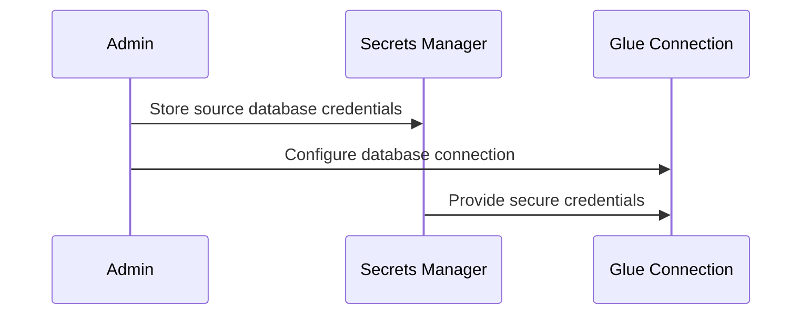

? What is the project name? test
? Describe your app in as much detail as possible. I want you to create a data warehouse. This data warehouse must centrailize all data from my company, so the system must periodically query my databases and load the data to the warehouse
Your project description seems a bit short. The better you can describe the project, the better GPT Pilot will understand what you'd like to build.

Here are some tips on how to better describe the project: https://github.com/Pythagora-io/gpt-pilot/wiki/How-to-write-a-good-initial-project-description


Let's start by refining your project idea:
? To accurately gather the requirements for your data warehouse project, let's break down your needs and objectives. I'll ask a series of questions to ensure we cover all necessary aspects.

**Question 1:**
Can you provide an overview of your company's data sources? Specifically, what types of databases or systems are we looking to integrate into the data warehouse? I want the system to read SQL databases hosted on a cloud provider
? To accurately capture your requirements for the data warehouse, I need to gather some essential information. Let's start with the first question:
 
1. Can you describe the main objectives and desired outcomes for your data warehouse? Specifically, what insights or functionalities do you hope to gain by centralizing your company’s data? I want to gather data to improve my internal processes
? To ensure I have a complete understanding of your requirements, let me ask you the first question:
 
1. Can you specify the types of SQL databases you are currently using (e.g., MySQL, PostgreSQL, SQL Server) and any specific cloud provider they're hosted on? This will help in understanding the data sources we need to integrate with. The system must be 
agnotic to database type and cloud provider 
? Can we proceed with this project description? If so, just press ENTER. Otherwise, please tell me what's missing or what you'd like to add. 
Planning project architecture...

Planning project end to end use cases...

**********************************************
Based on the provided client brief and project requirements, I'll design an AWS-based architecture using CDK with Python. The focus will be on creating a robust data warehouse solution that can periodically extract data from various SQL databases.

**1. High-Level Architecture Overview**

The architecture consists of the following CDK stacks:

- **Storage Stack**
- **ETL Stack**
- **Monitoring Stack**
- **Security Stack**
- **Networking Stack**

**Interactions:**
- The **ETL Stack** orchestrates data extraction and loading processes
- The **Storage Stack** manages the data warehouse and staging areas
- The **Security Stack** handles credentials and access management
- The **Monitoring Stack** tracks system health and job status
- The **Networking Stack** provides secure connectivity to source databases

**Justification:**
This architecture separates concerns while maintaining a cohesive data pipeline. It leverages AWS managed services to minimize operational overhead and provides scalability for growing data volumes.

**2. Detailed CDK Stack Descriptions**

**Storage Stack**

- **Purpose:** Manages the data warehouse and temporary storage
- **AWS Resources:**
  - **Amazon Redshift:** Primary data warehouse
  - **S3 Buckets:** Staging area for data loads
  - **Redshift Spectrum:** For querying data directly from S3
- **Interactions:**
  - Receives data from ETL processes
  - Provides query interface for analytics
- **Rationale:**
  - Redshift offers excellent performance for analytical queries
  - S3 provides cost-effective staging area

**ETL Stack**

- **Purpose:** Orchestrates data extraction and loading
- **AWS Resources:**
  - **AWS Glue:** ETL service and job orchestration
  - **AWS Lambda:** For lightweight transformations
  - **Step Functions:** Orchestrates complex ETL workflows
  - **EventBridge:** Schedules periodic data extractions
- **Interactions:**
  - Connects to source databases
  - Writes to Storage Stack
  - Reports status to Monitoring Stack
- **Rationale:**
  - Serverless architecture for cost-effectiveness
  - Built-in scheduling and error handling

**Monitoring Stack**

- **Purpose:** Tracks system health and ETL processes
- **AWS Resources:**
  - **CloudWatch:** Metrics and logging
  - **SNS:** Notifications for failures
  - **CloudWatch Dashboards:** Operational visibility
- **Interactions:**
  - Receives metrics from all other stacks
  - Sends alerts when issues occur
- **Rationale:**
  - Comprehensive monitoring solution
  - Real-time alerting capabilities

**Security Stack**

- **Purpose:** Manages access control and credentials
- **AWS Resources:**
  - **Secrets Manager:** Store database credentials
  - **IAM:** Role-based access control
  - **KMS:** Encryption key management
- **Interactions:**
  - Provides credentials to ETL Stack
  - Controls access to warehouse data
- **Rationale:**
  - Centralized security management
  - Secure credential storage

**Networking Stack**

- **Purpose:** Provides secure network connectivity
- **AWS Resources:**
  - **VPC:** Isolated network environment
  - **PrivateLink:** Secure database connectivity
  - **Transit Gateway:** For multi-account setup
- **Interactions:**
  - Enables secure access to source databases
  - Connects all components securely
- **Rationale:**
  - Secure and isolated network architecture
  - Flexible connectivity options

**3. Assumptions and Considerations**

**Assumptions:**
- Source databases are accessible via SQL interface
- Network connectivity to source databases is possible
- Data volume justifies a dedicated warehouse solution

**Constraints:**
- Must support multiple SQL database types
- Must be cloud provider agnostic for source databases
- Must handle periodic data extraction without impacting source systems

**Scalability and Security:**
- Architecture scales horizontally with data volume
- Security controls at network, application, and data levels
- Encryption at rest and in transit

**Key Features:**

1. **Data Extraction:**
   - Configurable schedules via EventBridge
   - Support for incremental loads
   - Connection pooling for database access

2. **Data Processing:**
   - Schema validation and transformation
   - Error handling and retry logic
   - Data quality checks

3. **Loading:**
   - Bulk loading capabilities
   - Transaction management
   - Data consistency checks

4. **Monitoring:**
   - Job status tracking
   - Performance metrics
   - Error alerting

This architecture provides a robust, scalable solution for centralizing data from various SQL databases into a unified warehouse, with strong security controls and comprehensive monitoring capabilities.
----------------------------------------------
I'll describe the main end-to-end workflows showing how data flows through the architecture.

**Main Workflows**

**1. Initial Data Source Configuration**


**2. Periodic Data Extraction Workflow**
```
EventBridge (Trigger) 
→ Step Functions (Orchestration)
  → Glue Job (Extract from source)
    → S3 (Raw data layer)
      → Glue Job (Transform)
        → Redshift (Load to warehouse)
          → CloudWatch (Log completion)
```

Detailed steps:

1. **Trigger (EventBridge)**
   - Scheduled event triggers Step Function
   - Can be configured for different frequencies per source
   - Passes source database identifier and parameters

2. **Orchestration (Step Functions)**
   - Initiates extraction workflow
   - Handles retry logic and error paths
   - Coordinates multiple Glue jobs
   - Tracks overall progress

3. **Extraction (Glue)**
   - Reads configuration from Secrets Manager
   - Establishes connection to source database
   - Executes optimized SQL queries
   - Implements incremental loading logic
   - Writes raw data to S3

4. **Staging (S3)**
   - Organizes data by source/date
   - Maintains partitioning structure
   - Serves as backup and audit trail
   - Enables data recovery if needed

5. **Transformation (Glue)**
   - Applies data quality rules
   - Performs necessary transformations
   - Standardizes data formats
   - Prepares for warehouse loading

6. **Loading (Redshift)**
   - Bulk loads transformed data
   - Maintains data consistency
   - Updates metadata tables
   - Manages historical data

7. **Monitoring (CloudWatch)**
   - Tracks job status
   - Records performance metrics
   - Triggers notifications if needed
   - Updates operational dashboards

**Example Scenarios**

**1. Daily Full Table Refresh**
```
7:00 AM - EventBridge triggers workflow
7:01 AM - Step Function starts orchestration
7:02 AM - Glue extracts data to S3
7:10 AM - Transformation job starts
7:15 AM - Data loaded to Redshift
7:16 AM - Success notification sent
```

**2. Incremental Load Based on Timestamp**
```
Every Hour:
:00 - EventBridge triggers
:01 - Check last successful timestamp
:02 - Extract only new/modified records
:05 - Transform delta data
:07 - Merge into warehouse tables
:08 - Update control tables
```

**3. Error Handling Scenario**
```
1. Source database unavailable
2. Step Function detects failure
3. Retry mechanism activated
4. After 3 failures:
   - Alert sent via SNS
   - Incident created
   - Workflow paused
```

**Data Organization**

1. **S3 Raw Layer**
```
s3://raw-data/
  ├── source1/
  │   ├── 2024/
  │   │   ├── 01/
  │   │   │   ├── 01/
  │   │   │   │   ├── table1_20240101_080000.parquet
  │   │   │   │   └── table2_20240101_080000.parquet
```

2. **Redshift Schema**
```sql
-- Control table
CREATE TABLE etl_control (
    source_name VARCHAR(100),
    table_name VARCHAR(100),
    last_successful_run TIMESTAMP,
    records_processed INT
);

-- Example warehouse table
CREATE TABLE fact_sales (
    source_system VARCHAR(50),
    load_timestamp TIMESTAMP,
    sale_id VARCHAR(100),
    -- business columns
);
```

**Monitoring and Alerting Setup**

1. **Operational Metrics**
   - Job duration
   - Records processed
   - Error counts
   - Storage usage
   - Query performance

2. **Alert Conditions**
   - Job failure
   - Data quality issues
   - Performance degradation
   - Storage thresholds
   - Latency spikes

**Security Controls**

1. **Network Level**
   - VPC endpoints for AWS services
   - Private subnets for processing
   - Security groups for access control

2. **Application Level**
   - IAM roles for service access
   - Encryption in transit
   - Secrets rotation

3. **Data Level**
   - Column-level encryption
   - Row-level security
   - Access logging

**Optimization Opportunities**

1. **Performance**
   - Parallel processing
   - Compression settings
   - Vacuum operations
   - Distribution keys

2. **Cost**
   - S3 lifecycle policies
   - Right-sized Redshift cluster
   - Spot instances for Glue
   - Reserved instances

This workflow ensures:
- Reliable data extraction
- Scalable processing
- Error handling
- Data quality
- Monitoring and alerting
- Security and compliance
- Cost optimization

The architecture can be extended to handle new sources by adding configurations without changing the core workflow.
**********************************************
Thank you for using Cloud Pilot!