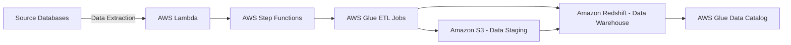
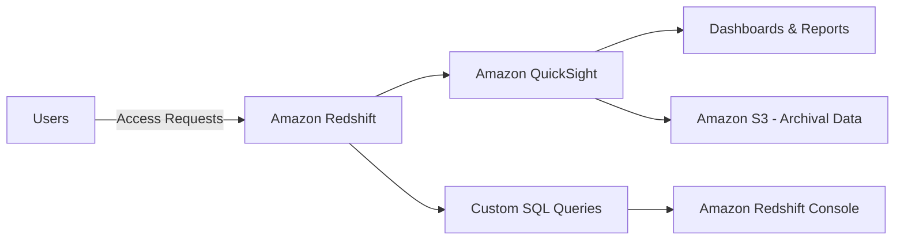
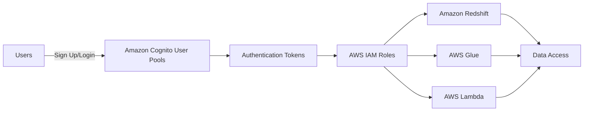
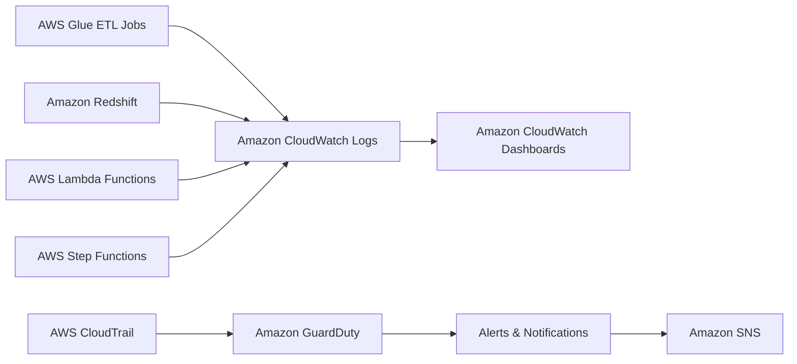
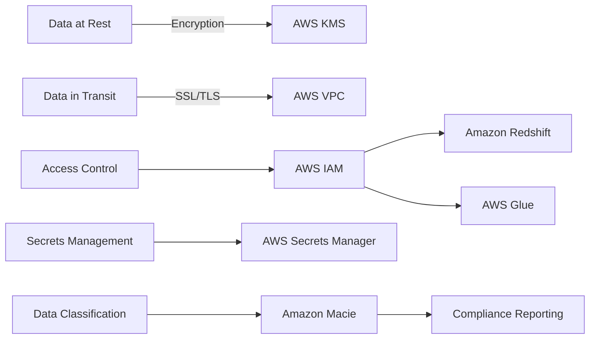
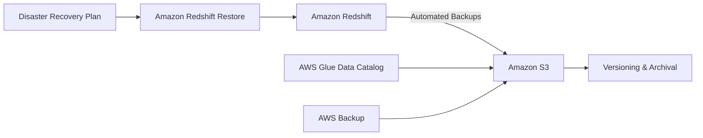

? What is the project name? test
? Describe your app in as much detail as possible.

**I want you to create a data warehouse. This data warehouse must centrailize all data from my company, so the system must periodically query my databases and load the data to the warehouse**

Your project description seems a bit short. The better you can describe the project, the better GPT Pilot will understand what you'd like to build.

Here are some tips on how to better describe the project: https://github.com/Pythagora-io/gpt-pilot/wiki/How-to-write-a-good-initial-project-description


Let's start by refining your project idea:

---

**Data Warehouse Centralization - Requirements Specification**

**1. Introduction**

The purpose of this document is to outline the requirements for developing a centralized data warehouse for the company. This data warehouse will aggregate and store data from various company databases, enabling unified data analysis and reporting. The system will periodically query existing databases to ensure the data warehouse remains up-to-date with the latest information.

**2. User Roles**

- **Data Analyst:**
  - Access and analyze data within the warehouse.
  - Create and manage reports and dashboards.
  
- **Database Administrator (DBA):**
  - Manage and maintain data sources and connections.
  - Monitor data extraction and loading processes.
  
- **System Administrator:**
  - Oversee the overall operation and security of the data warehouse.
  - Manage user permissions and access controls.
  
- **Executive/User:**
  - Access high-level reports and dashboards for decision-making.
  - Request specific data extracts or reports as needed.

**3. Functional Requirements**

**3.1 Data Centralization**

- **Data Source Integration:**
  - The system must connect to all existing company databases, including but not limited to SQL, NoSQL, and cloud-based databases.
  
- **Periodic Data Extraction:**
  - Implement a scheduling mechanism to query and extract data from source databases at defined intervals (e.g., hourly, daily).
  
- **Data Loading:**
  - Automate the loading of extracted data into the data warehouse.
  - Ensure data integrity and consistency during the transfer process.
  
- **Data Transformation:**
  - Perform necessary data transformations to ensure compatibility and standardization within the warehouse.
  - Handle data cleansing to remove duplicates, correct inconsistencies, and manage missing values.

**3.2 Data Storage and Management**

- **Schema Design:**
  - Develop a scalable and efficient schema that accommodates all data sources.
  - Utilize star or snowflake schema designs to optimize query performance.
  
- **Data Partitioning:**
  - Implement data partitioning strategies to enhance performance and manageability.
  
- **Indexing:**
  - Create appropriate indexes to speed up data retrieval and query execution.
  
- **Data Archival:**
  - Establish policies for archiving historical data to manage storage effectively.

**3.3 Data Accessibility and Reporting**

- **User Access:**
  - Provide role-based access to ensure users can only view data pertinent to their responsibilities.
  
- **Reporting Tools Integration:**
  - Integrate with popular reporting and visualization tools (e.g., Tableau, Power BI) to facilitate data analysis.
  
- **Custom Queries:**
  - Allow authorized users to execute custom SQL queries against the data warehouse.
  
- **Automated Reporting:**
  - Enable scheduling and distribution of regular reports to designated stakeholders.

**3.4 Monitoring and Maintenance**

- **System Monitoring:**
  - Implement monitoring tools to track the health and performance of the data warehouse.
  
- **Error Handling:**
  - Establish protocols for detecting, logging, and addressing errors during data extraction, transformation, and loading processes.
  
- **Performance Optimization:**
  - Continuously assess and optimize system performance to ensure efficient data processing and retrieval.

**3.5 Security and Compliance**

- **Data Encryption:**
  - Ensure data is encrypted both in transit and at rest to protect sensitive information.
  
- **User Authentication:**
  - Implement robust authentication mechanisms, such as multi-factor authentication (MFA), to secure user access.
  
- **Access Controls:**
  - Define and enforce granular access permissions based on user roles.
  
- **Compliance:**
  - Ensure the data warehouse adheres to relevant data protection regulations (e.g., GDPR, HIPAA).

**3.6 Backup and Recovery**

- **Regular Backups:**
  - Schedule automated backups of the data warehouse to prevent data loss.
  
- **Disaster Recovery Plan:**
  - Develop and document a disaster recovery plan to restore data and services in the event of system failures.

**4. User Interface Requirements**

- **Dashboard Interface:**
  - Provide a user-friendly dashboard for monitoring data warehouse status, including data loading schedules, system performance metrics, and error logs.
  
- **Reporting Interface:**
  - Offer intuitive interfaces for generating, customizing, and viewing reports.
  
- **Administrative Interface:**
  - Develop interfaces for system administrators and DBAs to manage data sources, user roles, and system settings.
  
- **Notification System:**
  - Implement alerts and notifications for important events, such as failed data loads, system errors, or completed tasks.

**5. Non-Functional Requirements**

- **Performance:**
  - Ensure the data warehouse can handle large volumes of data with minimal latency.
  
- **Scalability:**
  - Design the system to accommodate future growth in data volume and user base without significant performance degradation.
  
- **Reliability:**
  - Achieve high system uptime to ensure continuous data availability.
  
- **Usability:**
  - Create an intuitive and easy-to-navigate user interface to facilitate user adoption and efficiency.
  
- **Maintainability:**
  - Structure the system to allow for easy updates, enhancements, and maintenance tasks.

**6. Assumptions**

- All source databases are accessible and have the necessary APIs or connectors to facilitate data extraction.
- Data formats across source systems can be standardized or transformed to fit the data warehouse schema.
- Users requiring access to the data warehouse possess the necessary hardware and software to interact with the system.
- The company has allocated sufficient resources and budget for the development, deployment, and maintenance of the data warehouse.

**7. Constraints**

- **Development Timeline:**
  - The project must be completed within a timeframe that aligns with the company's strategic goals.
  
- **Budget Limitations:**
  - Development and maintenance costs must remain within the allocated budget.
  
- **Data Privacy Regulations:**
  - Must comply with all relevant data privacy and protection laws, limiting certain data handling practices.
  
- **Integration Limitations:**
  - Potential restrictions in integrating with legacy systems or databases that lack modern APIs or connectors.

---

This requirements specification provides a comprehensive overview of the necessary functionalities and considerations for developing a centralized data warehouse tailored to the company's needs. It ensures that all critical aspects, from data integration and storage to security and user accessibility, are addressed to facilitate effective data management and utilization.
Does this sound good, and does it capture all the information about your project?

? Can we proceed with this project description? If so, just press ENTER. Otherwise, please tell me what's missing or what you'd like to add. 
Planning project architecture...

Planning project end to end use cases...

Generating use cases mermaid diagrams...

Generating architecture mermaid diagram...

Generating the action plan for development...


## Architecture

---

**1. High-Level Architecture Overview**

The proposed architecture establishes a centralized data warehouse on AWS, designed to aggregate and store data from various company databases. The system automates periodic data extraction, transformation, and loading (ETL) processes to maintain an up-to-date and unified data repository for comprehensive data analysis and reporting.

**CDK Stacks List:**

- **Networking Stack**
- **Data Storage Stack**
- **Data Integration Stack**
- **Security Stack**
- **Monitoring and Logging Stack**

**Interactions:**

- The **Networking Stack** provides the foundational VPC and networking resources utilized by all other stacks.
- The **Data Storage Stack** hosts the centralized data warehouse, storing processed and integrated data.
- The **Data Integration Stack** manages the ETL processes, periodically extracting data from source databases and loading it into the data warehouse.
- The **Security Stack** defines access controls, encryption, and compliance measures, ensuring data protection across all components.
- The **Monitoring and Logging Stack** oversees the system’s health, performance, and logs, enabling proactive maintenance and issue resolution.

**Justification:**

This architecture leverages AWS managed services to ensure scalability, reliability, and security while minimizing operational overhead. Logical separation into CDK stacks facilitates modular development, enabling independent management and deployment of each component. Utilizing AWS services like AWS Glue and Amazon Redshift ensures efficient data processing and storage, aligning with the project’s requirement to centralize and maintain up-to-date data.

---

**2. Detailed CDK Stack Descriptions**

### **Networking Stack**

- **Purpose:**
  - Establishes the network infrastructure required for all data warehouse components.

- **AWS Resources:**
  - **Amazon VPC:** Provides an isolated network environment.
  - **Public and Private Subnets:** Segregates resources for enhanced security.
  - **Internet Gateway:** Enables internet access for public subnets.
  - **NAT Gateways:** Allows private subnets to access the internet securely.
  - **Route Tables:** Manages traffic routing within the VPC.
  - **Security Groups and Network ACLs:** Controls inbound and outbound traffic to AWS resources.

- **Interactions:**
  - All other stacks deploy resources within the VPC created by the Networking Stack.
  - ETL processes and data warehouse communicate securely within the network boundaries.

- **Rationale:**
  - A dedicated networking stack centralizes the network configuration, promoting consistency and security across all components. Utilizing VPC ensures data isolation and protection from external threats.

### **Data Storage Stack**

- **Purpose:**
  - Provides the centralized data warehouse for storing aggregated company data.

- **AWS Resources:**
  - **Amazon Redshift Cluster:** Serves as the primary data warehouse solution.
  - **Amazon S3 Buckets:** Used for data staging and archival.
  - **Amazon Redshift Spectrum:** Enables querying data directly from S3.
  - **AWS Glue Data Catalog:** Maintains metadata for data stored in Redshift and S3.

- **Interactions:**
  - Receives transformed data from the Data Integration Stack.
  - Interfaces with reporting and analysis tools for data access.

- **Rationale:**
  - Amazon Redshift offers high-performance data warehousing capabilities, scalable storage, and seamless integration with AWS data services, meeting the need for a robust and centralized data repository.

### **Data Integration Stack**

- **Purpose:**
  - Manages the ETL processes required to extract data from source databases, transform it, and load it into the data warehouse.

- **AWS Resources:**
  - **AWS Glue ETL Jobs:** Automates data extraction, transformation, and loading.
  - **AWS Lambda Functions:** Orchestrates and schedules ETL workflows.
  - **AWS Step Functions:** Coordinates complex ETL pipelines.
  - **AWS Glue Crawlers:** Discovers and catalogs data schemas from source databases.
  - **Amazon RDS Data Sources:** Connectors for various source databases.

- **Interactions:**
  - Connects to source databases to extract data periodically.
  - Loads processed data into the Amazon Redshift cluster within the Data Storage Stack.
  - Utilizes the Networking Stack’s VPC for secure data transfer.

- **Rationale:**
  - AWS Glue provides a scalable and managed ETL service, reducing the need for custom data pipeline development. Integration with Lambda and Step Functions enables flexible and automated ETL workflows, aligning with the requirement for periodic data loading.

### **Security Stack**

- **Purpose:**
  - Ensures the security and compliance of the data warehouse environment.

- **AWS Resources:**
  - **AWS Identity and Access Management (IAM):** Manages user permissions and roles.
  - **AWS Key Management Service (KMS):** Handles encryption keys for data encryption.
  - **AWS Secrets Manager:** Stores and manages database credentials securely.
  - **AWS Shield and AWS WAF:** Protects against DDoS attacks and web exploits.
  - **Amazon Macie:** Discovers, classifies, and protects sensitive data.
  - **AWS Config:** Monitors and records AWS resource configurations for compliance.

- **Interactions:**
  - Applied across all stacks to control access and secure data flows.
  - Integrates with the Data Integration and Data Storage stacks to enforce encryption and access policies.

- **Rationale:**
  - Leveraging AWS security services provides comprehensive protection, ensuring data confidentiality, integrity, and compliance with regulatory standards. Centralizing security in a dedicated stack enforces consistent security practices across the architecture.

### **Monitoring and Logging Stack**

- **Purpose:**
  - Monitors the performance, health, and security of the data warehouse system, providing visibility and insights through logging and alerting.

- **AWS Resources:**
  - **Amazon CloudWatch:** Collects and tracks metrics, logs, and events.
  - **AWS CloudTrail:** Logs and monitors account activity and API usage.
  - **Amazon GuardDuty:** Threat detection and continuous security monitoring.
  - **AWS Lambda Functions:** Processes and responds to monitoring events.
  - **Amazon SNS (Simple Notification Service):** Sends alerts and notifications to stakeholders.

- **Interactions:**
  - Monitors resources within all other stacks, collecting metrics and logs.
  - Triggers alerts and automated responses based on predefined thresholds and events.

- **Rationale:**
  - Comprehensive monitoring and logging are essential for maintaining system reliability, performance, and security. Using AWS’ native monitoring tools ensures seamless integration and real-time insights into system operations.

---

**3. Assumptions and Considerations**

- **Assumptions:**
  - All source databases support connections via AWS Glue and have compatible APIs or connectors for data extraction.
  - Data formats across source systems can be standardized or transformed to align with the data warehouse schema.
  - Sufficient budget and resources are allocated for AWS services usage, data storage, and ongoing maintenance.
  - Users accessing the data warehouse possess the necessary tools and knowledge to interact with AWS-powered data services.

- **Constraints:**
  - **Compliance:** Must adhere to data privacy regulations (e.g., GDPR, HIPAA), necessitating strict data handling and storage practices.
  - **Integration Limitations:** Legacy systems may present challenges if they lack modern APIs or data extraction capabilities.
  - **Budget and Timeline:** Development must align with the company’s strategic goals and budgetary limitations.
  - **Data Transfer Rates:** Network bandwidth and AWS service quotas may impact data transfer speeds and volumes.

- **Scalability and Security:**
  - **Scalability:**
    - The architecture leverages scalable AWS services like Amazon Redshift and AWS Glue, ensuring the system can accommodate increasing data volumes and user demands without performance degradation.
    - Utilization of serverless components (e.g., AWS Lambda, AWS Glue) allows automatic scaling based on workload.
  - **Security:**
    - Implements multi-layered security through VPC isolation, encryption in transit and at rest, IAM roles and policies, and continuous monitoring.
    - Regular security audits and compliance checks are enforced via AWS Config and Amazon Macie to maintain adherence to regulatory standards.

---

This architectural design ensures a robust, secure, and scalable data warehouse solution tailored to centralize and manage the company's diverse data sources effectively. By leveraging AWS managed services and structuring the infrastructure into logical CDK stacks, the system promotes maintainability, flexibility, and efficient resource management.

## End to end use cases

---

**4. Interaction of Main Use Cases with AWS Services**

This section outlines how the primary use cases of the centralized data warehouse interact with the defined AWS services. It details the data flow, handling processes, and the end-to-end workflow to ensure seamless data centralization, accessibility, and management.

### **4.1 Main Use Cases Overview**

1. **Data Extraction from Source Databases**
2. **Data Transformation and Cleansing**
3. **Data Loading into the Data Warehouse**
4. **Data Access and Reporting**
5. **Security and Compliance Management**
6. **System Monitoring and Maintenance**

### **4.2 Use Case Interactions with AWS Services**

#### **4.2.1 Data Extraction from Source Databases**

- **Actors:**
  - Database Administrator (DBA)
  - AWS Glue ETL Jobs

- **Workflow:**
  1. **Initiation:**
     - AWS Lambda Functions trigger AWS Glue ETL jobs based on a predefined schedule (e.g., hourly, daily).
  2. **Connection:**
     - AWS Glue connects to various source databases (e.g., Amazon RDS, on-premises SQL/NoSQL databases) using established connectors.
  3. **Data Retrieval:**
     - AWS Glue Crawlers discover and catalog the data schemas from source databases.
     - ETL jobs extract the required data fields from each source.

- **AWS Services Involved:**
  - **AWS Glue Crawlers**
  - **AWS Glue ETL Jobs**
  - **AWS Lambda**
  - **Amazon RDS** (as a data source)

- **Data Handling:**
  - Data is securely extracted from source databases and temporarily stored in Amazon S3 for processing.
  - Sensitive data is encrypted during transit using AWS KMS-managed keys.

#### **4.2.2 Data Transformation and Cleansing**

- **Actors:**
  - Data Engineer
  - AWS Glue ETL Jobs

- **Workflow:**
  1. **Transformation:**
     - AWS Glue ETL jobs perform data transformations to standardize formats, normalize data, and apply business rules.
  2. **Cleansing:**
     - Data cleansing operations remove duplicates, correct inconsistencies, and handle missing values.
  3. **Metadata Management:**
     - Transformed data schemas are updated in the AWS Glue Data Catalog for reference.

- **AWS Services Involved:**
  - **AWS Glue ETL Jobs**
  - **AWS Glue Data Catalog**
  - **Amazon S3** (for staging transformed data)

- **Data Handling:**
  - Transformed and cleansed data is validated for integrity and consistency before loading.
  - Logs of transformation processes are stored in Amazon CloudWatch for auditing and troubleshooting.

#### **4.2.3 Data Loading into the Data Warehouse**

- **Actors:**
  - Data Analyst
  - AWS Glue ETL Jobs
  - AWS Lambda

- **Workflow:**
  1. **Loading:**
     - AWS Glue ETL jobs load the processed data from Amazon S3 into the Amazon Redshift cluster.
  2. **Validation:**
     - Post-loading validation ensures data accuracy and completeness in the data warehouse.
  3. **Optimization:**
     - Data is partitioned and indexed in Amazon Redshift to optimize query performance.

- **AWS Services Involved:**
  - **Amazon Redshift**
  - **Amazon S3**
  - **AWS Glue ETL Jobs**
  - **AWS Lambda**

- **Data Handling:**
  - Data is ingested into Amazon Redshift using the COPY command from Amazon S3, ensuring high-speed data loading.
  - Automatic backups and snapshots are configured to safeguard data integrity.

#### **4.2.4 Data Access and Reporting**

- **Actors:**
  - Data Analyst
  - Executive/User
  - Reporting Tools (e.g., Tableau, Power BI)

- **Workflow:**
  1. **Access:**
     - Authorized users access the data warehouse through secure connections using IAM roles and policies.
  2. **Reporting:**
     - Users utilize integrated reporting tools connected to Amazon Redshift for data visualization and analysis.
  3. **Custom Queries:**
     - Authorized users execute custom SQL queries against the data warehouse for specific data retrieval needs.

- **AWS Services Involved:**
  - **Amazon Redshift**
  - **AWS IAM**
  - **Amazon QuickSight** (optional for AWS-native reporting)
  - **AWS Glue Data Catalog** (for metadata reference)

- **Data Handling:**
  - Query results are delivered in real-time, leveraging Amazon Redshift’s optimized performance.
  - Role-based access controls ensure users can only access data pertinent to their roles.

#### **4.2.5 Security and Compliance Management**

- **Actors:**
  - System Administrator
  - Compliance Officer

- **Workflow:**
  1. **Authentication and Authorization:**
     - Users authenticate via AWS IAM and are authorized based on predefined roles.
  2. **Encryption:**
     - Data is encrypted at rest using AWS KMS and in transit using SSL/TLS protocols.
  3. **Compliance Auditing:**
     - AWS Config continuously monitors resource configurations for compliance with standards like GDPR and HIPAA.
  4. **Data Protection:**
     - Amazon Macie identifies and protects sensitive data stored in Amazon S3 and Amazon Redshift.

- **AWS Services Involved:**
  - **AWS IAM**
  - **AWS KMS**
  - **AWS Config**
  - **Amazon Macie**
  - **AWS Secrets Manager**

- **Data Handling:**
  - Strict access controls and encryption ensure data confidentiality and integrity.
  - Regular audits and automated compliance checks maintain adherence to regulatory requirements.

#### **4.2.6 System Monitoring and Maintenance**

- **Actors:**
  - System Administrator
  - DBA
  - Data Engineer

- **Workflow:**
  1. **Monitoring:**
     - Amazon CloudWatch monitors system metrics, performance, and health of AWS resources.
  2. **Logging:**
     - AWS CloudTrail records all API calls and user activities for audit purposes.
  3. **Alerting:**
     - Amazon GuardDuty detects potential security threats and anomalous behavior, triggering alerts via Amazon SNS.
  4. **Automated Responses:**
     - AWS Lambda functions execute automated remediation tasks in response to specific alerts or thresholds.

- **AWS Services Involved:**
  - **Amazon CloudWatch**
  - **AWS CloudTrail**
  - **Amazon GuardDuty**
  - **AWS Lambda**
  - **Amazon SNS**

- **Data Handling:**
  - Continuous monitoring ensures system reliability and facilitates proactive issue resolution.
  - Logs and metrics are stored securely for historical analysis and compliance reporting.

### **4.3 End-to-End Workflow: Data Handling and Processing**

1. **Data Extraction:**
   - **Trigger:** Scheduled AWS Lambda functions initiate AWS Glue ETL jobs based on predefined intervals.
   - **Process:** AWS Glue Crawlers discover and catalog data schemas; ETL jobs extract raw data from source databases into Amazon S3.

2. **Data Transformation and Cleansing:**
   - **Process:** AWS Glue ETL jobs transform and cleanse the extracted data, standardizing formats and applying business rules.
   - **Storage:** Transformed data is stored in Amazon S3 and cataloged in the AWS Glue Data Catalog.

3. **Data Loading:**
   - **Process:** AWS Glue ETL jobs load the processed data from Amazon S3 into the Amazon Redshift data warehouse.
   - **Validation:** Post-loading checks ensure data integrity and completeness.

4. **Data Access and Reporting:**
   - **Access:** Authorized users connect to Amazon Redshift using IAM roles and execute queries or utilize reporting tools.
   - **Reporting:** Data analysts create dashboards and reports using integrated BI tools like Tableau or Amazon QuickSight.

5. **Security and Compliance:**
   - **Measures:** Continuous encryption, access controls, and compliance monitoring safeguard data integrity and regulatory adherence.
   - **Auditing:** AWS Config and Amazon Macie provide ongoing compliance auditing and data protection.

6. **Monitoring and Maintenance:**
   - **Monitoring:** Amazon CloudWatch and AWS GuardDuty continuously monitor system health and security.
   - **Alerting:** Alerts are sent via Amazon SNS for any anomalies or issues, triggering automated responses when necessary.

### **4.4 Next Steps in the End-to-End Workflow**

1. **Data Validation and Quality Assurance:**
   - Implement automated data validation rules within AWS Glue ETL jobs to ensure data accuracy before loading.
   - Establish data quality dashboards using Amazon QuickSight to monitor ongoing data integrity.

2. **Optimization of ETL Processes:**
   - Schedule incremental data loads to reduce processing time and resource utilization.
   - Utilize Amazon Redshift’s advanced features like concurrency scaling and workload management to enhance performance.

3. **Enhancement of Reporting Capabilities:**
   - Integrate additional BI tools or develop custom dashboards to cater to diverse reporting needs.
   - Implement role-based dashboard views to provide tailored insights for different user roles.

4. **Automation of Security Compliance Checks:**
   - Define and automate compliance rules in AWS Config to ensure continuous adherence to regulations.
   - Set up automated responses to security threats detected by Amazon GuardDuty using AWS Lambda.

5. **Scalability Planning:**
   - Monitor data growth trends and plan for Amazon Redshift cluster resizing or distribution to maintain performance.
   - Explore partitioning strategies and compression techniques to optimize storage and query efficiency.

6. **User Training and Documentation:**
   - Develop comprehensive documentation and training materials for users interacting with the data warehouse and reporting tools.
   - Conduct training sessions to ensure users are proficient in accessing and utilizing the data warehouse effectively.

7. **Continuous Improvement and Feedback Loop:**
   - Establish a feedback mechanism for users to report issues or suggest enhancements.
   - Regularly review system performance and user feedback to implement iterative improvements.

---

This comprehensive interaction model ensures that each main use case seamlessly integrates with the AWS services defined in the architecture. By outlining the data handling processes and the sequential workflow steps, the data warehouse system is positioned to deliver reliable, secure, and efficient data centralization and accessibility for the company's analytical needs.

## Use case diagrams

---

**Use Case: Data Extraction and Loading (ETL)**



---

**Use Case: Data Querying and Reporting**



---

**Use Case: User Authentication and Access Management**



---

**Use Case: Monitoring and Logging**



---

**Use Case: Security Enforcement and Compliance**



---

**Use Case: Backup and Recovery**



---

## Architecture diagram

```mermaid
graph TD
    %% User Interactions
    User((User))
    Admin((Admin))

    %% Networking Stack
    subgraph Networking_Stack
        VPC[VPC]
        Public_Subnets[Public Subnets]
        Private_Subnets[Private Subnets]
        Internet_Gateway[Internet Gateway]
        NAT_Gateway[NAT Gateway]
        Route_Table_Public[Route Table - Public]
        Route_Table_Private[Route Table - Private]
    end

    %% Authentication Stack
    subgraph Authentication_Stack
        Cognito[Cognito User Pool]
        Cognito_Identity[Cognito Identity Pool]
    end

    %% Application Stack
    subgraph Application_Stack
        APIGateway[API Gateway]
        Lambda_Function[Lambda Functions]
        AppLoadBalancer[Application Load Balancer]
    end

    %% Database Stack
    subgraph Database_Stack
        RDS[(Amazon RDS)]
        DynamoDB[(Amazon DynamoDB)]
    end

    %% Storage Stack
    subgraph Storage_Stack
        S3[Amazon S3]
    end

    %% Notification Stack
    subgraph Notification_Stack
        SNS[Amazon SNS]
        SQS[Amazon SQS]
    end

    %% Search Stack
    subgraph Search_Stack
        OpenSearch[(Amazon OpenSearch Service)]
    end

    %% Content Delivery Stack
    subgraph Content_Delivery_Stack
        CloudFront[Amazon CloudFront]
    end

    %% Security Components
    subgraph Security
        IAM[IAM Roles & Policies]
        KMS[AWS KMS]
        Security_Groups[Security Groups]
    end

    %% Monitoring and Logging Stack
    subgraph Monitoring_and_Logging
        CloudWatch[Amazon CloudWatch]
        CloudTrail[Amazon CloudTrail]
    end

    %% Interactions
    User -->|Access via| CloudFront
    CloudFront --> APIGateway
    Admin --> AppLoadBalancer
    AppLoadBalancer --> APIGateway
    APIGateway --> Lambda_Function
    Lambda_Function --> RDS
    Lambda_Function --> DynamoDB
    Lambda_Function --> S3
    Lambda_Function --> SNS
    SNS --> SQS
    Lambda_Function --> OpenSearch
    Cognito --> APIGateway
    Cognito --> Lambda_Function
    APIGateway --> CloudWatch
    Lambda_Function --> CloudWatch
    RDS --> CloudWatch
    DynamoDB --> CloudWatch
    S3 --> CloudWatch
    OpenSearch --> CloudWatch
    SNS --> CloudWatch
    SQS --> CloudWatch
    CloudTrail --> CloudWatch

    %% Security Interactions
    IAM --> Lambda_Function
    IAM --> APIGateway
    IAM --> RDS
    IAM --> DynamoDB
    IAM --> S3
    IAM --> SNS
    IAM --> SQS
    IAM --> OpenSearch
    KMS --> S3
    KMS --> RDS
    KMS --> DynamoDB
    Security_Groups --> VPC
    Security_Groups --> APIGateway
    Security_Groups --> AppLoadBalancer
    Security_Groups --> RDS
    Security_Groups --> DynamoDB
    Security_Groups --> S3
    Security_Groups --> OpenSearch

    %% VPC Configuration
    VPC --> Public_Subnets
    VPC --> Private_Subnets
    Internet_Gateway --> VPC
    NAT_Gateway --> Private_Subnets
    Route_Table_Public --> Public_Subnets
    Route_Table_Private --> Private_Subnets
    APIGateway -->|Deployed in| Public_Subnets
    AppLoadBalancer -->|Deployed in| Public_Subnets
    Lambda_Function -->|Runs in| Private_Subnets
    RDS -->|Hosted in| Private_Subnets
    DynamoDB -->|Managed Service| 
    S3 -->|Managed Service| 
    OpenSearch -->|Deployed in| Private_Subnets
    CloudFront -->|Edge Locations| 

    %% Optional Components
    style OpenSearch fill:#f9f,stroke:#333,stroke-width:2px
    style Cognito fill:#bbf,stroke:#333,stroke-width:2px
    style RDS fill:#ff9,stroke:#333,stroke-width:2px
    style DynamoDB fill:#ff9,stroke:#333,stroke-width:2px
    style S3 fill:#fcf,stroke:#333,stroke-width:2px
    style SNS fill:#cff,stroke:#333,stroke-width:2px
    style SQS fill:#cff,stroke:#333,stroke-width:2px
    style CloudFront fill:#ccf,stroke:#333,stroke-width:2px
    style API Gateway fill:#cfc,stroke:#333,stroke-width:2px
    style Lambda_Function fill:#cfc,stroke:#333,stroke-width:2px
```

## Development Plan
---

**Development Plan for AWS CDK Data Warehouse Application**

---

### **1. Networking Stack**

#### **Task 1: Create the VPC Configuration**
- **Description:**
  - In the `networking_stack.py` file, define a new CDK stack class named `NetworkingStack`.
  - Within this stack, create an Amazon VPC with the following specifications:
    - CIDR Block: `10.0.0.0/16`
    - Maximum Availability Zones: 3
    - Include public and private subnets distributed across the availability zones.
    - Enable DNS hostnames and DNS support.
  - Add necessary tags to the VPC for easy identification.
  - Ensure the VPC is exported for use by other stacks.
- **Outcome:**
  - A fully configured VPC with segregated public and private subnets, ready to host other AWS resources securely.

#### **Task 2: Set Up Subnets and Routing**
- **Description:**
  - Within the `NetworkingStack`, define separate public and private subnets in each availability zone of the VPC.
  - Configure route tables for both public and private subnets:
    - Public Subnets: Associate with an Internet Gateway to allow inbound and outbound internet traffic.
    - Private Subnets: Associate with NAT Gateways to enable outbound internet access while restricting inbound access.
  - Deploy NAT Gateways in each public subnet to ensure high availability.
  - Apply appropriate route table associations to subnets.
- **Outcome:**
  - Properly routed public and private subnets within the VPC, ensuring secure and efficient network traffic management.

#### **Task 3: Configure Security Groups and Network ACLs**
- **Description:**
  - In the `NetworkingStack`, create Security Groups to control inbound and outbound traffic for different resources:
    - **Data Warehouse Security Group:**
      - Allow inbound traffic on the Redshift port (default 5439) from the Data Integration Stack.
      - Allow outbound traffic to the internet via NAT Gateways.
    - **ETL Security Group:**
      - Allow inbound traffic from the Data Storage Stack and necessary ports for data extraction.
      - Allow outbound traffic to the Data Storage Stack.
  - Define Network ACLs to provide an additional layer of security:
    - Restrict unauthorized access by allowing only necessary protocols and ports.
    - Implement rules to deny all other traffic by default.
- **Outcome:**
  - Enhanced security for the network infrastructure with controlled access between different AWS resources.

---

### **2. Data Storage Stack**

#### **Task 1: Provision Amazon Redshift Cluster**
- **Description:**
  - In the `data_storage_stack.py` file, define a new CDK stack class named `DataStorageStack`.
  - Within this stack, create an Amazon Redshift cluster with the following specifications:
    - Node Type: `dc2.large`
    - Number of Nodes: 2
    - Cluster Identifier: `company-data-warehouse`
    - Database Name: `datawarehouse`
    - Master Username and Password: Securely retrieve from AWS Secrets Manager.
    - VPC: Import the VPC from the Networking Stack.
    - Subnets: Deploy Redshift in private subnets.
    - Security Groups: Associate with the Data Warehouse Security Group defined in the Networking Stack.
    - Enable encrypted storage using AWS KMS-managed keys.
  - Configure automatic backups with a retention period of 7 days.
- **Outcome:**
  - A secure and scalable Amazon Redshift cluster ready to serve as the centralized data warehouse.

#### **Task 2: Create Amazon S3 Buckets for Data Staging and Archival**
- **Description:**
  - Within the `DataStorageStack`, create two Amazon S3 buckets:
    - **Data Staging Bucket:**
      - Bucket Name: `company-data-staging`
      - Enable versioning to keep track of data changes.
      - Apply lifecycle policies to transition objects to Glacier after 30 days.
      - Configure appropriate bucket policies to allow access from the Data Integration Stack.
    - **Data Archival Bucket:**
      - Bucket Name: `company-data-archival`
      - Enable versioning for data retention.
      - Apply lifecycle policies to delete objects after 365 days.
      - Ensure encryption is enabled for all objects at rest using AWS KMS.
- **Outcome:**
  - Two S3 buckets configured for efficient data staging and archival, supporting the ETL processes.

#### **Task 3: Set Up AWS Glue Data Catalog**
- **Description:**
  - In the `DataStorageStack`, create an AWS Glue Data Catalog database named `company_data_catalog`.
  - Configure necessary IAM roles and permissions to allow AWS Glue to access Amazon S3 and Amazon Redshift.
  - Enable integration between Amazon Redshift and AWS Glue Data Catalog to facilitate metadata management.
- **Outcome:**
  - A centralized metadata repository for all data stored in Amazon Redshift and Amazon S3, enabling efficient data discovery and management.

---

### **3. Data Integration Stack**

#### **Task 1: Define AWS Glue ETL Jobs for Data Extraction**
- **Description:**
  - In the `data_integration_stack.py` file, define a new CDK stack class named `DataIntegrationStack`.
  - Create AWS Glue ETL jobs for each source database (e.g., SQL, NoSQL) with the following configurations:
    - Job Name: `extract-data-from-{source}`
    - Role: Attach an IAM role with permissions to read from source databases, write to S3, and access the Glue Data Catalog.
    - Script Location: Store ETL scripts in the Data Staging S3 bucket.
    - Connections: Configure connections to each source database using AWS Glue connectors.
    - Schedule: Set up scheduled triggers to run the ETL jobs at defined intervals (e.g., hourly, daily).
- **Outcome:**
  - Automated AWS Glue ETL jobs capable of extracting data from various source databases and loading it into the staging S3 bucket on a scheduled basis.

#### **Task 2: Implement AWS Lambda Functions for ETL Workflow Orchestration**
- **Description:**
  - Within the `DataIntegrationStack`, create AWS Lambda functions to orchestrate the ETL workflows:
    - **Trigger Function:**
      - Name: `trigger_etl_jobs`
      - Purpose: Initiate AWS Glue ETL jobs based on the defined schedule.
      - Configure triggers using Amazon CloudWatch Events (now Amazon EventBridge) to invoke the function at specified intervals.
      - Ensure the Lambda function has necessary permissions to start Glue ETL jobs.
    - **Post-Processing Function:**
      - Name: `post_processing_tasks`
      - Purpose: Perform post-ETL tasks such as data validation and notifications.
      - Configure to be invoked upon successful completion of Glue ETL jobs using AWS Step Functions.
- **Outcome:**
  - Lambda functions that effectively manage the initiation and post-processing of ETL workflows, ensuring seamless data integration.

#### **Task 3: Set Up AWS Step Functions for Coordinating Complex ETL Pipelines**
- **Description:**
  - In the `DataIntegrationStack`, define AWS Step Functions state machines to manage complex ETL workflows:
    - **ETL Workflow State Machine:**
      - Define states for initiating Glue ETL jobs, waiting for job completion, handling success/failure, and invoking post-processing Lambda functions.
      - Configure retry and error handling mechanisms to manage job failures gracefully.
      - Integrate with Amazon CloudWatch for monitoring state machine executions.
  - Ensure the state machine has necessary IAM permissions to interact with AWS Glue and AWS Lambda.
- **Outcome:**
  - A robust state machine that coordinates the entire ETL process, managing dependencies and error handling effectively.

#### **Task 4: Configure AWS Glue Crawlers for Schema Discovery**
- **Description:**
  - Within the `DataIntegrationStack`, create AWS Glue Crawlers to automatically discover and catalog data schemas:
    - **Crawler for Source Databases:**
      - Name: `source_db_crawler`
      - Configure to crawl data stored in the staging S3 bucket.
      - Schedule: Run immediately after data extraction ETL jobs complete.
      - Output: Update the AWS Glue Data Catalog with the latest schemas.
    - **Crawler for Transformed Data:**
      - Name: `transformed_data_crawler`
      - Configure to crawl data prepared for loading into Amazon Redshift.
      - Schedule: Run after data transformation and cleansing steps.
      - Output: Maintain up-to-date metadata in the Glue Data Catalog.
  - Assign appropriate IAM roles to allow Glue Crawlers to access necessary S3 buckets.
- **Outcome:**
  - Automated schema discovery and cataloging, ensuring the data warehouse remains synchronized with the latest data structures from source databases.

---

### **4. Security Stack**

#### **Task 1: Set Up AWS Identity and Access Management (IAM) Roles and Policies**
- **Description:**
  - In the `security_stack.py` file, define a new CDK stack class named `SecurityStack`.
  - Create IAM roles for various AWS services with least privilege access:
    - **Glue Service Role:**
      - Permissions: Access to source databases, S3 buckets, and Glue Data Catalog.
    - **Lambda Execution Role:**
      - Permissions: Invoke Glue ETL jobs, access S3, and interact with Step Functions.
    - **Redshift Access Role:**
      - Permissions: Read/write access to Amazon Redshift and S3 for data loading.
  - Define and attach inline policies to these roles specifying exact permissions required.
- **Outcome:**
  - Secure and compliant IAM roles ensuring that each AWS service operates with the minimum necessary permissions.

#### **Task 2: Configure AWS Key Management Service (KMS) for Data Encryption**
- **Description:**
  - Within the `SecurityStack`, create a KMS key for encrypting data at rest:
    - **KMS Key:**
      - Alias: `data-warehouse-key`
      - Key Policy: Define permissions for IAM roles to use the key for encryption and decryption.
      - Enable key rotation annually for enhanced security.
  - Apply the KMS key to encrypt:
    - Amazon Redshift Cluster.
    - Amazon S3 Buckets (`company-data-staging` and `company-data-archival`).
    - AWS Glue Data Catalog.
  - Ensure all data transfers are encrypted in transit using SSL/TLS protocols.
- **Outcome:**
  - Comprehensive encryption setup protecting data both at rest and in transit, complying with security best practices and regulatory requirements.

#### **Task 3: Implement AWS Secrets Manager for Secure Credential Storage**
- **Description:**
  - In the `SecurityStack`, create Secrets Manager secrets to store sensitive information such as database credentials:
    - **Redshift Credentials Secret:**
      - Name: `redshift/credentials`
      - Store master username and password securely.
    - **Source Database Credentials Secrets:**
      - Names: `source_db1/credentials`, `source_db2/credentials`, etc.
      - Store credentials for each source database.
  - Configure IAM policies to allow AWS Glue and Lambda functions to retrieve these secrets securely.
- **Outcome:**
  - Secure storage and management of all sensitive credentials, minimizing the risk of unauthorized access.

#### **Task 4: Deploy AWS Shield and AWS WAF for Enhanced Security**
- **Description:**
  - Within the `SecurityStack`, set up AWS Shield and AWS WAF to protect against DDoS attacks and web exploits:
    - **AWS Shield Standard:**
      - Automatically enabled to protect all AWS resources.
    - **AWS WAF Web ACL:**
      - Define rules to block common web exploits such as SQL injection and cross-site scripting (XSS).
      - Associate the Web ACL with relevant AWS resources like API Gateway or CloudFront distributions if applicable.
  - Monitor security threats and configure automated responses for detected malicious activities.
- **Outcome:**
  - Enhanced protection against external threats, ensuring the data warehouse remains secure and resilient against attacks.

#### **Task 5: Enable Amazon Macie for Sensitive Data Discovery**
- **Description:**
  - In the `SecurityStack`, activate Amazon Macie to automatically discover, classify, and protect sensitive data stored in Amazon S3 and Amazon Redshift:
    - **Macie Job Configuration:**
      - Set up classification jobs for the `company-data-staging` and `company-data-archival` S3 buckets.
      - Configure Macie to monitor Amazon Redshift for sensitive data patterns.
    - **Alerting:**
      - Integrate Macie findings with Amazon SNS to notify security teams of any sensitive data exposures or anomalies.
  - Define Macie policies to remediate identified issues automatically where applicable.
- **Outcome:**
  - Continuous monitoring and protection of sensitive data, ensuring compliance with data protection regulations and internal security policies.

---

### **5. Monitoring and Logging Stack**

#### **Task 1: Configure Amazon CloudWatch for Metrics and Alarms**
- **Description:**
  - In the `monitoring_logging_stack.py` file, define a new CDK stack class named `MonitoringLoggingStack`.
  - Set up CloudWatch metrics for key AWS resources:
    - **Amazon Redshift Metrics:**
      - CPU Utilization, Storage Used, Query Performance.
    - **AWS Glue Metrics:**
      - ETL Job Success Rates, Data Processing Latency.
    - **AWS Lambda Metrics:**
      - Invocation Counts, Error Rates, Duration.
  - Create CloudWatch Alarms for critical metrics:
    - Alert if Redshift CPU Utilization exceeds 80% for more than 5 minutes.
    - Notify on Glue ETL job failures or retries exceeding a threshold.
    - Trigger alerts on Lambda function errors or timeouts.
- **Outcome:**
  - Comprehensive monitoring of system performance and resource utilization with proactive alerting for potential issues.

#### **Task 2: Set Up AWS CloudTrail for API Activity Logging**
- **Description:**
  - Within the `MonitoringLoggingStack`, enable AWS CloudTrail to log all API activities across the AWS account:
    - **CloudTrail Configuration:**
      - Create a Trail named `company-data-warehouse-trail`.
      - Deliver logs to a dedicated S3 bucket (`company-cloudtrail-logs`) with appropriate encryption and access controls.
      - Enable logging of all regions to capture global API activities.
    - **Integration:**
      - Set up event selectors to capture management and data events as required.
  - Ensure the CloudTrail logs are accessible for auditing and compliance purposes.
- **Outcome:**
  - Detailed logging of all API activities, facilitating security audits and compliance reporting.

#### **Task 3: Deploy Amazon GuardDuty for Threat Detection**
- **Description:**
  - In the `MonitoringLoggingStack`, activate Amazon GuardDuty to continuously monitor for malicious or unauthorized activities:
    - **GuardDuty Settings:**
      - Enable GuardDuty across all supported AWS regions.
      - Configure threat intelligence feeds and anomaly detection settings.
    - **Alerting Integration:**
      - Set up Amazon SNS topics to receive GuardDuty findings.
      - Ensure that critical threats trigger immediate notifications to the security team.
  - Regularly review and update GuardDuty findings to maintain high security standards.
- **Outcome:**
  - Continuous threat detection and monitoring, enhancing the security posture of the data warehouse environment.

#### **Task 4: Implement AWS Lambda Functions for Automated Remediation**
- **Description:**
  - Within the `MonitoringLoggingStack`, create AWS Lambda functions to automatically respond to specific CloudWatch Alarms and GuardDuty findings:
    - **Auto-Remediation Function:**
      - Name: `auto_remediate_security_issues`
      - Purpose: Automatically remediate detected security threats, such as isolating compromised resources or revoking suspicious access.
      - Trigger: Invoke the function based on specific CloudWatch Alarms or GuardDuty findings.
      - Permissions: Assign an IAM role with necessary permissions to perform remediation actions.
    - **Log Processing Function:**
      - Name: `process_cloudtrail_logs`
      - Purpose: Analyze CloudTrail logs for patterns indicative of potential security breaches.
      - Trigger: Configure to process new log files as they arrive in the CloudTrail S3 bucket.
  - Ensure both functions have robust error handling and logging capabilities.
- **Outcome:**
  - Automated responses to security incidents and efficient processing of activity logs, enhancing system resilience and reducing response times to threats.

#### **Task 5: Configure Amazon SNS for Alert Notifications**
- **Description:**
  - In the `MonitoringLoggingStack`, set up Amazon SNS topics to handle alert notifications from CloudWatch Alarms and GuardDuty:
    - **SNS Topics:**
      - Create a topic named `data-warehouse-alerts`.
      - Subscribe relevant team members' email addresses and phone numbers to the topic for immediate notifications.
    - **Integration:**
      - Configure CloudWatch Alarms and GuardDuty to publish to the `data-warehouse-alerts` SNS topic upon triggering.
  - Ensure proper subscription confirmation processes are in place for all endpoints.
- **Outcome:**
  - Reliable and prompt alerting mechanism to notify stakeholders of critical events and security threats, enabling swift action.

---

This development plan meticulously breaks down each CDK stack into actionable tasks, ensuring that developers can implement the centralized data warehouse application efficiently. Each task is designed to be of medium complexity, involving clear coding instructions that align with the project's requirements and architecture.
