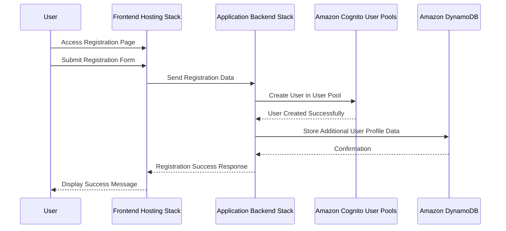
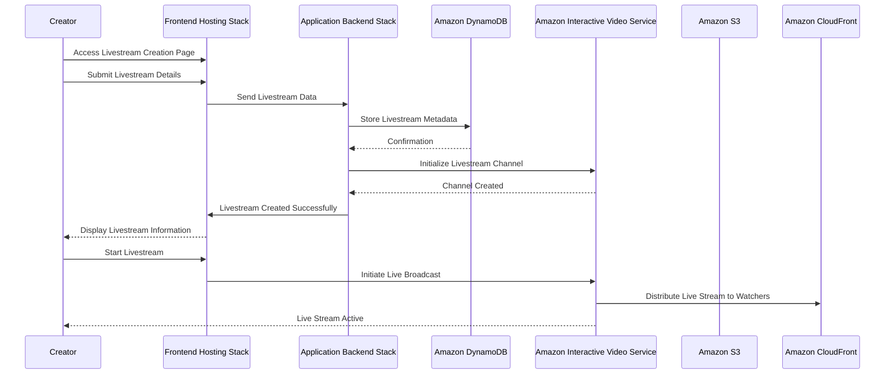
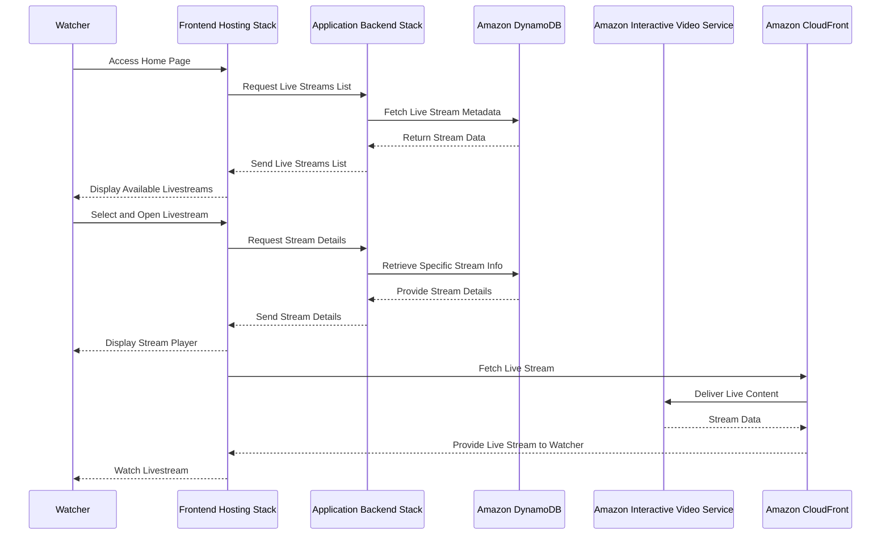
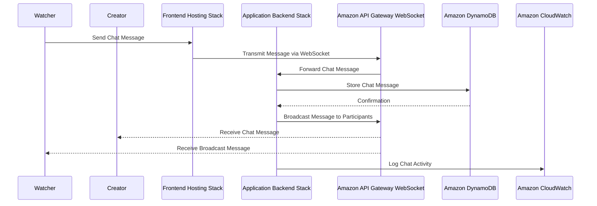
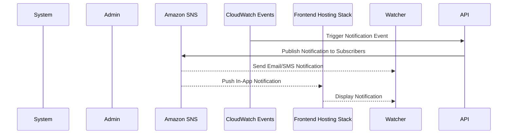

? What is the project name? test
? Describe your app in as much detail as possible.

**I want to create a streaming platform, on this platform we have two types of users, the creators, responsible for create the livestreams and the watchers, the users that consume the lives. It must have fast and stable content delivery**

Your project description seems a bit short. The better you can describe the project, the better GPT Pilot will understand what you'd like to build.

Here are some tips on how to better describe the project: https://github.com/Pythagora-io/gpt-pilot/wiki/How-to-write-a-good-initial-project-description


Let's start by refining your project idea:

---

**Streaming Platform - Requirements Specification**

**1. Introduction**

A web-based streaming platform that facilitates live content creation and consumption. The platform enables creators to broadcast livestreams, while watchers can view and engage with the live content seamlessly. Emphasis is placed on delivering fast and stable content to ensure an optimal user experience for both creators and watchers.

**2. User Roles**

- **Creator:** A registered user responsible for creating and managing livestreams.
- **Watcher:** A registered or unregistered user who consumes livestream content.
- **Administrator:** Platform administrator overseeing user management, content moderation, and system performance.

**3. Functional Requirements**

**3.1 User Registration and Authentication**

- **Registration:**
  - **Creators:**
    - Sign up using email address and password.
    - Provide additional information such as display name, profile picture, and a brief bio.
    - Email verification to activate the account.
  - **Watchers:**
    - Optional registration using email or social media accounts for enhanced features.
- **Login and Logout:**
  - Secure login and logout functionality for all registered users.
- **Password Management:**
  - Password reset and recovery options via email.

**3.2 Creator Features**

- **Stream Management:**
  - **Create Livestream:**
    - Schedule a livestream with details:
      - Stream title
      - Description
      - Category/Tags
      - Scheduled date and time
    - Set stream privacy (public or private).
  - **Start Livestream:**
    - Initiate live broadcasting based on the scheduled time.
    - Access to streaming tools (e.g., webcam, screen sharing).
  - **Manage Livestreams:**
    - Edit stream details before going live.
    - Cancel or reschedule upcoming streams.
- **Engagement Tools:**
  - **Live Chat:**
    - Real-time chat feature for interaction with watchers.
  - **Moderation:**
    - Ability to moderate chat by removing inappropriate messages or banning users.
- **Analytics:**
  - Access to stream performance metrics such as viewer count, engagement rates, and watch duration.

**3.3 Watcher Features**

- **Browsing and Discovery:**
  - **Explore Streams:**
    - Browse live streams by category, popularity, or recommended content.
  - **Search Functionality:**
    - Search for streams using keywords, categories, or creator names.
- **Viewing Streams:**
  - **Watch Livestream:**
    - View live video content with minimal buffering.
  - **Interact:**
    - Participate in live chat.
    - Like or react to streams.
- **Personalization:**
  - **Follow Creators:**
    - Follow favorite creators to receive notifications about their upcoming streams.
  - **Notifications:**
    - Get alerts for when followed creators go live or have scheduled streams.

**3.4 Content Delivery**

- **Fast and Stable Streaming:**
  - Utilize Content Delivery Networks (CDNs) to ensure low latency and high availability.
  - Adaptive bitrate streaming to adjust video quality based on the viewer's internet connection.
- **Scalability:**
  - Handle a large number of concurrent viewers without performance degradation.
- **Reliability:**
  - Ensure minimal downtime with robust infrastructure and failover mechanisms.

**3.5 User Interface Requirements**

- **Responsive Design:**
  - Accessible and optimized for desktop, tablet, and mobile devices.
- **Intuitive Navigation:**
  - Easy access to main features such as browsing streams, managing livestreams, and accessing profiles.
- **Stream Player:**
  - High-quality video player with controls for volume, quality settings, and full-screen mode.
- **Profile Pages:**
  - **Creators:**
    - Display creator's bio, upcoming streams, past streams, and follower count.
  - **Watchers:**
    - Personal profiles to view followed creators, watch history, and personalized recommendations.

**3.6 Notifications**

- **Email Notifications:**
 ? Can we proceed with this project description? If so, just press ENTER. Otherwise, please tell me what's missing or what you'd like to add. 
Planning project architecture...

Planning project end to end use cases...

Generating use cases mermaid diagrams...

Generating architecture mermaid diagram...

Generating the action plan for development...


## Architecture

---

**1. High-Level Architecture Overview**

The proposed architecture is a scalable and resilient streaming platform hosted on AWS, designed to facilitate seamless live content creation and consumption. The architecture leverages AWS managed services to ensure fast and stable content delivery, while promoting separation of concerns through logically grouped CDK stacks.

**CDK Stacks List:**

- **Networking Stack**
- **Authentication Stack**
- **Streaming Stack**
- **Application Backend Stack**
- **Frontend Hosting Stack**
- **Storage and Content Delivery Stack**
- **Monitoring and Logging Stack**

**Interactions:**

- The **Networking Stack** establishes the foundational network infrastructure utilized by all other stacks.
- The **Authentication Stack** manages user authentication and integrates with the **Application Backend Stack** to secure API endpoints.
- The **Streaming Stack** handles live stream ingestion and delivery, interfacing with both creators and watchers.
- The **Application Backend Stack** hosts the backend services and APIs, interacting with the **Database** and **Storage** services.
- The **Frontend Hosting Stack** serves the client-side application, communicating with the backend APIs and streaming services.
- The **Storage and Content Delivery Stack** manages media storage and ensures efficient content distribution via CDN.
- The **Monitoring and Logging Stack** oversees platform performance, security, and operational health, providing insights to administrators.

**Justification:**

This architecture ensures scalability, security, and high availability by utilizing AWS's managed services. Logical separation through distinct CDK stacks enhances maintainability and allows independent scaling of components based on demand. Leveraging AWS CDK with Python facilitates infrastructure as code, enabling rapid deployment and consistency across environments.

---

**2. Detailed CDK Stack Descriptions**

---

### **Networking Stack**

- **Purpose:**
  
  Establishes the network infrastructure for the streaming platform, ensuring secure and efficient communication between components.

- **AWS Resources:**
  
  - **Amazon VPC:** Creates an isolated network environment.
  - **Public and Private Subnets:** Segregates resources based on accessibility needs.
  - **Internet Gateway:** Enables internet access for public resources.
  - **NAT Gateways:** Provides internet access for resources in private subnets.
  - **Security Groups:** Defines inbound and outbound traffic rules for resources.
  - **Network ACLs:** Adds an additional layer of security at the subnet level.

- **Interactions:**
  
  - Serves as the foundational network for all other stacks.
  - Ensures secure communication between backend services, databases, and external clients.

- **Rationale:**
  
  A dedicated networking stack allows centralized management of network resources, enhancing security and simplifying updates or changes to the network configuration.

---

### **Authentication Stack**

- **Purpose:**
  
  Manages user authentication and authorization for creators, watchers, and administrators.

- **AWS Resources:**
  
  - **Amazon Cognito User Pools:** Handles user sign-up, sign-in, and authentication.
  - **Amazon Cognito Identity Pools:** Provides temporary AWS credentials for authorized access to resources.
  - **AWS Lambda Functions:** For custom authentication workflows or triggers.
  - **IAM Roles and Policies:** Define permissions for accessing AWS services based on user roles.

- **Interactions:**
  
  - Integrates with the **Application Backend Stack** to secure API endpoints.
  - Facilitates user authentication for the **Frontend Hosting Stack**.

- **Rationale:**
  
  Amazon Cognito offers a scalable and secure solution for user management, reducing the overhead of building and maintaining custom authentication systems.

---

### **Streaming Stack**

- **Purpose:**
  
  Handles live stream ingestion, processing, and delivery to ensure low-latency and high-quality streaming experiences.

- **AWS Resources:**
  
  - **Amazon Interactive Video Service (IVS):** Manages live stream ingestion and real-time streaming.
  - **Amazon CloudFront:** Distributes live and recorded streams globally with low latency.
  - **AWS Elemental MediaLive (optional):** For advanced live video processing needs.
  - **Amazon Route 53:** Manages DNS routing for streaming endpoints.

- **Interactions:**
  
  - Receives live streams from **Creators** via the **Frontend Hosting Stack**.
  - Distributes streams to **Watchers** through **CloudFront**.
  - Interfaces with the **Storage and Content Delivery Stack** for archived content.

- **Rationale:**
  
  Leveraging Amazon IVS ensures a managed, scalable, and reliable streaming solution tailored for interactive live video, minimizing latency and enhancing viewer experience.

---

### **Application Backend Stack**

- **Purpose:**
  
  Hosts the backend services, APIs, and business logic required to support platform functionalities.

- **AWS Resources:**
  
  - **AWS Lambda:** Serverless compute for handling API requests and backend logic.
  - **Amazon API Gateway:** Exposes RESTful API endpoints for frontend and third-party integrations.
  - **Amazon DynamoDB:** NoSQL database for storing user data, stream metadata, and engagement metrics.
  - **AWS AppSync (optional):** For implementing GraphQL APIs if needed.
  - **Amazon ElastiCache (optional):** Provides in-memory caching to enhance performance.
  - **IAM Roles and Policies:** Define permissions for backend services to access other AWS resources.

- **Interactions:**
  
  - Communicates with the **Authentication Stack** to validate user tokens.
  - Interfaces with the **Streaming Stack** to manage live streams.
  - Reads from and writes to **DynamoDB** for data persistence.
  - Utilizes **Storage and Content Delivery Stack** for media storage access.

- **Rationale:**
  
  AWS Lambda and API Gateway offer a serverless and scalable backend solution, reducing operational overhead and allowing the platform to handle variable workloads efficiently.

---

### **Frontend Hosting Stack**

- **Purpose:**
  
  Serves the client-side application, providing user interfaces for creators and watchers to interact with the platform.

- **AWS Resources:**
  
  - **Amazon S3:** Hosts static website assets (HTML, CSS, JavaScript).
  - **Amazon CloudFront:** Distributes frontend assets globally for low-latency access.
  - **AWS Amplify (optional):** Facilitates continuous deployment and hosting of frontend applications.
  - **AWS Certificate Manager:** Manages SSL/TLS certificates for secure HTTPS access.

- **Interactions:**
  
  - Connects with the **Application Backend Stack** via API endpoints.
  - Interfaces with the **Streaming Stack** for live stream integration.
  - Utilizes **Authentication Stack** for user authentication workflows.

- **Rationale:**
  
  Hosting the frontend on Amazon S3 with CloudFront ensures high availability, scalability, and fast content delivery to users worldwide.

---

### **Storage and Content Delivery Stack**

- **Purpose:**
  
  Manages media storage, archival of recorded streams, and efficient content distribution to users.

- **AWS Resources:**
  
  - **Amazon S3:** Stores recorded livestreams, user-generated content, and static assets.
  - **Amazon CloudFront:** Acts as the CDN for delivering stored content with low latency.
  - **AWS Elemental MediaConvert (optional):** Transcodes recorded streams into various formats for compatibility.
  - **AWS Transfer for SFTP (optional):** Enables secure file transfers if needed.

- **Interactions:**
  
  - Receives recorded streams from the **Streaming Stack** for archival.
  - Serves stored content to the **Frontend Hosting Stack** and directly to **Watchers**.
  - Integrates with the **Application Backend Stack** for managing media metadata.

- **Rationale:**
  
  Amazon S3 combined with CloudFront offers a robust and scalable solution for storing and delivering media content, ensuring high availability and performance.

---

### **Monitoring and Logging Stack**

- **Purpose:**
  
  Oversees platform performance, security, and operational health through comprehensive monitoring and logging solutions.

- **AWS Resources:**
  
  - **Amazon CloudWatch:** Monitors metrics, logs, and sets up alarms for various AWS resources.
  - **AWS CloudTrail:** Provides audit logs for API calls and user activities.
  - **AWS X-Ray (optional):** Traces and analyzes requests through the application for performance insights.
  - **Amazon Elasticsearch Service (optional):** Enables advanced log analysis and visualization.
  - **AWS SNS:** Sends notifications based on specific alarms or alerts.

- **Interactions:**
  
  - Collects logs and metrics from all other stacks and services.
  - Provides dashboards and alerts to administrators via the **Application Backend Stack**.

- **Rationale:**
  
  Implementing robust monitoring and logging ensures the platform's reliability, facilitates quick issue resolution, and enhances security through continuous oversight.

---

**3. Assumptions and Considerations**

---

### **Assumptions:**

- **User Infrastructure:**
  
  - Creators have access to reliable internet connections and necessary broadcasting equipment (cameras, microphones).
  
- **Content Nature:**
  
  - The platform will comply with relevant copyright laws and content regulations.
  
- **User Base:**
  
  - Initial user base is expected to be moderate, with plans to scale as the platform grows.
  
- **Development Timeline:**
  
  - The initial MVP focuses on core functionalities such as user registration, livestream creation, and basic streaming capabilities within a one to two-week development period.

### **Constraints:**

- **Budget Limitations:**
  
  - Must utilize AWS services within the allocated budget, optimizing for cost-efficiency without compromising performance.
  
- **Regulatory Compliance:**
  
  - Adherence to data protection regulations (e.g., GDPR) is mandatory, influencing data storage and processing decisions.
  
- **Technology Stack:**
  
  - The architecture must be implemented using AWS CDK with Python, adhering to best practices for infrastructure as code.

### **Scalability and Security:**

- **Scalability:**
  
  - The architecture leverages AWS's scalable services (e.g., Lambda, IVS, DynamoDB) to handle increasing user demand and concurrent streams without performance degradation.
  
- **Security:**
  
  - Implements strict access controls through IAM roles and security groups.
  - Utilizes Amazon Cognito for secure user authentication and authorization.
  - Ensures data encryption at rest and in transit using AWS-managed certificates and encryption services.
  - Regularly monitors and audits platform activities using CloudWatch and CloudTrail to detect and respond to potential security threats.

---

This architectural design leverages AWS's robust suite of services to build a scalable, secure, and high-performance streaming platform. By logically organizing resources into dedicated CDK stacks, the architecture ensures maintainability and facilitates rapid development and deployment, aligning with the project's MVP objectives.

## End to end use cases

---

**Main Use Cases Interaction with AWS Services**

This section outlines how the primary use cases of the streaming platform interact with the defined AWS services. It details the data handling processes and provides an end-to-end workflow for each use case, illustrating the seamless integration of AWS services to deliver a robust and efficient streaming experience.

---

### **1. User Registration and Authentication**

**Use Case Overview:**
Users (Creators and Watchers) register and authenticate to access platform features.

**Workflow:**

1. **User Registration:**
   - **Frontend Interaction:**
     - A user accesses the registration page hosted on the **Frontend Hosting Stack** (Amazon S3 & CloudFront).
     - The user submits registration details (email, password, etc.).
   - **API Request:**
     - The frontend sends the registration data to the **Application Backend Stack** via **Amazon API Gateway**.
   - **Authentication Stack Interaction:**
     - **Amazon Cognito User Pools** processes the registration, creating a new user entry.
     - An email verification is triggered using **Amazon Cognito** to activate the account.
   - **Data Handling:**
     - User credentials and profiles are securely stored in **Amazon Cognito User Pools**.
     - Additional user data may be stored in **Amazon DynamoDB** if required.
   - **Notification:**
     - A verification email is sent to the user for account activation.

2. **User Login:**
   - **Frontend Interaction:**
     - The user navigates to the login page on the **Frontend Hosting Stack**.
     - The user enters credentials to log in.
   - **API Request:**
     - Login credentials are sent to the **Application Backend Stack** via **Amazon API Gateway**.
   - **Authentication Stack Interaction:**
     - **Amazon Cognito User Pools** validates the credentials.
     - Upon successful authentication, **Amazon Cognito Identity Pools** issues temporary AWS credentials.
   - **Data Handling:**
     - Authentication tokens are returned to the frontend for session management.
   - **Security:**
     - Secure tokens ensure authenticated access to protected API endpoints.

**Data Flow Diagram:**
1. User ↔ Frontend Hosting (S3 & CloudFront)
2. Frontend ↔ Application Backend (API Gateway)
3. Application Backend ↔ Authentication Stack (Cognito)

**Next Steps:**
- Upon successful authentication, users are redirected to their respective dashboards (Creators to stream management, Watchers to browsing streams).

---

### **2. Livestream Creation and Management (Creator)**

**Use Case Overview:**
Creators schedule, create, and manage their livestreams.

**Workflow:**

1. **Accessing Stream Management:**
   - **Frontend Interaction:**
     - Authenticated Creators access the stream management interface via the **Frontend Hosting Stack**.
   - **API Request:**
     - Requests are sent to the **Application Backend Stack** through **Amazon API Gateway**.

2. **Scheduling a Livestream:**
   - **Creator Input:**
     - The Creator inputs stream details (title, description, category, scheduled time, privacy settings).
   - **Application Backend Interaction:**
     - **AWS Lambda** functions within the **Application Backend Stack** process and validate the input.
     - Stream metadata is stored in **Amazon DynamoDB**.
   - **Data Handling:**
     - Scheduled livestream details are saved in the **DynamoDB** table for future reference and management.

3. **Starting a Livestream:**
   - **Initiation:**
     - At the scheduled time, the Creator initiates the stream via the frontend interface.
   - **Streaming Stack Interaction:**
     - **Amazon IVS (Interactive Video Service)** handles the live stream ingestion.
     - **Amazon Route 53** directs streaming requests to the appropriate **IVS** endpoints.
   - **Data Handling:**
     - Live stream data is transmitted through **IVS**, ensuring low-latency delivery.
   - **Content Delivery:**
     - **Amazon CloudFront** distributes the live stream to Watchers globally, leveraging CDN for minimal buffering.

4. **Managing Livestreams:**
   - **Editing or Canceling:**
     - Creators can edit stream details or cancel/reschedule streams via the frontend.
   - **Application Backend Interaction:**
     - **AWS Lambda** functions update or remove entries in **Amazon DynamoDB**.
   - **Streaming Stack Interaction:**
     - If a stream is canceled, **Amazon IVS** terminates the live stream, and notifications are sent to Watchers.

**Data Flow Diagram:**
1. Creator ↔ Frontend Hosting (S3 & CloudFront)
2. Frontend ↔ Application Backend (API Gateway & Lambda)
3. Application Backend ↔ Streaming Stack (Amazon IVS & Route 53)
4. Streaming Stack ↔ Content Delivery (CloudFront)

**Next Steps:**
- Once the livestream ends, the stream can be archived in **Amazon S3** for on-demand viewing, and analytics data is updated in **Amazon DynamoDB**.

---

### **3. Watching a Livestream (Watcher)**

**Use Case Overview:**
Watchers browse, discover, and view live streams in real-time.

**Workflow:**

1. **Browsing and Discovery:**
   - **Frontend Interaction:**
     - Watchers access the browsing interface hosted on the **Frontend Hosting Stack**.
     - They can explore streams by category, popularity, or search using keywords.
   - **API Request:**
     - Search and filter requests are sent to the **Application Backend Stack** via **Amazon API Gateway**.
   - **Application Backend Interaction:**
     - **AWS Lambda** queries **Amazon DynamoDB** for relevant stream listings.
     - Results are returned to the frontend for display.

2. **Selecting and Viewing a Stream:**
   - **Stream Selection:**
     - The Watcher selects a livestream to watch.
   - **Streaming Stack Interaction:**
     - The frontend requests the live stream URL from **Amazon IVS** via **API Gateway**.
     - **Amazon CloudFront** delivers the live video content to the Watcher's device.
   - **Data Handling:**
     - Video data flows through **IVS** and **CloudFront**, ensuring efficient and stable delivery.
   - **Content Delivery:**
     - Adaptive bitrate streaming adjusts video quality based on the Watcher's internet connection for optimal viewing.

3. **Interacting During the Stream:**
   - **Live Chat and Reactions:**
     - Watchers participate in live chat and send reactions through the frontend interface.
   - **Application Backend Interaction:**
     - Chat messages and reactions are sent to **AWS Lambda** via **API Gateway**.
     - Engagement data is stored in **Amazon DynamoDB** and possibly cached in **Amazon ElastiCache** for real-time access.
   - **Streaming Stack Interaction:**
     - **Amazon IVS** manages real-time chat integration, ensuring synchronization between live video and interactions.

4. **Post-Stream Actions:**
   - **Following Creators:**
     - Watchers can follow creators to receive notifications about future streams.
   - **Notifications:**
     - **Amazon Cognito** and **Amazon SNS** handle sending notifications about new streams or updates.

**Data Flow Diagram:**
1. Watcher ↔ Frontend Hosting (S3 & CloudFront)
2. Frontend ↔ Application Backend (API Gateway & Lambda)
3. Application Backend ↔ Streaming Stack (Amazon IVS & CloudFront)
4. Streaming Stack ↔ Real-time Interactions (IVS Chat)
5. Notifications ↔ Amazon SNS

**Next Steps:**
- Watchers receive notifications for followed creators' upcoming streams, enhancing engagement and retention.

---

### **4. Content Delivery and Scalability**

**Use Case Overview:**
Ensuring fast, stable, and scalable delivery of live and recorded content to users.

**Workflow:**

1. **Live Stream Ingestion:**
   - **Streaming Stack Interaction:**
     - Creators use streaming tools (webcam, screen sharing) to send live video to **Amazon IVS**.
     - **Amazon Route 53** manages DNS routing for stream ingestion endpoints.

2. **Content Distribution:**
   - **Amazon CloudFront:**
     - Distributes live and recorded streams to Watchers globally, minimizing latency.
     - Implements caching strategies to handle high traffic loads efficiently.
   - **Adaptive Bitrate Streaming:**
     - **Amazon IVS** adjusts video quality in real-time based on Watcher’s bandwidth, ensuring continuous playback with minimal buffering.

3. **Scalability Handling:**
   - **Amazon IVS and CloudFront:**
     - Automatically scales to accommodate varying numbers of concurrent viewers without manual intervention.
   - **Application Backend Stack:**
     - **AWS Lambda** functions scale automatically to handle increased API requests during peak streaming times.
     - **Amazon DynamoDB** scales to manage increased data read/write operations, ensuring consistent performance.

4. **Recorded Content Archival:**
   - **Streaming Stack Interaction:**
     - After a livestream ends, **Amazon IVS** can archive the stream.
   - **Storage and Content Delivery Stack:**
     - Archived streams are stored in **Amazon S3** for on-demand viewing.
     - **Amazon CloudFront** serves archived content to Watchers, leveraging CDN for efficient delivery.
   - **Optional Processing:**
     - **AWS Elemental MediaConvert** transcodes recorded streams into multiple formats for broader device compatibility.

**Data Flow Diagram:**
1. Creator ↔ Streaming Stack (Amazon IVS & Route 53)
2. Streaming Stack ↔ Content Delivery (CloudFront)
3. Application Backend ↔ DynamoDB & Lambda
4. Archival ↔ Storage Stack (S3 & MediaConvert)

**Next Steps:**
- Implement monitoring to track content delivery performance and adjust CloudFront configurations as needed for optimal scalability.

---

### **5. Engagement and Interaction**

**Use Case Overview:**
Facilitating real-time interactions between Creators and Watchers through chat, reactions, and notifications.

**Workflow:**

1. **Live Chat Interaction:**
   - **Frontend Interaction:**
     - Watchers send chat messages via the frontend interface.
   - **API Request:**
     - Chat messages are sent to the **Application Backend Stack** through **Amazon API Gateway**.
   - **Streaming Stack Interaction:**
     - **Amazon IVS Chat** manages real-time message distribution to all viewers.
   - **Data Handling:**
     - Chat logs are stored in **Amazon DynamoDB** for future reference and analytics.

2. **Moderation Tools:**
   - **Creator and Admin Actions:**
     - Creators and administrators can moderate chat by removing inappropriate messages or banning users.
   - **Application Backend Interaction:**
     - Moderation actions are processed by **AWS Lambda** functions.
     - Updated permissions and message statuses are reflected in **Amazon DynamoDB**.
   - **Streaming Stack Interaction:**
     - **Amazon IVS Chat** enforces moderation rules in real-time, preventing banned users from sending messages.

3. **Reactions and Interactions:**
   - **Frontend Interaction:**
     - Watchers can like or react to streams using the frontend interface.
   - **API Request:**
     - Reactions are sent to the **Application Backend Stack** via **Amazon API Gateway**.
   - **Data Handling:**
     - Reaction data is stored in **Amazon DynamoDB** and updated in real-time through **AWS Lambda** functions.
   - **Streaming Stack Interaction:**
     - **Amazon IVS** ensures that reactions are displayed to all viewers in real-time.

4. **Notifications:**
   - **In-App Notifications:**
     - Real-time alerts for new chat messages, reactions, and stream interactions are handled by **Amazon IVS** and **Amazon API Gateway**.
   - **Email Notifications:**
     - **Amazon SNS** sends email alerts to Watchers for followed creators' upcoming streams or significant interactions.
   - **Creator Notifications:**
     - **Amazon Cognito** and **Amazon SNS** notify Creators about stream performance and engagement metrics.

**Data Flow Diagram:**
1. Watcher ↔ Frontend Hosting (S3 & CloudFront)
2. Frontend ↔ Application Backend (API Gateway & Lambda)
3. Application Backend ↔ Streaming Stack (Amazon IVS Chat)
4. Notifications ↔ Amazon SNS

**Next Steps:**
- Implement analytics dashboards in the **Monitoring and Logging Stack** to visualize engagement metrics and optimize user interaction features.

---

### **6. Monitoring, Logging, and Analytics**

**Use Case Overview:**
Ensuring platform reliability, performance monitoring, and gaining insights through analytics.

**Workflow:**

1. **Real-Time Monitoring:**
   - **Monitoring and Logging Stack Interaction:**
     - **Amazon CloudWatch** collects metrics from all AWS services (e.g., Lambda invocations, API Gateway requests, IVS stream health).
     - **AWS CloudTrail** logs API calls for auditing and security purposes.
   - **Data Handling:**
     - Metrics and logs are aggregated in **CloudWatch** and **CloudTrail** for real-time analysis.

2. **Alerting and Notifications:**
   - **CloudWatch Alarms:**
     - Set up alarms for critical metrics (e.g., high error rates, latency issues).
     - **Amazon SNS** sends notifications to administrators upon alarm triggers.
   - **Automated Responses:**
     - **AWS Lambda** functions can automatically remediate certain issues based on predefined rules.

3. **Log Management and Analysis:**
   - **AWS X-Ray (Optional):**
     - Traces requests through the application to identify performance bottlenecks.
   - **Amazon Elasticsearch Service (Optional):**
     - Enables advanced search and visualization of logs for deeper insights.
   - **Data Handling:**
     - Logs from various services are indexed and made searchable for troubleshooting and analysis.

4. **Analytics and Reporting:**
   - **Application Backend Interaction:**
     - **AWS Lambda** processes engagement data from **Amazon DynamoDB** to generate analytics.
     - Reports on user behavior, stream performance, and system health are created and stored.
   - **Dashboard Visualization:**
     - Administrators access comprehensive dashboards displaying key performance indicators (KPIs) and usage statistics.
   - **Content Delivery Metrics:**
     - **Amazon CloudFront** metrics provide insights into content delivery performance and viewer distribution.

**Data Flow Diagram:**
1. AWS Services ↔ Monitoring Stack (CloudWatch & CloudTrail)
2. Monitoring Stack ↔ Alerting (SNS)
3. Logs ↔ ElasticSearch (Optional)
4. Analytics ↔ Application Backend (Lambda & DynamoDB)

**Next Steps:**
- Continuously refine monitoring configurations and analytics models to enhance platform performance and user satisfaction.

---

### **End-to-End Workflow Example: Creator Livestreaming**

**Scenario:**
A Creator schedules and initiates a livestream, while Watchers discover and view the stream, interacting in real-time.

**Step-by-Step Workflow:**

1. **Scheduling the Livestream:**
   - **Creator** logs in via the **Frontend Hosting Stack**.
   - Navigates to the stream management interface and schedules a livestream.
   - **Application Backend Stack** processes the scheduling request, storing stream details in **Amazon DynamoDB**.

2. **Initiating the Livestream:**
   - At the scheduled time, the **Creator** starts the livestream through the frontend.
   - **Amazon IVS** ingests the live video feed, handling encoding and real-time delivery.
   - **Amazon CloudFront** distributes the live stream to **Watchers** with minimal latency.

3. **Watching the Livestream:**
   - **Watcher** accesses the platform via the **Frontend Hosting Stack**.
   - Browses and selects the live stream to watch.
   - **Amazon IVS** streams the video through **CloudFront**, adapting quality based on Watcher's connection.
   - **Watcher** engages via live chat, with messages processed by **Amazon IVS Chat** and stored in **Amazon DynamoDB**.

4. **Real-Time Interactions:**
   - **Watcher** sends chat messages and reactions.
   - Messages are routed through **API Gateway** and processed by **AWS Lambda**, updating **DynamoDB** and reflecting in real-time via **Amazon IVS Chat**.
   - **Creator** moderates the chat as needed using frontend controls, with actions enforced by **Amazon IVS Chat** and **DynamoDB** entries.

5. **Ending the Livestream:**
   - **Creator** ends the livestream on the frontend.
   - **Amazon IVS** stops live ingestion and optionally archives the stream to **Amazon S3** via the **Storage and Content Delivery Stack**.
   - **Application Backend Stack** updates stream status in **Amazon DynamoDB** and triggers notifications to **Watchers** about the stream's end.

6. **Post-Stream Analytics:**
   - **Monitoring and Logging Stack** collects performance metrics and engagement data.
   - Administrators review analytics dashboards to assess stream performance and user engagement.

**Data Flow Summary:**
1. Creator ↔ Frontend ↔ Application Backend ↔ DynamoDB ↔ IVS ↔ CloudFront ↔ Watchers
2. Watchers ↔ Frontend ↔ API Gateway ↔ Lambda ↔ DynamoDB ↔ IVS Chat ↔ Creator

**Next Steps:**
- Review and optimize the livestream setup based on analytics insights.
- Plan future streams and interactions to enhance user engagement and platform growth.

---

**Conclusion**

The outlined interactions demonstrate a cohesive integration of AWS services to support the streaming platform's core functionalities. By leveraging services like Amazon IVS for live streaming, Amazon Cognito for authentication, and Amazon CloudFront for content delivery, the architecture ensures a seamless, scalable, and secure user experience. The detailed data handling processes and end-to-end workflows provide a clear roadmap for implementing and optimizing the platform's key use cases.

---

## Use case diagrams

### User Registration and Authentication



---

### Creator Creates and Manages a Livestream



---

### Watcher Discovers and Watches a Livestream



---

### Engagement through Live Chat



---

### Notifications for Upcoming Livestreams



---

## Architecture diagram

```mermaid
graph TB
    %% User Interactions
    subgraph Users
        Creator((Creator))
        Watcher((Watcher))
        Admin((Administrator))
    end

    %% Networking Stack
    subgraph Networking_Stack["Networking Stack"]
        VPC[VPC]
        Public_Subnets[Public Subnets]
        Private_Subnets[Private Subnets]
        IGW[Internet Gateway]
        NAT[NAT Gateway]
        SG[Security Groups]
        NACL[Network ACLs]
    end

    %% Authentication Stack
    subgraph Authentication_Stack["Authentication Stack"]
        Cognito_UserPool[Cognito User Pool]
        Cognito_IdentityPool[Cognito Identity Pool]
        Auth_Lambda[Auth Lambda Functions]
        Auth_IAM[IAM Roles & Policies]
    end

    %% Application Stack
    subgraph Application_Stack["Application Stack"]
        Lambda_Functions[AWS Lambda]
        APIGateway[API Gateway]
        App_IAM[IAM Roles & Policies]
    end

    %% Database Stack
    subgraph Database_Stack["Database Stack"]
        DynamoDB[(DynamoDB)]
        DB_IAM[IAM Roles & Policies]
    end

    %% Storage Stack
    subgraph Storage_Stack["Storage Stack"]
        S3_Buckets[(S3 Buckets)]
        Storage_IAM[IAM Roles & Policies]
    end

    %% Notification Stack
    subgraph Notification_Stack["Notification Stack"]
        SNS[(Amazon SNS)]
        SES[(Amazon SES)]
        Notification_IAM[IAM Roles & Policies]
    end

    %% Search Stack
    subgraph Search_Stack["Search Stack"]
        OpenSearch[(Amazon OpenSearch Service)]
        Search_IAM[IAM Roles & Policies]
    end

    %% Content Delivery Stack
    subgraph Content_Delivery_Stack["Content Delivery Stack"]
        CloudFront[(CloudFront CDN)]
        Route53[(Route 53)]
        CDN_IAM[IAM Roles & Policies]
    end

    %% Monitoring and Logging Stack
    subgraph Monitoring_Logging_Stack["Monitoring and Logging Stack"]
        CloudWatch[(CloudWatch)]
        CloudTrail[(CloudTrail)]
        XRay[(AWS X-Ray)]
        Elasticsearch[(Amazon Elasticsearch Service)]
        SNS_Alerts[(SNS Alerts)]
    end

    %% Frontend Hosting Stack
    subgraph Frontend_Hosting_Stack["Frontend Hosting Stack"]
        S3_Frontend[(S3 Static Website)]
        CloudFront_Frontend[(CloudFront)]
        Frontend_IAM[IAM Roles & Policies]
    end

    %% Streaming Stack
    subgraph Streaming_Stack["Streaming Stack"]
        IVS[(Amazon IVS)]
        MediaLive[(MediaLive)]
        Route53_Stream[(Route 53 Streaming)]
    end

    %% Interactions

    %% User to Frontend
    Creator -->|Access| CloudFront_Frontend
    Watcher -->|Access| CloudFront_Frontend
    Admin -->|Access| CloudFront_Frontend

    %% Frontend to API Gateway
    CloudFront_Frontend -->|API Requests| APIGateway

    %% Authentication Flow
    Creator -->|Sign Up/Login| Cognito_UserPool
    Watcher -->|Sign Up/Login| Cognito_UserPool
    Admin -->|Sign Up/Login| Cognito_UserPool
    Cognito_UserPool --> Cognito_IdentityPool
    Cognito_IdentityPool --> Lambda_Functions
    Cognito_UserPool --> Auth_Lambda
    Cognito_UserPool --> Auth_IAM

    %% API Gateway to Lambda
    APIGateway -->|Invoke| Lambda_Functions
    Lambda_Functions -->|Access Data| DynamoDB
    Lambda_Functions -->|Store Media| S3_Buckets
    Lambda_Functions -->|Send Notifications| SNS
    Lambda_Functions -->|Search Queries| OpenSearch
    Lambda_Functions -->|Stream Control| IVS

    %% Streaming Interaction
    Creator -->|Broadcast| IVS
    IVS -->|Stream Delivery| CloudFront
    Watcher -->|View Stream| CloudFront

    %% Storage and Content Delivery
    S3_Buckets --> CloudFront
    CloudFront --> Watcher

    %% Notifications
    SNS -->|Emails/SMS| Watcher
    SNS -->|Notifications| Creator

    %% Search
    Watcher -->|Search Content| OpenSearch
    Lambda_Functions --> OpenSearch

    %% Monitoring and Logging
    Lambda_Functions --> CloudWatch
    APIGateway --> CloudWatch
    Cognito_UserPool --> CloudWatch
    IVS --> CloudWatch
    CloudTrail --> CloudWatch
    XRay --> CloudWatch
    Elasticsearch --> CloudWatch
    CloudWatch --> SNS_Alerts

    %% Security
    VPC --> APIGateway
    VPC --> Lambda_Functions
    VPC --> DynamoDB
    VPC --> S3_Buckets
    VPC --> IVS
    VPC --> CloudFront
    Security Groups -->|Control Access| APIGateway
    Security Groups -->|Control Access| Lambda_Functions
    Security Groups -->|Control Access| DynamoDB
    Security Groups -->|Control Access| S3_Buckets
    Security Groups -->|Control Access| IVS
    Security Groups -->|Control Access| CloudFront
    IAM Roles & Policies --> Lambda_Functions
    IAM Roles & Policies --> DynamoDB
    IAM Roles & Policies --> S3_Buckets
    IAM Roles & Policies --> SNS
    IAM Roles & Policies --> OpenSearch
    IAM Roles & Policies --> CloudFront
    IAM Roles & Policies --> IVS

    %% Optional Components
    MediaLive --> CloudFront
    Amazon Elasticsearch Service --> CloudWatch
```

## Development Plan
---

### **Development Plan for AWS CDK Streaming Platform**

This development plan outlines the tasks required to implement the streaming platform architecture using AWS CDK with Python. Each task is meticulously crafted to ensure clarity and maintainability, adhering to the specified rules for task creation.

---

#### **1. Networking Stack**

**Task 1: Create Virtual Private Cloud (VPC) with Public and Private Subnets**

- **Description:**
  In the `networking_stack.py` file, define a new CDK stack class named `NetworkingStack`. Within this stack, create an Amazon VPC that spans three Availability Zones to ensure high availability. Allocate both public and private subnets within each Availability Zone, assigning appropriate CIDR blocks. Ensure that public subnets are designated for resources requiring internet access, while private subnets are reserved for internal resources. Include appropriate tags for easy identification and management.

**Task 2: Configure Internet Gateway and NAT Gateways**

- **Description:**
  Extend the `NetworkingStack` by adding an Internet Gateway to the VPC to facilitate internet connectivity for public subnets. Subsequently, deploy NAT Gateways in each public subnet to allow instances within private subnets to access the internet securely. Configure routing tables to direct traffic from public subnets through the Internet Gateway and from private subnets through the NAT Gateways. Ensure that the number of NAT Gateways matches the number of Availability Zones to maintain redundancy.

**Task 3: Define Security Groups and Network ACLs**

- **Description:**
  Within the `NetworkingStack`, create Security Groups to control inbound and outbound traffic for various resources. Define specific rules that allow necessary traffic types, such as HTTP/HTTPS for web servers and SSH for administrative access, restricting all other ports by default. Additionally, establish Network ACLs at the subnet level to provide an extra layer of security. Configure these ACLs to allow necessary traffic while denying unauthorized access, ensuring compliance with security best practices.

---

#### **2. Authentication Stack**

**Task 1: Set Up Amazon Cognito User Pool**

- **Description:**
  In the `authentication_stack.py` file, create a new CDK stack class named `AuthenticationStack`. Initialize an Amazon Cognito User Pool to manage user registrations and authentications. Configure the User Pool to require email verification upon registration and include necessary attributes such as email, password, display name, and bio. Enable multi-factor authentication (MFA) to enhance security. Additionally, set up password policies enforcing complexity and expiration requirements to ensure robust user credential management.

**Task 2: Configure Amazon Cognito Identity Pool**

- **Description:**
  Extend the `AuthenticationStack` by adding an Amazon Cognito Identity Pool linked to the previously created User Pool. This configuration will allow authenticated users to obtain temporary AWS credentials necessary for accessing AWS resources securely. Define authentication providers and ensure that both authenticated and unauthenticated roles are appropriately configured. Attach IAM policies to these roles to grant necessary permissions while adhering to the principle of least privilege.

**Task 3: Implement IAM Roles and Policies for Cognito Users**

- **Description:**
  Within the `AuthenticationStack`, define IAM roles and corresponding policies tailored for different user roles (Creators, Watchers, Administrators). These roles will dictate the level of access each user type has to various AWS services. For instance, Creators might require permissions to interact with the Streaming Stack services, while Watchers might need access to content delivery resources. Ensure that policies are granular and enforce security best practices.

**Task 4: Add Lambda Triggers for Custom Authentication Workflows**

- **Description:**
  Enhance the `AuthenticationStack` by integrating AWS Lambda triggers with the Cognito User Pool for custom authentication workflows. Implement functions for events such as user sign-up, sign-in, and account confirmation. For example, create a Lambda function that enriches user profiles with additional metadata upon successful registration or restricts access based on specific criteria. Deploy these Lambda functions and configure them as triggers in the Cognito User Pool to automate and customize authentication processes.

---

#### **3. Streaming Stack**

**Task 1: Provision Amazon Interactive Video Service (IVS) Resources**

- **Description:**
  In the `streaming_stack.py` file, define a new CDK stack class named `StreamingStack`. Within this stack, deploy Amazon Interactive Video Service (IVS) resources to manage live stream ingestion and real-time streaming. Configure IVS channels with appropriate settings, such as latency mode and playback configurations, to ensure low-latency and high-quality streams. Assign necessary permissions and integrate IVS with other AWS services to facilitate seamless stream management.

**Task 2: Configure Route 53 for Streaming Endpoints**

- **Description:**
  Extend the `StreamingStack` by setting up Amazon Route 53 to manage DNS routing for streaming endpoints. Create hosted zones and define DNS records that point to the IVS streaming endpoints. Ensure that these records are highly available and resilient by distributing them across multiple Availability Zones. Configure routing policies, such as weighted or latency-based routing, to optimize stream delivery based on viewer locations and network conditions.

**Task 3: Integrate Amazon CloudFront with IVS for Content Distribution**

- **Description:**
  Within the `StreamingStack`, deploy Amazon CloudFront distributions to integrate with Amazon IVS for efficient content delivery. Configure CloudFront to cache and distribute live and recorded streams globally, reducing latency and improving viewer experience. Apply security measures such as signed URLs or Geo Restriction to control access to the streaming content. Optimize caching behaviors and edge locations to handle high traffic loads and ensure reliable stream availability.

---

#### **4. Application Backend Stack**

**Task 1: Create DynamoDB Tables for User Data, Stream Metadata, and Engagement Metrics**

- **Description:**
  In the `application_backend_stack.py` file, define a new CDK stack class named `ApplicationBackendStack`. Within this stack, create Amazon DynamoDB tables to store various data types essential for the platform. Set up tables for user profiles, stream metadata (such as titles, descriptions, schedules), and engagement metrics (including chat logs and reactions). Define appropriate primary keys, secondary indexes, and provisioning settings to ensure optimal performance and scalability.

**Task 2: Set Up Amazon API Gateway with RESTful Endpoints**

- **Description:**
  Extend the `ApplicationBackendStack` by deploying Amazon API Gateway to expose RESTful API endpoints required by the frontend application. Define resources and methods corresponding to functionalities such as user registration, login, livestream creation, and chat interactions. Configure request and response schemas, enabling seamless data exchange between the frontend and backend services. Implement necessary throttling and caching strategies to enhance API performance and reliability.

**Task 3: Implement AWS Lambda Functions for API Requests**

- **Description:**
  Within the `ApplicationBackendStack`, develop AWS Lambda functions to handle incoming API requests routed through Amazon API Gateway. For each endpoint defined in the API Gateway, create corresponding Lambda functions that execute the required business logic. For example, implement functions for user authentication, livestream scheduling, chat message processing, and engagement tracking. Ensure that these functions interact securely with DynamoDB tables and other necessary AWS services, maintaining data integrity and security.

**Task 4: Configure AWS AppSync for GraphQL APIs (Optional)**

- **Description:**
  Optionally, enhance the `ApplicationBackendStack` by integrating AWS AppSync to provide GraphQL APIs for more flexible data queries and mutations. Define GraphQL schemas that mirror the application's data structures, such as user profiles and livestream details. Implement resolvers that connect GraphQL operations to DynamoDB tables and Lambda functions, enabling efficient data retrieval and manipulation. Configure necessary authentication and authorization mechanisms to secure the GraphQL endpoints.

**Task 5: Deploy Amazon ElastiCache for In-Memory Caching (Optional)**

- **Description:**
  Optionally, within the `ApplicationBackendStack`, deploy Amazon ElastiCache to provide in-memory caching capabilities that enhance application performance. Configure Redis or Memcached clusters based on the application's caching requirements. Integrate ElastiCache with Lambda functions to store and retrieve frequently accessed data, such as session information or popular livestream metadata. Ensure that caching strategies are optimized to reduce latency and minimize repeated database queries.

---

#### **5. Frontend Hosting Stack**

**Task 1: Provision Amazon S3 Bucket for Static Website Hosting**

- **Description:**
  In the `frontend_hosting_stack.py` file, define a new CDK stack class named `FrontendHostingStack`. Within this stack, create an Amazon S3 bucket configured for static website hosting to serve the frontend application's assets, including HTML, CSS, and JavaScript files. Enable static website hosting features and set appropriate bucket policies to allow public read access while securing write operations. Organize the bucket structure to accommodate different environments (e.g., development, production) if necessary.

**Task 2: Configure Amazon CloudFront Distribution for Frontend Assets**

- **Description:**
  Extend the `FrontendHostingStack` by deploying an Amazon CloudFront distribution to serve frontend assets from the S3 bucket with low latency and high availability. Configure origin settings to point to the S3 bucket and set up caching behaviors to optimize content delivery. Integrate AWS Certificate Manager to provision and attach SSL/TLS certificates, ensuring secure HTTPS access to the frontend application. Implement security headers and access controls to protect against common web vulnerabilities.

**Task 3: Set Up AWS Amplify for Continuous Deployment (Optional)**

- **Description:**
  Optionally, within the `FrontendHostingStack`, integrate AWS Amplify to facilitate continuous deployment and hosting of the frontend application. Configure Amplify to connect with the source code repository (e.g., GitHub) and automatically deploy updates upon code commits. Define build specifications and environment variables necessary for the frontend application. Ensure that Amplify is linked with the CloudFront distribution to serve the latest frontend assets seamlessly to users.

**Task 4: Manage SSL/TLS Certificates with AWS Certificate Manager**

- **Description:**
  In the `FrontendHostingStack`, utilize AWS Certificate Manager (ACM) to provision SSL/TLS certificates for securing the frontend application's domain. Configure ACM to request certificates for the specified domain names and validate ownership through DNS or email verification. Attach the certificates to the CloudFront distribution to enable HTTPS access, ensuring encrypted data transmission between users and the frontend assets. Regularly monitor certificate renewals to maintain uninterrupted secure access.

---

#### **6. Storage and Content Delivery Stack**

**Task 1: Create Amazon S3 Buckets for Recorded Livestreams and User-Generated Content**

- **Description:**
  In the `storage_content_delivery_stack.py` file, define a new CDK stack class named `StorageContentDeliveryStack`. Within this stack, create separate Amazon S3 buckets dedicated to storing recorded livestreams and user-generated content such as profile pictures and uploaded media. Configure bucket policies to enforce strict access controls, ensuring that only authorized services and users can read from or write to the buckets. Enable versioning and lifecycle policies to manage storage costs and data retention effectively.

**Task 2: Deploy Amazon CloudFront Distributions for Stored Content**

- **Description:**
  Extend the `StorageContentDeliveryStack` by deploying Amazon CloudFront distributions to serve content from the S3 buckets with optimal performance. Configure origins to point to the respective S3 buckets and define caching behaviors tailored to different content types. Implement security features such as signed URLs or signed cookies to control access to premium or private content. Optimize CloudFront settings to handle high traffic volumes and ensure seamless content delivery to users globally.

**Task 3: Integrate AWS Elemental MediaConvert for Video Transcoding (Optional)**

- **Description:**
  Optionally, within the `StorageContentDeliveryStack`, set up AWS Elemental MediaConvert to transcode recorded livestreams into various formats compatible with different devices and network conditions. Define MediaConvert job settings that specify input sources, output formats, and encoding parameters. Automate the transcoding process by triggering MediaConvert jobs upon the completion of livestream recordings using AWS Lambda functions. Store the transcoded videos back into the designated S3 buckets for on-demand access by Watchers.

**Task 4: Configure AWS Transfer for SFTP for Secure File Transfers (Optional)**

- **Description:**
  Optionally, within the `StorageContentDeliveryStack`, deploy AWS Transfer for SFTP to enable secure file transfers for administrative purposes or creator uploads. Configure SFTP users with appropriate access permissions to the designated S3 buckets. Set up custom authentication mechanisms if required, integrating with existing user pools or identity providers. Ensure that all file transfers are encrypted and logged for security and compliance purposes.

---

#### **7. Monitoring and Logging Stack**

**Task 1: Set Up Amazon CloudWatch for Metrics and Logs**

- **Description:**
  In the `monitoring_logging_stack.py` file, define a new CDK stack class named `MonitoringLoggingStack`. Within this stack, configure Amazon CloudWatch to collect and monitor metrics from all AWS services used in the application, including Lambda functions, API Gateway, IVS, and DynamoDB. Create log groups and define log streams for each service to centralize logging. Set up CloudWatch dashboards to visualize key performance indicators (KPIs) such as latency, error rates, and resource utilization.

**Task 2: Configure AWS CloudTrail for API Auditing**

- **Description:**
  Extend the `MonitoringLoggingStack` by deploying AWS CloudTrail to capture and log all API calls made within the AWS account. Configure CloudTrail to record events across all regions and services, storing the logs in a dedicated S3 bucket within the stack. Enable integration with Amazon CloudWatch Logs to facilitate real-time monitoring and alerting based on specific API activities or patterns indicative of security threats. Ensure that CloudTrail logs are immutable to maintain audit integrity.

**Task 3: Implement AWS X-Ray for Distributed Tracing (Optional)**

- **Description:**
  Optionally, within the `MonitoringLoggingStack`, set up AWS X-Ray to enable distributed tracing of requests across the application components. Integrate X-Ray with AWS Lambda functions and API Gateway to trace the flow of requests and identify performance bottlenecks or errors. Configure sampling rules to collect representative traces without incurring excessive costs. Utilize the X-Ray console to visualize service maps and analyze trace data for optimizing application performance.

**Task 4: Deploy Amazon Elasticsearch Service for Log Analysis (Optional)**

- **Description:**
  Optionally, within the `MonitoringLoggingStack`, deploy Amazon Elasticsearch Service to facilitate advanced log analysis and visualization. Configure Elasticsearch domains with appropriate instance types and storage settings to handle the volume of logs generated by the application. Integrate with CloudWatch Logs to automatically ingest log data into Elasticsearch. Set up Kibana dashboards to create customizable visualizations and perform in-depth analysis of log data, aiding in troubleshooting and performance optimization.

**Task 5: Configure AWS Simple Notification Service (SNS) for Alarm Notifications**

- **Description:**
  Within the `MonitoringLoggingStack`, create Amazon SNS topics to handle alarm notifications triggered by CloudWatch alarms. Define SNS subscriptions to deliver alerts via email, SMS, or other supported protocols to administrators and relevant stakeholders. Configure CloudWatch alarms for critical metrics such as high error rates, increased latency, or resource exhaustion, and link these alarms to the appropriate SNS topics. Ensure that notification thresholds are calibrated to balance timely alerts with reducing false positives.

---

### **Completion**

Following this development plan will ensure a structured and efficient implementation of the streaming platform using AWS CDK with Python. Each task is designed to build upon the previous ones, culminating in a fully functional and scalable application that meets the project's requirements.

---
